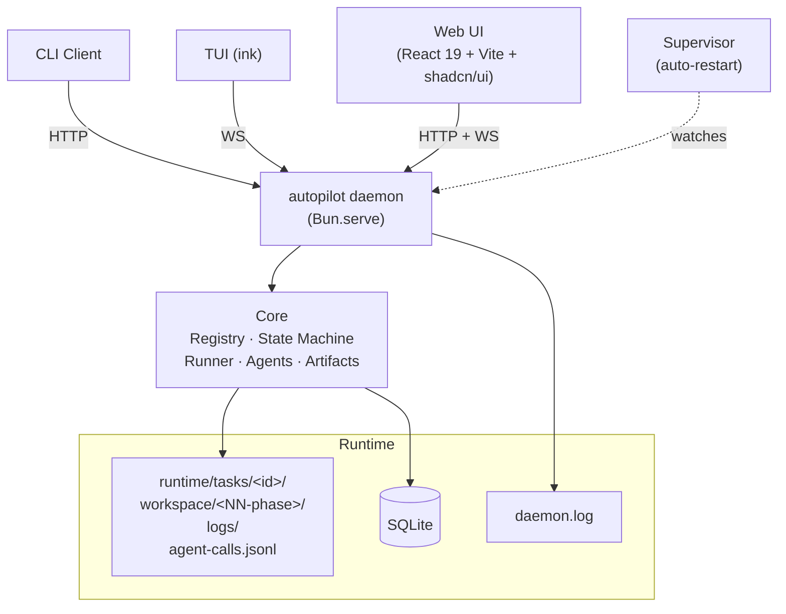

[中文](README.md) | [English](README.en.md)

<div align="center">

# autopilot

**Lightweight Multi-Phase Task Orchestration Engine**

Define phases, write the logic for each step, and let the framework handle sequential execution, failure retries, rejection rollback, parallel execution, and stall recovery.

Ships with a Web UI (professional SaaS look · light & dark themes · graphical workflow editor · ⌘K command palette · live logs · human-in-the-loop banners), a TUI, and a CLI.

[](https://bun.sh/)
[](https://www.typescriptlang.org/)
[](https://github.com/larrygogo/autopilot/actions/workflows/ci.yml)
[](LICENSE)

</div>

---

## What problem it solves

A single LLM agent call is impressive, but **real work is rarely a single call**. You want the AI to:

- Write code, run the tests itself, retry on failure, and ping you when it's clearly stuck
- Draft a plan first, get your sign-off, then start the actual work
- Pause and ask you when it hits a fork in the road
- On error, jump back a step, keep its context, and redo the work

This isn't an agent capability problem — it's an **orchestration layer** problem. autopilot is that layer: agent calls become first-class citizens, wrapped in a state machine, human-in-the-loop hooks, visualization, and local persistence.

No distributed workers (Temporal lives in another league), no DIY UI (LangGraph only ships a library), and not an API-connector factory (n8n is a different paradigm). **Single-process daemon + SQLite + built-in Web UI — get your first agent workflow running in half an hour.**

## Who it's for

- **Solo developers** who want to chain Claude / Codex / Gemini together for real dev work without flying blind in a black box
- **AI engineers** running agent-driven backend flows in a product, who need visual debugging plus human approval gates
- **Small-team internal tools** that need a "submit a request — agent works on it — I review — delivered" interface for non-technical teammates
- **Agent tinkerers** wiring different models and prompts into pipelines to compare outcomes

## Three real scenarios

### 1. AI-driven dev pipeline (the built-in `dev` workflow)

```
You: add a task-tagging feature
  ↓
architect agent reads your repo + writes the technical plan → workspace/00-design/plan.md
  ↓
[Gate: you review the plan] ← Pass to continue, Reject to loop back (agent gets your reason and rewrites)
  ↓
developer agent writes code + runs tests + git commits
  ↓
reviewer agent inspects the diff → REVIEW_RESULT: PASS/REJECT
  ↓
gh pr create  ← actually opens the PR
```

Each step can use a different model (Opus for architecture, Sonnet for dev); each step's artifacts (plan.md / dev_report.md / agent transcript) are auto-archived into the task workspace and visible in the UI.

### 2. Content production line

```
You: ship a blog post on Bun performance this week
  ↓
researcher agent reads 5 reference pieces + organizes the facts
  ↓
[Gate: you review the outline] ← Not happy? Write "add a benchmark section" → researcher redoes it
  ↓
writer agent drafts
  ↓
editor agent polishes + fact-checks
  ↓
saved to workspace/03-final/post.md
```

### 3. Let the agent ask you back when the path is unclear

```
You: migrate the backend from Express to Hono
  ↓
After reading the repo for a bit, the agent calls ask_user:
  "I see 5 middleware modules; one (X) isn't compatible with Hono.
   Options: A find an equivalent  B rewrite it  C keep Express alongside for now"
  ↓
[Ask banner: you click B]
  ↓
agent receives your answer and continues
```

## Not a good fit for

- **Simple one-off prompts** → just call the SDK, don't add abstraction for its own sake
- **Cross-machine scheduling / thousands of tasks per second** → Temporal / Airflow
- **Pure data ETL with no LLM** → Airflow / Dagster
- **Team permissions / audit / SSO** → autopilot is a single-user local tool
- **Production SaaS for unknown users** → it's a local daemon, no account system

## How it compares

| Dimension | autopilot | LangGraph | n8n | Temporal |
|---|---|---|---|---|
| **Core abstraction**¹ | agent + phase | arbitrary node | API connector | activity (any function) |
| **Built-in UI** | ✅ workflow editor + execution view | ❌ DIY | ✅ node editor | partial (execution view) |
| **Human-in-the-loop**² | ✅ Gate / ask_user built in | DIY | ❌ | DIY |
| **Deployment shape** | single-process daemon + SQLite | library (embedded in your process) | self-host or SaaS | cluster (multiple workers + server) |
| **Local-first** | ✅ | ✅ | self-host possible | cluster deployment |
| **Learning curve** | low | medium | low | high |

¹ **Core abstraction** = the unit of work the tool nudges you to think in. autopilot: "which agent runs this phase, and what's the prompt"; n8n: "which connector node do I drag in"; Temporal: "write an activity function".
² **Human-in-the-loop** = ability to suspend the workflow mid-run for human approval or input. autopilot ships `gate: true` and the `ask_user` tool out of the box; the others require you to wire the state and UI yourself.

---

## Features

| | Feature | Description |
|---|---|---|
| **📝** | **YAML Declarative Workflow** | `workflow.yaml` defines the structure, `workflow.ts` only contains phase functions, states are auto-derived |
| **🎨** | **Graphical Web UI Editor** | Phases / parallel blocks / reject / agent overrides — all visual, `workflow.ts` auto-synced |
| **🔌** | **Plugin-style Discovery** | Drop into `~/.autopilot/workflows/` for automatic registration, zero configuration |
| **🤖** | **Multi-Agent Three-Layer Config** | Global → workflow → runtime `RunOptions`, supports Claude / Codex / Gemini |
| **🙋** | **Built-in Human-in-the-loop** | `gate: true` suspends a phase for manual approval; agents can call the `ask_user` tool mid-run |
| **📦** | **Workspace Auto-Archive** | Per-phase artifacts (`agent-trace.md` + `phase.log`) automatically written to `workspace/<NN>-<phase>/` |
| **⚡** | **Parallel Phases** | `parallel:` syntax for fork/join + failure strategies |
| **🔄** | **State Machine Driven** | SQLite persistence · atomic transitions · illegal transitions blocked |
| **🚀** | **Push Model** | Non-blocking launch of the next phase upon completion, no polling required |
| **🛡️** | **Supervisor Watchdog** | Daemon auto-restarts on crash, exponential backoff + fast-crash protection |
| **📜** | **Three-Layer Log Persistence** | Process logs / task event stream / agent transcript — all traceable |

## Architecture



- The **core engine** runs as a long-lived daemon; CLI / TUI / Web connect over HTTP + WebSocket
- The **Supervisor** watches the daemon and auto-restarts it on crash
- Each task has its own isolated **workspace** sandbox; on phase completion the framework auto-archives the agent transcript + phase log

## Quick Start

### Install

```bash
git clone https://github.com/larrygogo/autopilot && cd autopilot
bun install
bun run dev init                  # create ~/.autopilot/
bun run dev upgrade               # run database migrations
```

### Launch

```bash
autopilot daemon start            # start daemon in background (with supervisor)
autopilot dashboard               # open Web UI (browser http://127.0.0.1:6180)
# or: autopilot tui  for the TUI
```

### Your First Workflow

In the Web UI click **Workflows → New Workflow**, or create manually:

```
~/.autopilot/workflows/hello/
├── workflow.yaml
└── workflow.ts
```

```yaml
# workflow.yaml
name: hello
description: minimal example
phases:
  - name: greet
    timeout: 60
```

```typescript
// workflow.ts
import { homedir } from "os";
import { join } from "path";
import { writeFileSync } from "fs";

function taskWorkspace(taskId: string): string {
  const home = process.env.AUTOPILOT_HOME ?? join(homedir(), ".autopilot");
  return join(home, "runtime", "tasks", taskId, "workspace");
}

export async function run_greet(taskId: string): Promise<void> {
  const ws = taskWorkspace(taskId);
  writeFileSync(join(ws, "hello.txt"), "hello world\n");
}
```

In the Web UI click **Tasks → New Task**, pick the `hello` workflow, **fill in the title (required) + requirement details (optional markdown)** → Create (the task ID is generated automatically). On the task detail page you can see:
- Pipeline (horizontal step view, dagre auto-layout)
- State machine diagram (current state highlighted; `cancel` edges extracted as a separate "escape hatch" hint)
- Workspace files tab → `00-greet/agent-trace.md` + `00-greet/phase.log` auto-archived by the framework
- 4 detail tabs: Phase Logs / Agent Calls / Status Logs / Live Logs

## Web UI

**Visuals & Infrastructure**
- Tailwind v4 + shadcn/ui professional SaaS look (restrained grayscale + slate-blue accent)
- Light / dark / follow-system themes, persisted in `localStorage`
- Persistent left navigation + top bar + mobile Sheet drawer
- ⌘K command palette: navigate / search tasks / new task / switch theme
- Lazy-loaded routes: first-screen JS gzip ≈ 128 KB, each page is a separate on-demand chunk

**Graphical Workflow Editor**
- Inline rename phases / change timeout / set reject; drag to reorder
- Create / break / migrate sub-phases between parallel blocks
- Field validation before save (illegal values flagged on the spot, save blocked until fixed)
- `workflow.ts` auto-sync: rename functions on rename, scaffold added phases, one-click cleanup of orphans
- Read-only Code Viewer for the current `workflow.ts`

**Task Detail**
- Three-way hover sync between task info + pipeline + state machine diagram
- 5 detail tabs: Workspace file browser / Phase logs (search + level filter) / Agent call transcript / Status logs / Live logs (with baseline load + agent stream bridging)
- One-click cancel / multi-select bulk cancel from the list
- One-click pack workspace as zip download / manual release
- Collapsible "Requirement Details" section, supports long markdown

**Human-in-the-loop**
- **Gate banner** (orange): shown when a phase configured with `gate: true` finishes and suspends — [Pass / Reject (reason required) / Cancel task]; the rejection reason is written to `task.last_user_decision` for the agent to read on retry
- **Ask banner** (blue): shown when an agent calls `mcp__autopilot_workflow__ask_user(question, options?)` — supports both option-button and Textarea modes

**Configuration**
- Providers page: health checks for the three CLIs + default model candidate list (live when an API key is present, otherwise the built-in catalog)
- Agent CRUD + dry-run (debug system_prompt)
- Advanced YAML direct editing

## CLI

```bash
# daemon lifecycle
autopilot daemon run                # foreground
autopilot daemon start              # background (with supervisor)
autopilot daemon supervise          # foreground supervisor for debugging
autopilot daemon restart            # reload after editing config.yaml
autopilot daemon stop
autopilot daemon status

# tasks (task ID auto-generated; title required, requirement optional)
autopilot task start "<title>" -w <workflow> [-r "<requirement>" | -r @./req.md]
autopilot task status [<task-id>]
autopilot task cancel <task-id>
autopilot task logs <task-id> [--follow]

# workflows
autopilot workflow list

# UI
autopilot tui                       # terminal UI
autopilot dashboard                 # open Web UI in browser

# build Web (run after editing the frontend)
bun run build:web
```

## Directory Layout

```
autopilot/
├── src/
│   ├── core/                       # framework core: db / state-machine / runner / registry /
│   │                               # infra / watcher / workspace / artifacts /
│   │                               # task-logs / task-context / logger
│   ├── daemon/                     # daemon process: server / routes / ws / event-bus / supervisor / protocol
│   ├── client/                     # thin client library (HTTP + WS)
│   ├── cli/                        # thin CLI client
│   ├── tui/                        # ink (React) terminal UI
│   ├── web/                        # React 19 + Vite + Tailwind v4 + shadcn/ui SPA
│   └── agents/                     # agent system (providers + tools + pending-questions)
├── ~/.autopilot/                   # user space (AUTOPILOT_HOME)
│   ├── config.yaml                 # providers / agents / daemon / workspace_retention
│   ├── workflows/<name>/
│   │   ├── workflow.yaml
│   │   ├── workflow.ts
│   │   └── workspace_template/     # optional: initial workspace skeleton for tasks
│   └── runtime/
│       ├── workflow.db             # SQLite
│       ├── daemon.pid · supervisor.pid
│       ├── logs/daemon.log         # daemon main log (with rotated backup .1)
│       └── tasks/<id>/
│           ├── workspace/<NN-phase>/   # per-phase artifacts: agent-trace.md + phase.log
│           ├── agent-calls.jsonl       # whole-task agent call raw transcript
│           └── logs/
│               ├── phase-*.log
│               └── events.jsonl
```

## Configuration

`~/.autopilot/config.yaml` (optional, infrastructure shared across workflows):

```yaml
providers:                # LLM providers (credentials managed by each CLI itself)
  anthropic:
    default_model: claude-sonnet-4-6
    enabled: true
  openai:
    default_model: gpt-5
  google:
    default_model: gemini-2.5-pro

agents:                   # named agents, can be overridden by same name or via extends in workflows
  coder:
    provider: anthropic
    model: claude-sonnet-4-6
    max_turns: 10
    permission_mode: auto
    system_prompt: "You are a general-purpose coding assistant."

daemon:                   # optional: daemon listen config (run autopilot daemon restart after editing)
  host: 127.0.0.1         # set 0.0.0.0 to expose on the LAN
  port: 6180

workspace_retention:      # optional: auto cleanup of terminal-state task workspaces
  days: 30
  max_total_mb: 5120
```

## Development

```bash
bun install
bun test                  # 174 tests
bun run typecheck
bun run build:web
```

**Standards**: TypeScript strict · Bun runtime · core must not introduce workflow-specific logic · each workflow is self-contained

## Dependencies

- **Runtime**: Bun >= 1.3
- **Core**: commander >= 13 · yaml >= 2.8
- **TUI**: React 19 · ink 7
- **Web frontend**: React 19 · Vite 6 · Tailwind v4 · shadcn/ui (Radix) · cmdk · sonner · lucide-react · dagre

Optional Agent CLIs (login as needed):
- `@anthropic-ai/claude-agent-sdk` (npm package, native JS SDK) + `claude login`
- `@openai/codex` (native CLI launcher, framework spawns child process) + `codex login`
- `gemini` (Google official CLI, framework spawns child process) + `gemini auth login`

## Documentation

- [`docs/en/quickstart.md`](docs/en/quickstart.md) — 5-minute quickstart
- [`docs/en/architecture.md`](docs/en/architecture.md) — architecture deep dive
- [`docs/en/workflow-development.md`](docs/en/workflow-development.md) — workflow development guide (incl. human-in-the-loop / Gate / ask_user)
- [`docs/en/state-machine.md`](docs/en/state-machine.md) — state machine and rejection mechanism
- [`docs/en/faq.md`](docs/en/faq.md) — FAQ
- [`examples/workflows/`](examples/workflows/) — 6 example workflows (incl. `with_human` for human-in-the-loop)

中文文档见 [`docs/`](docs/)。

## Contributing

Issues and PRs are welcome! Please read [CONTRIBUTING.md](CONTRIBUTING.md) and follow the [Contributor Covenant](CODE_OF_CONDUCT.md).

## License

[MIT](LICENSE)
