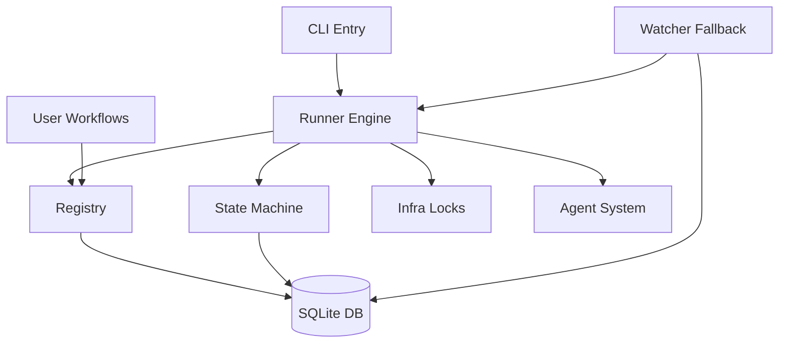

[中文](README.md) | [English](README.en.md)

<div align="center">

# autopilot

**Lightweight Multi-Phase Task Orchestration Engine**

Define phases, write step logic, and let the framework handle sequential execution, failure retries, rejection rollbacks, parallel execution, and stall recovery.

[](https://bun.sh/)
[](https://www.typescriptlang.org/)
[](https://github.com/larrygogo/autopilot/actions/workflows/ci.yml)
[](LICENSE)

</div>

---

## Features

| | Feature | Description |
|---|---|---|
| **📝** | **YAML Declarative Definition** | `workflow.yaml` defines the structure, `workflow.ts` only contains phase functions, states are auto-derived |
| **🔌** | **Plugin-based Workflows** | Drop into `~/.autopilot/workflows/` for automatic discovery and registration, zero configuration |
| **🤖** | **Multi-Agent Support** | Built-in Anthropic / OpenAI / Google agent providers, invoke AI agents within phases |
| **⚡** | **Parallel Phases** | `parallel:` syntax supports fork/join parallel execution with configurable failure strategies |
| **🔄** | **State Machine Driven** | SQLite persistence, atomic state transitions (optimistic locking), illegal transitions blocked at runtime |
| **🚀** | **Push Model** | Non-blocking launch of next phase upon completion, no polling required |
| **🔒** | **Concurrency Safe** | File locks (PID liveness detection) + SQLite transactions for dual protection against race conditions |
| **👀** | **Watcher Fallback** | Periodic detection of stalled tasks with automatic recovery |
| **📦** | **User Space Separation** | Framework code and user data are separated, `git pull` upgrades without conflicts |

## Quick Start

```bash
# Install
git clone https://github.com/larrygogo/autopilot && cd autopilot
bun install

# Initialize
bun run dev init
bun run dev upgrade

# Start a task
bun run dev start <req_id> --workflow <name>
```

> **5-Minute Tutorial**: From installation to running your first demo, see [`docs/en/quickstart.md`](docs/en/quickstart.md)

## Defining Workflows

Drop into `~/.autopilot/workflows/`, and the framework auto-discovers and registers them.

### YAML + TypeScript (Recommended)

Each workflow gets its own directory. `workflow.yaml` defines the structure, `workflow.ts` contains only phase functions:

```yaml
# workflow.yaml
name: my_workflow
description: My workflow

phases:
  - name: design
    timeout: 900

  - name: review
    timeout: 600
    reject: design          # Retry design on rejection

  - name: develop
    timeout: 1800
```

```typescript
// workflow.ts
export async function run_design(taskId: string): Promise<void> {
  // ...
}

export async function run_review(taskId: string): Promise<void> {
  // ...
}

export async function run_develop(taskId: string): Promise<void> {
  // ...
}
```

> Auto-derived from phase `name`: `pending_state` · `running_state` · `trigger` · `complete_trigger` · `fail_trigger` · `label` · `func`

### Parallel Phases

```yaml
phases:
  - name: design
    timeout: 900

  - parallel:
      name: development
      fail_strategy: cancel_all    # cancel_all (default) | continue
      phases:
        - name: frontend
          timeout: 1800
        - name: backend
          timeout: 1800

  - name: code_review
    timeout: 1200
```

## Architecture



```
autopilot/
├── src/
│   ├── core/                    # Framework core
│   │   ├── registry.ts          # Workflow discovery + YAML loading + state derivation
│   │   ├── state-machine.ts     # Atomic state transitions (optimistic locking)
│   │   ├── runner.ts            # Execution engine + Push model + parallel fork/join
│   │   ├── db.ts                # SQLite persistence (tasks / task_logs / subtasks)
│   │   ├── infra.ts             # File locks (PID liveness detection + stale lock cleanup)
│   │   ├── watcher.ts           # Stall detection & auto-recovery
│   │   ├── notify.ts            # Notification system
│   │   ├── migrate.ts           # Database migration engine
│   │   ├── config.ts            # Configuration loading
│   │   └── logger.ts            # Phase-tagged logging
│   ├── agents/                  # Agent system
│   │   ├── registry.ts          # Agent cache management
│   │   └── providers/           # Agent providers (anthropic / openai / google)
│   ├── migrations/              # Migration scripts
│   ├── cli.ts                   # Unified CLI entry point (commander)
│   └── index.ts                 # Version + AUTOPILOT_HOME
├── bin/                         # CLI entry scripts
├── examples/                    # Example workflows
├── docs/                        # Architecture documentation
└── tests/                       # Unit tests
```

> Detailed architecture: [`docs/architecture.md`](docs/architecture.md)

## CLI

```bash
autopilot init                                          # Initialize workspace
autopilot start <req-id> [-t <title>] [-w <workflow>]   # Start a task
autopilot status [<task-id>]                            # Task status (detail/list)
autopilot cancel <task-id>                              # Cancel a task
autopilot list                                          # Registered workflows
autopilot upgrade                                       # Database migration
```

## Development

```bash
bun install
bun test
bun run typecheck
```

**Standards**: TypeScript strict · Bun runtime · Framework core must not introduce workflow-specific logic

## Dependencies

- **Bun** >= 1.0
- **commander** >= 13.0
- **yaml** >= 2.8

Optional Agent SDKs (install as needed):
- `@anthropic-ai/claude-agent-sdk`
- `@openai/codex`
- `@google/gemini-cli-sdk`

## Contributing

Contributions are welcome! Please read the [Contributing Guide](CONTRIBUTING.md) to get started.

This project follows the [Contributor Covenant Code of Conduct](CODE_OF_CONDUCT.md).

## License

[MIT](LICENSE)
