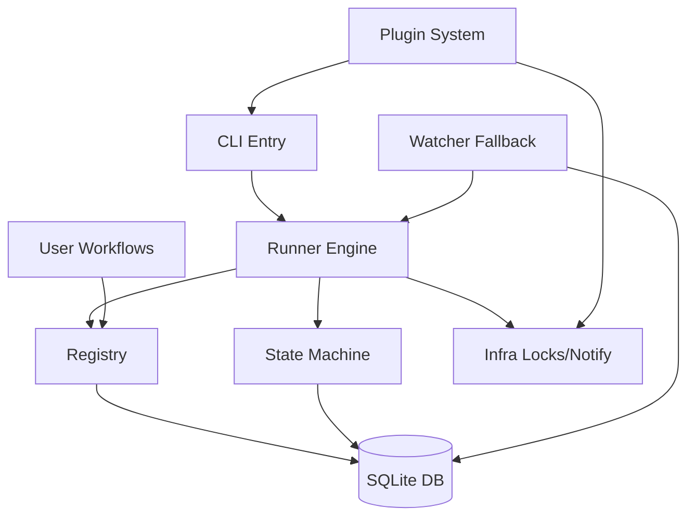

[中文](README.md) | [English](README.en.md)

<div align="center">

# autopilot

**Lightweight Multi-Phase Task Orchestration Engine**

Define phases, write step logic, and let the framework handle sequential execution, failure retries, rejection rollbacks, parallel execution, and stall recovery.

[](https://www.python.org/downloads/)
[](https://github.com/larrygogo/autopilot/actions/workflows/ci.yml)
[](LICENSE)
[](https://github.com/astral-sh/ruff)

</div>

---

## Features

| | Feature | Description |
|---|---|---|
| **📝** | **YAML Declarative Definition** | `workflow.yaml` defines the structure, `workflow.py` only contains phase functions, states are auto-derived |
| **🔌** | **Plugin-based Workflows** | Drop into `~/.autopilot/workflows/` for automatic discovery and registration, zero configuration |
| **🧩** | **Third-party Plugins** | `pip install` auto-registers extensions: notification backends / CLI commands / global hooks |
| **⚡** | **Parallel Phases** | `parallel:` syntax supports fork/join parallel execution with configurable failure strategies |
| **🔄** | **State Machine Driven** | SQLite persistence, atomic state transitions, illegal transitions blocked at runtime |
| **🚀** | **Push Model** | Non-blocking launch of next phase upon completion, no polling required |
| **🔒** | **Concurrency Safe** | File locks + SQLite transactions for dual protection against race conditions |
| **👀** | **Watcher Fallback** | Periodic detection of stalled tasks with automatic recovery |
| **📦** | **User Space Separation** | Framework code and user data are separated, `git pull` upgrades without conflicts |

## Quick Start

```bash
# Install
git clone https://github.com/larrygogo/autopilot && cd autopilot
pip install -e ".[dev]"

# Initialize
autopilot init
autopilot upgrade

# Start a task
autopilot start <req_id> --project my-project
```

> **5-Minute Tutorial**: From installation to running your first demo, see [`docs/en/quickstart.md`](docs/en/quickstart.md)

## Defining Workflows

Drop into `~/.autopilot/workflows/`, and the framework auto-discovers and registers them. Two approaches are supported:

### Approach 1: YAML + Python (Recommended)

Each workflow gets its own directory. `workflow.yaml` defines the structure, `workflow.py` contains only phase functions:

```yaml
# workflow.yaml
name: my_workflow
description: My workflow

phases:
  - name: design
    timeout: 900

  - name: review
    timeout: 600
    reject: design          # Retry design on rejection

  - name: develop
    timeout: 1800
```

```python
# workflow.py
def run_design(task_id: str) -> None:
    ...

def run_review(task_id: str) -> None:
    ...

def run_develop(task_id: str) -> None:
    ...
```

> Auto-derived from phase `name`: `pending_state` · `running_state` · `trigger` · `complete_trigger` · `fail_trigger` · `label` · `func`

### Parallel Phases

```yaml
phases:
  - name: design
    timeout: 900

  - parallel:
      name: development
      fail_strategy: cancel_all    # cancel_all (default) | continue
      phases:
        - name: frontend
          timeout: 1800
        - name: backend
          timeout: 1800

  - name: code_review
    timeout: 1200
```

### Approach 2: Pure Python

A single `.py` file exporting a `WORKFLOW` dictionary:

```python
# ~/.autopilot/workflows/my_workflow.py
WORKFLOW = {
    'name': 'my_workflow',
    'phases': [
        {'name': 'step1', 'func': run_step1, ...},
        {'name': 'step2', 'func': run_step2, ...},
    ],
}
```

> Full development guide: [`docs/workflow-development.md`](docs/workflow-development.md)

## Architecture



```
autopilot/
├── core/                    # Framework core
│   ├── registry.py          # Workflow discovery + YAML loading + state derivation
│   ├── state_machine.py     # Atomic state transitions
│   ├── runner.py            # Execution engine + Push model + parallel fork/join
│   ├── db.py                # SQLite persistence (tasks / task_logs / subtasks)
│   ├── infra.py             # File locks / git / notification dispatch
│   ├── watcher.py           # Stall detection & auto-recovery
│   ├── plugin.py            # Third-party plugin discovery & registration (entry_points)
│   ├── notify.py            # Multi-backend notifications (webhook / command / plugin extensions)
│   ├── migrate.py           # Database migration engine
│   └── cli.py               # Unified CLI entry point
├── examples/                # Example workflows (dev / req_review / doc_gen / parallel_build / data_pipeline)
├── docs/                    # Architecture documentation
└── tests/                   # Unit tests
```

> Detailed architecture: [`docs/architecture.md`](docs/architecture.md) · Plugin development: [`docs/plugin-development.md`](docs/plugin-development.md)

## CLI

```bash
autopilot start <req_id> [--project <p>] [--workflow <w>]              # Start a task
autopilot list [--status <s>] [--workflow <w>] [--project <p>] [--all] # List tasks
autopilot show <task_id> [--logs <n>]                                  # Task details
autopilot cancel <task_id> [--reason <r>]                              # Cancel a task
autopilot stats                                                        # Statistics overview
autopilot workflows                                                    # Registered workflows
autopilot validate [<name>]                                            # Validate workflow definition
autopilot init                                                         # Initialize workspace
autopilot upgrade [--status] [--dry-run]                               # Database migration
autopilot watch                                                        # Stall detection
autopilot config check                                                 # Validate configuration
```

## Development

```bash
pip install -e ".[dev]"
pytest tests/ -v
ruff check . && ruff format .
```

**Standards**: Python 3.10+ · `from __future__ import annotations` · ruff (line width 120) · Framework core must not introduce workflow-specific logic

## Dependencies

- **Python** 3.10+
- **PyYAML** >= 6.0
- **click** >= 8.0

## Contributing

Contributions are welcome! Please read the [Contributing Guide](CONTRIBUTING.md) to get started.

This project follows the [Contributor Covenant Code of Conduct](CODE_OF_CONDUCT.md).

## License

[MIT](LICENSE)
