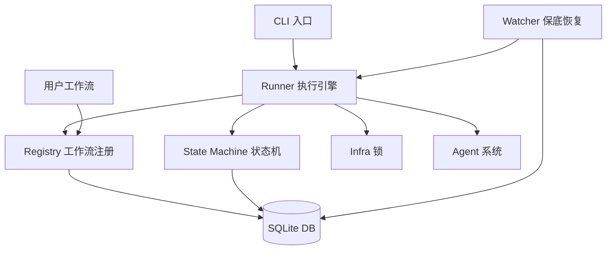

[中文](README.md) | [English](README.en.md)

<div align="center">

# autopilot

**轻量级多阶段任务编排引擎**

定义阶段，写每步逻辑，框架负责按顺序跑、失败重试、驳回回退、并行执行、卡死恢复。

[](https://bun.sh/)
[](https://www.typescriptlang.org/)
[](https://github.com/larrygogo/autopilot/actions/workflows/ci.yml)
[](LICENSE)

</div>

---

## 特性

| | 特性 | 说明 |
|---|---|---|
| **📝** | **YAML 声明式定义** | `workflow.yaml` 定义结构，`workflow.ts` 只写阶段函数，状态自动推导 |
| **🔌** | **插件化工作流** | 放入 `~/.autopilot/workflows/` 即自动发现注册，零配置接入 |
| **🤖** | **多 Agent 支持** | 内置 Anthropic / OpenAI / Google 三大 Agent 提供商，可在阶段中调用 AI Agent |
| **⚡** | **并行阶段** | `parallel:` 语法支持 fork/join 并行执行，可配置失败策略 |
| **🔄** | **状态机驱动** | SQLite 持久化，原子性状态转换（乐观锁），非法转换运行时阻止 |
| **🚀** | **Push 模型** | 阶段完成后非阻塞启动下一阶段，无需轮询 |
| **🔒** | **并发安全** | 文件锁（PID 存活检测）+ SQLite 事务双重保障，防止竞态 |
| **👀** | **Watcher 保底** | 定期检测卡死任务，自动恢复执行 |
| **📦** | **用户空间分离** | 框架代码与用户数据分离，`git pull` 升级无冲突 |

## 快速开始

```bash
# 安装
git clone https://github.com/larrygogo/autopilot && cd autopilot
bun install

# 初始化
bun run dev init
bun run dev upgrade

# 启动任务
bun run dev start <req_id> --workflow <name>
```

> **5 分钟入门教程**：从安装到跑通第一个 demo，详见 [`docs/quickstart.md`](docs/quickstart.md)

## 定义工作流

放入 `~/.autopilot/workflows/`，框架自动发现并注册。

### YAML + TypeScript（推荐）

每个工作流一个目录，`workflow.yaml` 定义结构，`workflow.ts` 只写阶段函数：

```yaml
# workflow.yaml
name: my_workflow
description: 我的工作流

phases:
  - name: design
    timeout: 900

  - name: review
    timeout: 600
    reject: design          # 驳回后重试 design

  - name: develop
    timeout: 1800
```

```typescript
// workflow.ts
export async function run_design(taskId: string): Promise<void> {
  // ...
}

export async function run_review(taskId: string): Promise<void> {
  // ...
}

export async function run_develop(taskId: string): Promise<void> {
  // ...
}
```

> 从 phase `name` 自动推导：`pending_state` · `running_state` · `trigger` · `complete_trigger` · `fail_trigger` · `label` · `func`

### 并行阶段

```yaml
phases:
  - name: design
    timeout: 900

  - parallel:
      name: development
      fail_strategy: cancel_all    # cancel_all（默认）| continue
      phases:
        - name: frontend
          timeout: 1800
        - name: backend
          timeout: 1800

  - name: code_review
    timeout: 1200
```

## 架构



```
autopilot/
├── src/
│   ├── core/                    # 框架核心
│   │   ├── registry.ts          # 工作流发现 + YAML 加载 + 状态推导
│   │   ├── state-machine.ts     # 原子性状态转换（乐观锁）
│   │   ├── runner.ts            # 执行引擎 + Push 模型 + 并行 fork/join
│   │   ├── db.ts                # SQLite 持久化（tasks / task_logs / 子任务）
│   │   ├── infra.ts             # 文件锁（PID 存活检测 + 僵尸锁清理）
│   │   ├── watcher.ts           # 卡死检测 & 自动恢复
│   │   ├── notify.ts            # 通知系统
│   │   ├── migrate.ts           # 数据库迁移引擎
│   │   ├── config.ts            # 配置加载
│   │   └── logger.ts            # 阶段标签日志
│   ├── agents/                  # Agent 系统
│   │   ├── registry.ts          # Agent 缓存管理
│   │   └── providers/           # Agent 提供商（anthropic / openai / google）
│   ├── migrations/              # 迁移脚本
│   ├── cli.ts                   # 统一 CLI 入口（commander）
│   └── index.ts                 # 版本号 + AUTOPILOT_HOME
├── bin/                         # CLI 入口脚本
├── examples/                    # 示例工作流
├── docs/                        # 架构文档
└── tests/                       # 单元测试
```

> 详细架构文档见 [`docs/architecture.md`](docs/architecture.md)

## CLI

```bash
autopilot init                                          # 初始化工作空间
autopilot start <req-id> [-t <title>] [-w <workflow>]   # 启动任务
autopilot status [<task-id>]                            # 任务状态（详情/列表）
autopilot cancel <task-id>                              # 取消任务
autopilot list                                          # 已注册工作流
autopilot upgrade                                       # 数据库迁移
```

## 开发

```bash
bun install
bun test
bun run typecheck
```

**规范**：TypeScript strict · Bun runtime · 框架核心不引入工作流专属逻辑

## 依赖

- **Bun** >= 1.0
- **commander** >= 13.0
- **yaml** >= 2.8

可选 Agent SDK（按需安装）：
- `@anthropic-ai/claude-agent-sdk`
- `@openai/codex`
- `@google/gemini-cli-sdk`

## 参与贡献

欢迎任何形式的贡献！请阅读 [贡献指南](CONTRIBUTING.md) 了解如何参与。

本项目遵循 [Contributor Covenant 行为准则](CODE_OF_CONDUCT.md)。

## License

[MIT](LICENSE)
