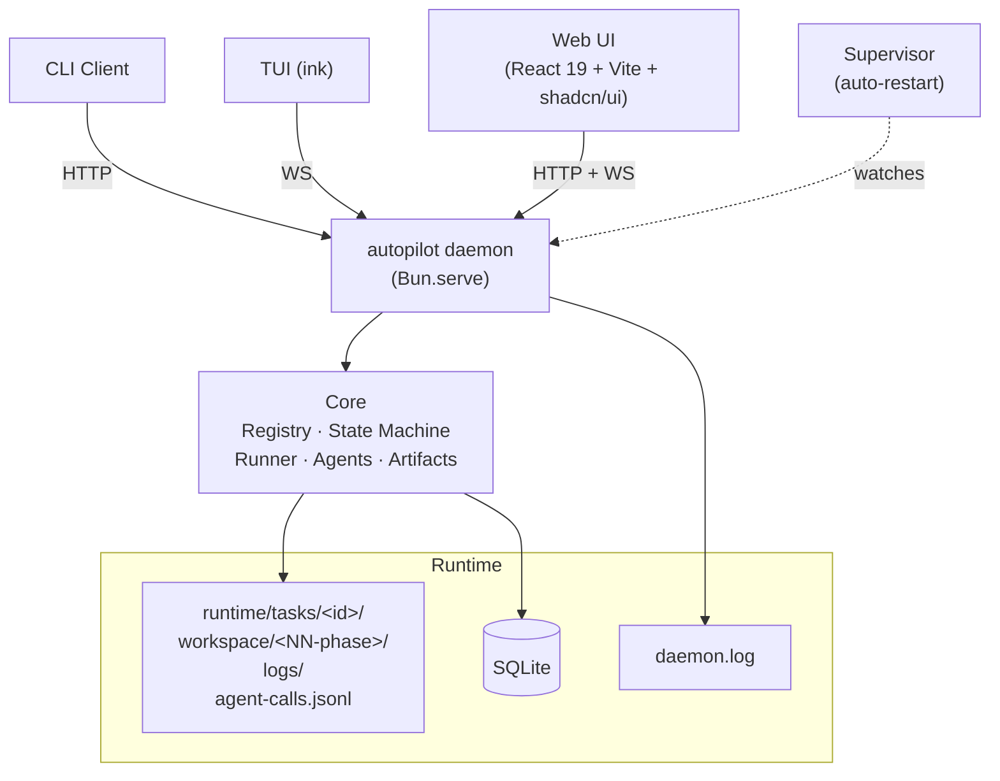

[中文](README.md) | [English](README.en.md)

<div align="center">

# autopilot

**轻量级多阶段任务编排引擎**

定义阶段，写每步逻辑，框架负责按顺序跑、失败重试、驳回回退、并行执行、卡死恢复。

附带 Web UI（专业 SaaS 风格 · 亮暗双模 · 图形化工作流编辑器 · ⌘K 命令面板 · 实时日志 · 人机交互 banner）、TUI、CLI 三种客户端。

[](https://bun.sh/)
[](https://www.typescriptlang.org/)
[](https://github.com/larrygogo/autopilot/actions/workflows/ci.yml)
[](LICENSE)

</div>

---

## 它解决什么问题

LLM agent 单次调用很厉害，但**真实工作很少是单次的**。你想让 AI：

- 写完代码自己跑测试，挂了重试，挂太多次叫你
- 出方案先给你看，你点头才开干
- 中途遇到二选一停下来问你
- 出错回到上一步、保留上下文、重做

这不是 agent 能力问题，是**编排层**问题。autopilot 给的就是这一层：把"agent 调用"作为一等公民，配上状态机、人机协作、可视化、本地持久化。

不需要分布式 worker（Temporal 是另一个量级），不需要自己搭 UI（LangGraph 只给库），不是 API connector 工厂（n8n 是另一个范式）。**单进程 daemon + SQLite + 自带 Web，半小时跑通你的第一个 agent 工作流**。

## 适合谁

- **个人开发者**：想让 Claude / Codex / Gemini 串起来做实际开发任务，又不想黑盒自动跑
- **AI 工程师**：在产品里用 agent 做后台流程，需要可视化 debug + 人审节点
- **小团队的内部工具**：要给非技术同事一个"提需求—agent 处理—我审—交付"的界面
- **agent 玩家**：想把不同模型、不同 prompt 拼成流水线试效果

## 三个真实场景

### 1. AI 驱动的开发流水线（自带的 `dev` 工作流）

```
你：给我加个任务标签功能
  ↓
architect agent 读你的 repo + 写技术方案 → workspace/00-design/plan.md
  ↓
[Gate: 你审方案] ← 通过则继续，驳回回上一步（agent 收到你的驳回理由再写）
  ↓
developer agent 写代码 + 跑测试 + git commit
  ↓
reviewer agent 看 diff 评审 → REVIEW_RESULT: PASS/REJECT
  ↓
gh pr create  ← 真的提 PR
```

每一步可换不同模型（架构用 Opus，开发用 Sonnet）；每一步产物（plan.md / dev_report.md / agent transcript）自动归档到 task workspace，UI 可视化。

### 2. 内容生产线

```
你：这周更一篇关于 Bun 性能的博客
  ↓
researcher agent 读 5 篇相关材料 + 整理事实
  ↓
[Gate: 你看大纲] ← 不满意写"加一节实测对比" → researcher 重做
  ↓
writer agent 出初稿
  ↓
editor agent 润色 + 检查事实
  ↓
保存到 workspace/03-final/post.md
```

### 3. 不知道方向时让 agent 反过来问你

```
你：把后端从 Express 迁到 Hono
  ↓
agent 读 repo 一会儿后调 ask_user：
  "我看到中间件挂了 5 个，其中 X 跟 Hono 不兼容。
   选项：A 找等价替代  B 自己重写  C 暂留 Express 共存"
  ↓
[Ask banner: 你点选 B]
  ↓
agent 收到答案继续
```

## 不适合什么

- **简单一次性 prompt** → 直接用 SDK，别给自己加抽象
- **跨机器调度 / 几千 task/秒吞吐** → Temporal / Airflow
- **纯数据 ETL，无 LLM** → Airflow / Dagster
- **团队权限 / 审计 / SSO** → autopilot 是单用户本地工具
- **生产 SaaS 给陌生用户用** → 本地 daemon，不带账号系统

## 跟相似产品的取舍

| 维度 | autopilot | LangGraph | n8n | Temporal |
|---|---|---|---|---|
| **核心抽象**¹ | agent + phase | 任意 node | API connector | activity（任意函数） |
| **自带 UI** | ✅ 工作流编辑 + 执行可视化 | ❌ 自己搭 | ✅ 节点编辑器 | 部分（执行视图） |
| **人在中间**² | ✅ Gate / ask_user 内建 | 自己实现 | ❌ | 自己实现 |
| **部署形态** | 单进程 daemon + SQLite | 库（嵌业务进程） | 自部署或 SaaS | 集群（多 worker + 服务端） |
| **本地优先** | ✅ | ✅ | 可自部署 | 集群部署 |
| **学习曲线** | 低 | 中 | 低 | 高 |

¹ **核心抽象** = 工具默认让你怎么思考工作单元。autopilot：「这阶段调哪个 agent，prompt 是啥」；n8n：「拖哪个 connector 节点」；Temporal：「写一个 activity 函数」。
² **人在中间** = 工作流中间挂起等人审批/输入的能力。autopilot 内建 `gate: true` 和 `ask_user` 工具；其他工具需要自己拼状态 + UI。

---

## 核心能力

| | 特性 | 说明 |
|---|---|---|
| **📝** | **YAML 声明式工作流** | `workflow.yaml` 定义结构，`workflow.ts` 只写阶段函数，状态自动推导 |
| **🎨** | **Web UI 图形化编辑** | 阶段 / 并行块 / 驳回 / 智能体覆盖全可视化，`workflow.ts` 自动同步 |
| **🔌** | **插件化发现** | 放入 `~/.autopilot/workflows/` 即自动注册，零配置 |
| **🤖** | **多 Agent 三层配置** | 全局 → 工作流 → 运行时 RunOptions，支持 Claude / Codex / Gemini |
| **🙋** | **人机交互内建** | `gate: true` 让阶段挂起等人工审批；agent 中途可调 `ask_user` 工具向用户提问 |
| **📦** | **Workspace 自动归档** | 每阶段产物（`agent-trace.md` + `phase.log`）框架自动写到 `workspace/<NN>-<phase>/` |
| **⚡** | **并行阶段** | `parallel:` 语法 fork/join + 失败策略 |
| **🔄** | **状态机驱动** | SQLite 持久化 · 原子性转换 · 非法转换被阻止 |
| **🚀** | **Push 模型** | 阶段完成后非阻塞启动下一阶段，无需轮询 |
| **🛡️** | **Supervisor 守护** | daemon 崩溃自动重启，指数退避 + 快速崩溃保护 |
| **📜** | **三层日志落盘** | 进程日志 / 任务事件流 / Agent 调用 transcript 全部可追溯 |

## 架构



- **核心引擎**作为长驻 daemon 运行；CLI / TUI / Web 通过 HTTP + WebSocket 接入
- **Supervisor** 守护 daemon，崩了自动重启
- **每任务**一个独立 workspace 沙盒，每个 phase 完成时框架自动归档 agent 调用 + phase 日志

## 快速开始

### 安装

```bash
git clone https://github.com/larrygogo/autopilot && cd autopilot
bun install
bun run dev init                  # 创建 ~/.autopilot/
bun run dev upgrade               # 执行数据库迁移
```

### 启动

```bash
autopilot daemon start            # 后台启动 daemon（带 supervisor 守护）
autopilot dashboard               # 打开 Web UI（浏览器访问 http://127.0.0.1:6180）
# 或：autopilot tui 进 TUI
```

### 第一个工作流

在 Web UI 点 **工作流 → 新建工作流**，或手动创建：

```
~/.autopilot/workflows/hello/
├── workflow.yaml
└── workflow.ts
```

```yaml
# workflow.yaml
name: hello
description: 最小示例
phases:
  - name: greet
    timeout: 60
```

```typescript
// workflow.ts
import { homedir } from "os";
import { join } from "path";
import { writeFileSync } from "fs";

function taskWorkspace(taskId: string): string {
  const home = process.env.AUTOPILOT_HOME ?? join(homedir(), ".autopilot");
  return join(home, "runtime", "tasks", taskId, "workspace");
}

export async function run_greet(taskId: string): Promise<void> {
  const ws = taskWorkspace(taskId);
  writeFileSync(join(ws, "hello.txt"), "hello world\n");
}
```

Web UI 点 **任务 → 新建任务**，选 `hello` 工作流，**填标题（必填）+ 需求详情（可选 markdown）** → 创建（task ID 由系统自动生成）。任务详情可看到：
- 流水线（横向步骤展示，dagre 自动布局）
- 状态机图（节点高亮当前状态；`cancel` 边抽出为独立"逃生出口"提示）
- Workspace 文件 tab → `00-greet/agent-trace.md` + `00-greet/phase.log` 框架自动归档
- 阶段日志 / Agent 调用 / 状态日志 / 实时日志 4 个细节 tab

## Web UI

**视觉与基础设施**
- Tailwind v4 + shadcn/ui 专业 SaaS 风（克制灰阶 + 灰蓝 accent）
- 亮 / 暗 / 跟随系统三种主题，`localStorage` 持久化
- 左侧持久导航栏 + 顶部条 + 移动端 Sheet 抽屉
- ⌘K 命令面板：跳转 / 搜索任务 / 新建任务 / 切主题
- 路由懒加载：首屏 JS gzip ≈ 128 KB，每个页面独立 chunk 按需拉取

**工作流图形化编辑器**
- 阶段 inline 重命名 / 改 timeout / 设 reject；拖拽排序
- 并行块新建 / 拆解 / 子阶段互迁
- 保存前字段校验（非法当场标红，修复前无法保存）
- `workflow.ts` 自动同步：改名重命名函数、新增阶段追加脚手架、一键清理孤儿
- 只读 Code Viewer 查看当前 `workflow.ts`

**任务详情**
- 任务信息 + 流水线 + 状态机图 三方 hover 联动
- 5 个细节 tab：Workspace 文件浏览器 / 阶段日志（搜索 + 级别过滤）/ Agent 调用 transcript / 状态日志 / 实时日志（含 baseline 加载 + agent 流桥接）
- 一键取消 / 列表多选批量取消
- Workspace 一键打包 zip 下载 / 手动释放
- 折叠展开的"需求详情"区，支持长 markdown

**人机交互**
- **Gate banner**（橙）：phase 配 `gate: true` 时跑完挂起，[通过 / 驳回（必填理由）/ 取消任务]；驳回理由自动写入 `task.last_user_decision`，agent 重做时可读取
- **Ask banner**（蓝）：agent 调 `mcp__autopilot_workflow__ask_user(question, options?)` 工具时弹出，按钮选项 / Textarea 双模式

**配置**
- Providers 页：三家 CLI 健康检查 + 默认模型候选列表（有 API key 走实时，否则内置 catalog）
- 智能体 CRUD + 试跑（调试 system_prompt）
- 高级 YAML 直编

## CLI

```bash
# daemon 生命周期
autopilot daemon run                # 前台启动
autopilot daemon start              # 后台（带 supervisor）
autopilot daemon supervise          # 前台 supervisor 调试
autopilot daemon restart            # 改完 config.yaml 后重载
autopilot daemon stop
autopilot daemon status

# 任务（task ID 自动生成；title 必填，requirement 可选）
autopilot task start "<title>" -w <workflow> [-r "<需求>" | -r @./req.md]
autopilot task status [<task-id>]
autopilot task cancel <task-id>
autopilot task logs <task-id> [--follow]

# 工作流
autopilot workflow list

# UI
autopilot tui                       # 终端 UI
autopilot dashboard                 # 浏览器打开 Web UI

# 构建 Web（开发完改前端需执行）
bun run build:web
```

## 目录结构

```
autopilot/
├── src/
│   ├── core/                       # 框架核心：db / state-machine / runner / registry /
│   │                               # infra / watcher / workspace / artifacts /
│   │                               # task-logs / task-context / logger
│   ├── daemon/                     # daemon 进程：server / routes / ws / event-bus / supervisor / protocol
│   ├── client/                     # 薄客户端库（HTTP + WS）
│   ├── cli/                        # CLI 薄客户端
│   ├── tui/                        # ink (React) 终端 UI
│   ├── web/                        # React 19 + Vite + Tailwind v4 + shadcn/ui SPA
│   └── agents/                     # Agent 系统（providers + tools + pending-questions）
├── ~/.autopilot/                   # 用户空间（AUTOPILOT_HOME）
│   ├── config.yaml                 # providers / agents / daemon / workspace_retention
│   ├── workflows/<name>/
│   │   ├── workflow.yaml
│   │   ├── workflow.ts
│   │   └── workspace_template/     # 可选：任务 workspace 初始骨架
│   └── runtime/
│       ├── workflow.db             # SQLite
│       ├── daemon.pid · supervisor.pid
│       ├── logs/daemon.log         # daemon 主日志（含旋转备份 .1）
│       └── tasks/<id>/
│           ├── workspace/<NN-phase>/   # 每阶段产出归档 agent-trace.md + phase.log
│           ├── agent-calls.jsonl       # 全任务 agent 调用 raw transcript
│           └── logs/
│               ├── phase-*.log
│               └── events.jsonl
```

## 配置

`~/.autopilot/config.yaml`（可选，跨工作流共享的基础设施）：

```yaml
providers:                # LLM 提供商（凭证由对应 CLI 自身管理）
  anthropic:
    default_model: claude-sonnet-4-6
    enabled: true
  openai:
    default_model: gpt-5
  google:
    default_model: gemini-2.5-pro

agents:                   # 命名 agent，工作流可同名覆盖或 extends
  coder:
    provider: anthropic
    model: claude-sonnet-4-6
    max_turns: 10
    permission_mode: auto
    system_prompt: "你是通用编码助手。"

daemon:                   # 可选：daemon 监听配置（改后 autopilot daemon restart 生效）
  host: 127.0.0.1         # 设 0.0.0.0 暴露到局域网
  port: 6180

workspace_retention:      # 可选：自动清理终态任务 workspace
  days: 30
  max_total_mb: 5120
```

## 开发

```bash
bun install
bun test                  # 174 tests
bun run typecheck
bun run build:web
```

**规范**：TypeScript strict · Bun runtime · 核心不引入工作流专属逻辑 · 每个工作流自包含

## 依赖

- **运行时**：Bun >= 1.3
- **核心**：commander >= 13 · yaml >= 2.8
- **TUI**：React 19 · ink 7
- **Web 前端**：React 19 · Vite 6 · Tailwind v4 · shadcn/ui (Radix) · cmdk · sonner · lucide-react · dagre

可选 Agent CLI（按需登录）：
- `@anthropic-ai/claude-agent-sdk`（npm 包，原生 JS SDK）+ `claude login`
- `@openai/codex`（native CLI launcher，框架 spawn 子进程调用）+ `codex login`
- `gemini`（Google 官方 CLI，框架 spawn 子进程调用）+ `gemini auth login`

## 文档

- [`docs/quickstart.md`](docs/quickstart.md) — 5 分钟入门
- [`docs/architecture.md`](docs/architecture.md) — 架构详解
- [`docs/workflow-development.md`](docs/workflow-development.md) — 工作流开发指南（含人机交互 / Gate / ask_user）
- [`docs/state-machine.md`](docs/state-machine.md) — 状态机与驳回机制
- [`docs/faq.md`](docs/faq.md) — 常见问题
- [`examples/workflows/`](examples/workflows/) — 6 个示例工作流（含 `with_human` 演示人机交互）

English docs under [`docs/en/`](docs/en/).

## 参与贡献

欢迎 Issue / PR！请阅读 [CONTRIBUTING.md](CONTRIBUTING.md)，遵循 [Contributor Covenant](CODE_OF_CONDUCT.md)。

## License

[MIT](LICENSE)
