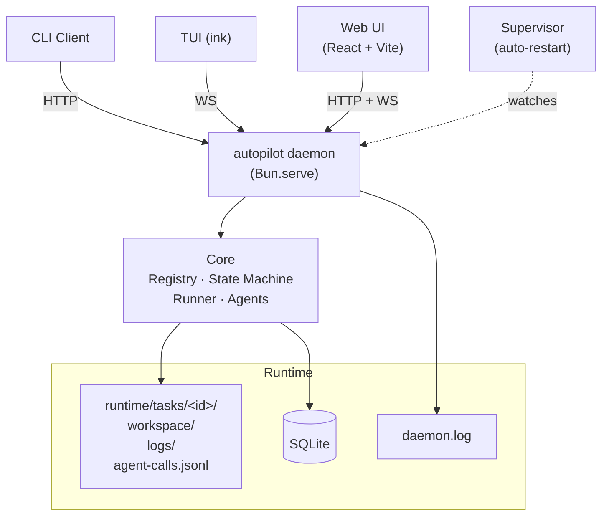

[中文](README.md) | [English](README.en.md)

<div align="center">

# autopilot

**轻量级多阶段任务编排引擎**

定义阶段，写每步逻辑，框架负责按顺序跑、失败重试、驳回回退、并行执行、卡死恢复。

附带 Web UI（图形化工作流编辑器 / 智能体配置 / 实时日志）、TUI、CLI 三种客户端。

[](https://bun.sh/)
[](https://www.typescriptlang.org/)
[](https://github.com/larrygogo/autopilot/actions/workflows/ci.yml)
[](LICENSE)

</div>

---

## 核心能力

| | 特性 | 说明 |
|---|---|---|
| **📝** | **YAML 声明式工作流** | `workflow.yaml` 定义结构，`workflow.ts` 只写阶段函数，状态自动推导 |
| **🎨** | **Web UI 图形化编辑** | 阶段 / 并行块 / 驳回 / 智能体覆盖全可视化，workflow.ts 自动同步 |
| **🔌** | **插件化发现** | 放入 `~/.autopilot/workflows/` 即自动注册，零配置 |
| **🤖** | **多 Agent 三层配置** | 全局 → 工作流 → 运行时 RunOptions，支持 Claude / Codex / Gemini |
| **📦** | **Workspace 沙盒** | 每任务独立目录 + 可选 template 骨架 + 保留策略自动清理 |
| **⚡** | **并行阶段** | `parallel:` 语法 fork/join + 失败策略 |
| **🔄** | **状态机驱动** | SQLite 持久化 · 原子性转换 · 非法转换被阻止 |
| **🚀** | **Push 模型** | 阶段完成后非阻塞启动下一阶段，无需轮询 |
| **🛡️** | **Supervisor 守护** | daemon 崩溃自动重启，指数退避 + 快速崩溃保护 |
| **📜** | **三层日志落盘** | 进程日志 / 任务事件流 / Agent 调用 transcript 全部可追溯 |

## 架构



- **核心引擎**作为长驻 daemon 运行；CLI / TUI / Web 通过 HTTP + WebSocket 接入
- **Supervisor** 守护 daemon，崩了自动重启
- **每任务**一个独立 workspace 沙盒 + 完整日志归档（事件流 / 阶段日志 / Agent transcript）

## 快速开始

### 安装

```bash
git clone https://github.com/larrygogo/autopilot && cd autopilot
bun install
bun run dev init                  # 创建 ~/.autopilot/
bun run dev upgrade               # 执行数据库迁移
```

### 启动

```bash
autopilot daemon start            # 后台启动 daemon（带 supervisor 守护）
autopilot dashboard               # 打开 Web UI
# 或：autopilot tui 进 TUI
```

### 第一个工作流

在 Web UI 点 **工作流 → 新建工作流**，或手动创建：

```
~/.autopilot/workflows/hello/
├── workflow.yaml
└── workflow.ts
```

```yaml
# workflow.yaml
name: hello
description: 最小示例
phases:
  - name: greet
    timeout: 60
```

```typescript
// workflow.ts
import { homedir } from "os";
import { join } from "path";
import { writeFileSync } from "fs";

function taskWorkspace(taskId: string): string {
  const home = process.env.AUTOPILOT_HOME ?? join(homedir(), ".autopilot");
  return join(home, "runtime", "tasks", taskId, "workspace");
}

export async function run_greet(taskId: string): Promise<void> {
  const ws = taskWorkspace(taskId);
  writeFileSync(join(ws, "hello.txt"), "hello world\n");
}
```

Web UI 点 **任务 → 新建任务**，选 `hello` 工作流，填任意 `reqId` → 创建。进入任务详情可看到：
- 流水线（横向步骤展示）
- 状态机图（节点高亮当前状态）
- Workspace 文件 tab（展开看 `hello.txt`）
- 阶段日志 / Agent 调用 tabs

## Web UI 亮点

**工作流图形化编辑器**
- 阶段 inline 重命名 / 改 timeout / 设 reject；拖拽排序
- 并行块新建 / 拆解 / 子阶段互迁
- 保存前字段校验（非法当场标红，修复前无法保存）
- `workflow.ts` 自动同步：改名重命名函数、新增阶段追加脚手架、一键清理孤儿
- 只读 Code Viewer 查看当前 `workflow.ts`

**任务详情**
- 任务信息 + 流水线 + 状态机图 三方 hover 联动
- 5 个细节 tab：Workspace 文件浏览器 / 阶段日志（搜索 + 级别过滤）/ Agent 调用 transcript / 状态日志 / 实时日志
- 一键取消 / 列表多选批量取消
- Workspace 一键打包 zip 下载 / 手动释放

**配置**
- Providers 页：三家 CLI 健康检查 + 默认模型候选列表（有 API key 走实时，否则内置 catalog）
- 智能体 CRUD + 试跑（调试 system_prompt）
- 高级 YAML 直编

## CLI

```bash
# daemon 生命周期
autopilot daemon run                # 前台启动
autopilot daemon start              # 后台（带 supervisor）
autopilot daemon supervise          # 前台 supervisor 调试
autopilot daemon stop
autopilot daemon status

# 任务
autopilot task start <req-id> [-w <workflow>]
autopilot task status [<task-id>]
autopilot task cancel <task-id>
autopilot task logs <task-id> [--follow]

# 工作流
autopilot workflow list

# UI
autopilot tui                       # 终端 UI
autopilot dashboard                 # 浏览器打开 Web UI

# 构建 Web（开发完改前端需执行）
bun run build:web
```

## 目录结构

```
autopilot/
├── src/
│   ├── core/                       # 框架核心：db / state-machine / runner / registry /
│   │                               # infra / watcher / workspace / task-logs / task-context / logger
│   ├── daemon/                     # daemon 进程：server / routes / ws / event-bus / supervisor
│   ├── client/                     # 薄客户端库（HTTP + WS）
│   ├── cli/                        # CLI 薄客户端
│   ├── tui/                        # ink (React) 终端 UI
│   ├── web/                        # React + Vite SPA
│   └── agents/                     # Agent 系统（providers + model-list + cli-status）
├── ~/.autopilot/                   # 用户空间（AUTOPILOT_HOME）
│   ├── config.yaml                 # providers / agents / workspace_retention
│   ├── workflows/<name>/
│   │   ├── workflow.yaml
│   │   ├── workflow.ts
│   │   └── workspace_template/     # 可选：任务 workspace 初始骨架
│   └── runtime/
│       ├── workflow.db             # SQLite
│       ├── daemon.pid · supervisor.pid
│       ├── logs/daemon.log         # daemon 主日志（含旋转备份 .1）
│       └── tasks/<id>/
│           ├── workspace/          # 任务沙盒
│           ├── agent-calls.jsonl   # agent 调用 transcript
│           └── logs/
│               ├── phase-*.log
│               └── events.jsonl
```

## 配置

`~/.autopilot/config.yaml`（可选，跨工作流共享的基础设施）：

```yaml
providers:                # LLM 提供商（凭证由 CLI 管理）
  anthropic:
    default_model: claude-sonnet-4-6
    enabled: true
  openai: { default_model: o4-mini }
  google: { default_model: gemini-2.5-pro }

agents:                   # 命名 agent，工作流可同名覆盖或 extends
  coder:
    provider: anthropic
    model: claude-sonnet-4-6
    max_turns: 10
    system_prompt: "你是通用编码助手。"

workspace_retention:      # 可选：自动清理终态任务 workspace
  days: 30
  max_total_mb: 5120
```

## 开发

```bash
bun install
bun test                  # 152 tests
bun run typecheck
bun run build:web
```

**规范**：TypeScript strict · Bun runtime · 核心不引入工作流专属逻辑 · 每个工作流自包含

## 依赖

- **Bun** >= 1.3
- **commander** >= 13.0 · **yaml** >= 2.8 · **React** 19 · **ink** 7

可选 Agent SDK（按需）：
- `@anthropic-ai/claude-agent-sdk` + `claude login`
- `@openai/codex` + `codex login`
- `@google/gemini-cli-sdk` + `gemini auth login`

## 文档

- [`docs/quickstart.md`](docs/quickstart.md) — 5 分钟入门
- [`docs/architecture.md`](docs/architecture.md) — 架构详解
- [`docs/workflow-development.md`](docs/workflow-development.md) — 工作流开发指南
- [`docs/state-machine.md`](docs/state-machine.md) — 状态机与驳回机制
- [`docs/faq.md`](docs/faq.md) — 常见问题

English docs under [`docs/en/`](docs/en/).

## 参与贡献

欢迎 Issue / PR！请阅读 [CONTRIBUTING.md](CONTRIBUTING.md)，遵循 [Contributor Covenant](CODE_OF_CONDUCT.md)。

## License

[MIT](LICENSE)
