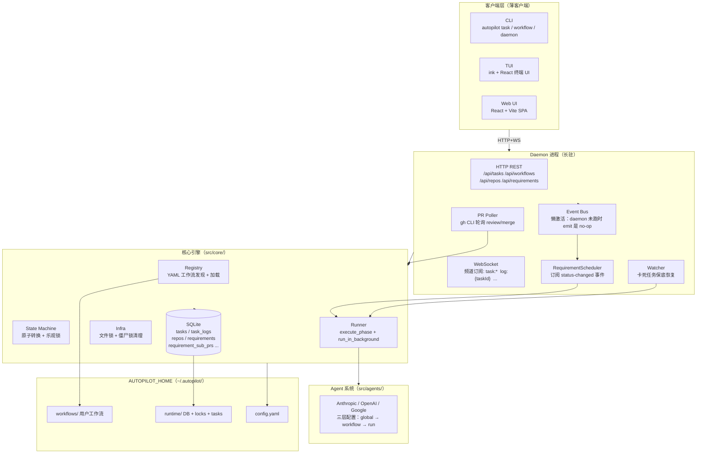
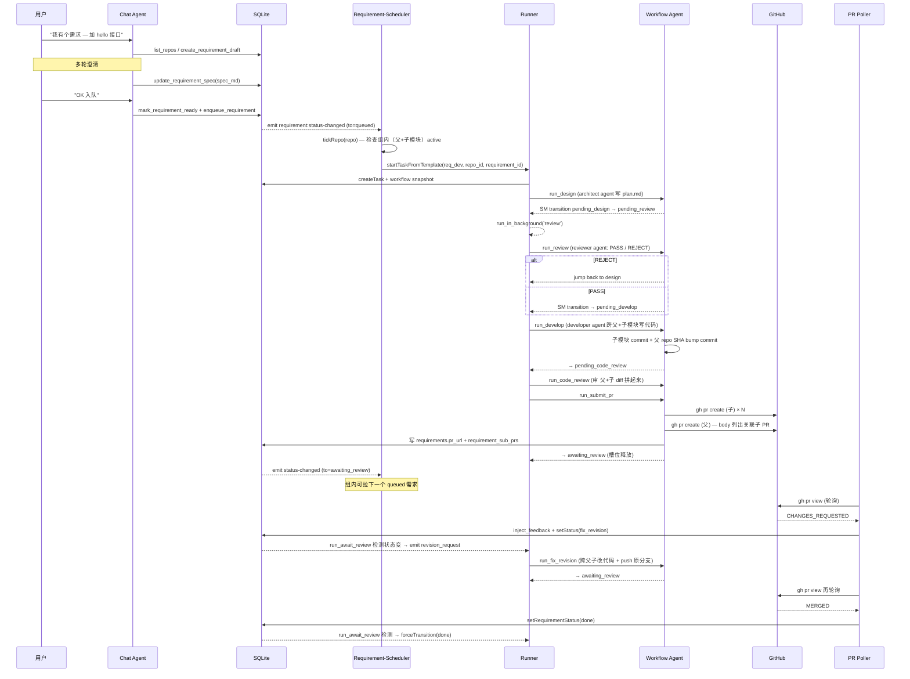

[中文](architecture.md) | [English](en/architecture.md)

# 架构总览

autopilot 是一个**轻量级多阶段任务编排引擎**，基于状态机 + Push 模型 + 插件化工作流。运行时是 Bun + TypeScript（早期 Python 版本已退役）。

## 核心定位

把"长流程的开发任务"（设计 → 评审 → 编码 → 代码审查 → 提 PR → 等 review → 修订 → 合并）拆成**离散阶段**，状态机驱动按顺序推进。每个阶段是独立的子进程，可挂 AI agent 跑实际工作。框架本身**不持有任何业务逻辑**——业务全部装在用户工作流里。

## 整体架构



**两个层面的解耦**：

1. **Daemon vs 客户端** — 核心引擎只跑在 daemon 进程里；CLI/TUI/Web 都是 HTTP+WS 客户端，没有"哪种 UI 才能用"的概念
2. **核心引擎 vs 工作流** — `src/core/` 不含任何业务知识，工作流以目录形式装在 `AUTOPILOT_HOME/workflows/<name>/`（YAML + TS）

## 进程模型

```
autopilot daemon start
  └─ supervisor 进程（保活 / 自动重启）
       └─ daemon 进程
            ├─ Bun.serve()  HTTP + WebSocket 同端口
            ├─ Event Bus    内存事件总线
            ├─ Watcher      定时扫卡死任务
            ├─ Requirement-Scheduler  订阅事件、按需创建 task
            └─ PR Poller    定时轮询 GitHub PR review/merge

autopilot task start <req-id>  ← CLI 是薄客户端，HTTP 调 daemon
autopilot tui                   ← 终端 UI，WebSocket 连 daemon
autopilot dashboard             ← 浏览器打开 daemon serve 的 SPA
```

每个**阶段函数**仍走 Push 模型：阶段完成后用 `runInBackground()` 派一个新子进程跑下一阶段；子进程退出后 daemon 继续处理事件。

## 核心模块职责

### `src/core/`（框架引擎，零业务知识）

| 模块 | 职责 |
|---|---|
| `db.ts` | SQLite 持久化、`tasks` / `task_logs` 等表的 CRUD；emit `task:created/updated`；导出 `TABLE_COLUMNS` / `PROTECTED_COLUMNS` 给上层校验 |
| `state-machine.ts` | 原子状态转换；从 registry 动态加载转换表；`db.transaction()` 事务 + 乐观锁；emit `task:transition` |
| `runner.ts` | 执行引擎：`execute_phase` 拿锁 → 跑阶段函数 → 释放；`run_in_background` 非阻塞 spawn 下一阶段；emit `phase:started/completed/error` |
| `registry.ts` | 启动时扫 `AUTOPILOT_HOME/workflows/`；加载 `workflow.yaml` + 同名 TS 模块；自动推导 `pending/running/trigger` 状态名；解析 `parallel:` 块生成 fork/join 转换 |
| `infra.ts` | 跨平台文件锁；启动时检查 PID 存活清僵尸锁 |
| `watcher.ts` | 定期扫 `running_*` 状态 + 无锁 + 超时的 task；按策略恢复（重试或失败）；emit `watcher:recovery` |
| `logger.ts` | 阶段标签日志；emit `log:entry` 让 WS 客户端实时订阅 |
| `migrate.ts` | DB 迁移引擎：扫 `src/migrations/NNN-*.ts`、按文件名前缀版本号顺序执行；用 `schema_version` 表追踪已应用版本 |
| `config.ts` | 加载 `config.yaml`、提取 `providers / agents / daemon / workspace_retention` 段 |
| `task-factory.ts` | 高层工厂：`startTaskFromTemplate` 创建 task 行 + 准备 workspace + 启动首阶段 |
| `workspace.ts` | `<HOME>/runtime/tasks/<id>/workspace/` 目录管理 + 模板拷贝；路径穿越防护 |
| `manifest.ts` | task 创建时 snapshot 当前 workflow 定义到 task 行（保证旧 task 在工作流改动后仍能读对状态机） |
| `repos.ts` / `repo-health.ts` | 仓库注册表 + git/origin 健康检查；`listRepos()` 默认过滤子模块 |
| `submodules.ts` / `gitmodules-parser.ts` | `.gitmodules` 解析 + 自动登记子模块为带 `parent_repo_id` 的 repos 行 |
| `requirements.ts` / `requirement-feedbacks.ts` / `requirement-sub-prs.ts` | 需求队列：状态机（10 状态）+ 反馈历史 + 子模块 PR 关联表 |
| `notify.ts` | 通知调度（委托工作流 `notify_func` 或全局通知后端） |

### `src/daemon/`（HTTP + WS + 事件订阅者）

| 模块 | 职责 |
|---|---|
| `index.ts` | Daemon 入口：`init → server → watcher → signal 处理` |
| `server.ts` | `Bun.serve()` 启动；HTTP+WS 同端口分流 |
| `routes.ts` | REST 路由：`/api/tasks /api/workflows /api/repos /api/requirements /api/agents /api/sessions` ... |
| `ws.ts` | WebSocket 连接管理 + 频道订阅分发；从 event-bus 拿事件按 channel 推到客户端 |
| `event-bus.ts` | 进程内事件总线；`enableBus()` 懒激活——core 模块 emit 时 daemon 没起也不报错 |
| `protocol.ts` | JSON 协议类型定义（`AutopilotEvent` 联合类型） |
| `pid.ts` | PID 文件管理 + 监听信息（host/port）持久化 |
| `supervisor.ts` | 子进程保活（daemon 异常退出时自动重启） |
| `requirement-scheduler.ts` | 订阅 `requirement:status-changed` 事件；`tickRepo` 算法（组级锁：父 + 子模块作为单一调度槽） |
| `pr-poller.ts` | 定时跑 `gh pr view` 拉所有 `awaiting_review` 状态需求的父 PR 状态：`CHANGES_REQUESTED` → `inject_feedback`；`MERGED` → `transition req → done` |

### `src/agents/`（LLM 调用封装）

| 模块 | 职责 |
|---|---|
| `agent.ts` | Agent 基类（spawn provider CLI + 收集输出 + 解析 usage） |
| `providers/anthropic.ts / openai.ts / google.ts` | 三大 provider 子类（凭证由对应 CLI 自身管理；autopilot 不存 token） |
| `registry.ts` | 命名 agent 缓存；解析三层配置：global `config.yaml.agents` → workflow `agents[]` 覆盖 → 运行时 `RunOptions` 覆盖 |
| `tools.ts` | chat agent 用的工具集（`list_repos / create_requirement_draft / inject_feedback / start_task ...`）+ workflow agent 用的 `ask_user` 工具 |
| `pending-questions.ts` | `ask_user` 工具的等待中 promise 注册表；用户在 UI 回答后 resolve |

## 数据流：req_dev workflow 完整生命周期

以"用户在 chat 给 reverse-bot-gui 提一个跨前后端需求"为例：



关键点：
- **scheduler 不直接调 runner**——它响应事件、拿 candidate、调 `task-factory.startTaskFromTemplate` 创建 task；后续阶段推进靠 Runner 的 Push 模型自然走完
- **chat 提需求 与 task 执行解耦**——requirement 是用户视角的对象（带状态线 + 反馈历史 + 关联 PR）；task 是工作流执行视角的对象。一对一映射但生命周期独立
- **PR Poller 单向**——它只读 GitHub 状态、写回 DB；不直接驱动 task 转换。runner 的 `run_await_review` 阶段函数自己轮询 DB 状态变化触发 jump

## 状态机驱动

每个工作流定义一组 phase，autopilot 自动给每个 phase 推导 4 类状态：

```yaml
- name: develop
  timeout: 1800
  reject: design   # 语法糖：自动生成 jump_trigger + jump_target
```

→ 自动展开为：
- `pending_develop`（前置态，等下一阶段被调度）
- `running_develop`（阶段函数执行中）
- 转换：`pending_develop --[start_develop]--> running_develop --[develop_complete]--> pending_<next>`
- 驳回：`running_develop --[develop_reject]--> review_rejected_develop --[retry_design]--> pending_design`

并行块（`parallel:` 块）会生成 fork/join 转换，主任务等所有子任务完成。

详见 [状态机文档](state-machine.md)。

## 用户空间：AUTOPILOT_HOME

框架代码与用户数据严格分离：

```
~/.autopilot/                    # 默认；可用 AUTOPILOT_HOME 环境变量覆盖
├── config.yaml                  # providers / agents / daemon / workspace_retention
├── workflows/                   # 用户工作流
│   └── req_dev/
│       ├── workflow.yaml        # 阶段定义（推导状态 + 转换）
│       └── workflow.ts          # 阶段函数 + setup_func + （可选）notify_func
├── prompts/                     # 用户提示词模板
└── runtime/
    ├── workflow.db              # SQLite
    ├── daemon.pid               # PID + 监听信息
    ├── locks/                   # 文件锁
    └── tasks/<task-id>/workspace/  # 任务工作区（templated）
```

**升级流程**：`git pull` 框架代码 → `bun run dev upgrade` 跑新迁移；用户数据原地保留。

## 设计决策

### 为什么 Push 模型而不是事件循环驱动？

每阶段独立子进程的 Push 模型给我们：
- **天然隔离**：单阶段崩溃不影响其他任务
- **简化超时**：每个进程只管自己的超时，不用嵌套
- **资源高效**：空闲时 0 CPU，daemon 也只是事件订阅

事件总线（在 Push 之上叠加）解决：
- WS 实时推送给客户端
- requirement-scheduler 响应 `status-changed` 事件创建 task
- pr-poller 异步把 GitHub 状态注入回 DB

### 并发控制：文件锁 + 事务双重保障

1. **文件锁**（`infra.acquireLock`）防止同一 task 被多个 phase 进程同时执行
2. **SQLite `db.transaction()` 事务**（bun:sqlite 的同步事务包装）防止状态读取-更新之间的竞态

文件锁还有 PID 存活检测：daemon 启动时清掉无主僵尸锁，避免上次 crash 后死锁。

### Watcher 作为 Push 的兜底

Push 偶尔会失败（spawn 进程失败 / OOM 杀子进程 / 阶段函数 hang），Watcher 定期扫 `running_*` 状态 + 锁文件不存在 + 时间超阈值的 task → 触发 `fail_trigger` 重试或 → 标 `failed`。

### Daemon 单进程：简化共享状态

需求队列、子模块组级锁、活跃 task 计数等都需要"一致视图"。单 daemon 进程让 event-bus 和内存数据结构（如 pending-questions）天然只有一份。多机扩展（如果有那天）走"daemon 集群 + DB 锁"路线。

### 框架零业务知识

`src/core/` 不允许引用任何工作流专属常量（如 phase 名 `design / develop`）。req_dev 业务全部装在 `examples/workflows/req_dev/workflow.ts` 里——包括跨父子 git 操作、`gh pr create`、子模块切分支、PR body 格式化。换工作流就换目录，框架不变。

详见 [工作流开发指南](workflow-development.md)。

---

## 相关文档

| 文档 | 说明 |
|---|---|
| [5 分钟快速入门](quickstart.md) | 从安装到跑通第一个 demo |
| [需求队列工作模式指南](requirement-queue.md) | 主用工作模式：chat 提需求 → 自动 PR |
| [req_dev workflow 指南](req-dev-workflow.md) | 内置工作流 7 阶段细节 |
| [状态机详解](state-machine.md) | 状态推导规则、驳回机制、完整状态图 |
| [工作流开发指南](workflow-development.md) | YAML 字段参考、阶段函数编写规范 |
| [插件开发指南](plugin-development.md) | 自定义工作流 / 通知后端 / Agent provider |
| [需求队列设计文档](superpowers/specs/2026-05-06-requirement-queue-design.md) | 需求队列模式的设计推演 |
| [子模块支持设计文档](superpowers/specs/2026-05-07-submodule-support-design.md) | P5 git submodule 集成的设计推演 |
| [FAQ 与故障排查](faq.md) | 常见问题与解决方案 |
