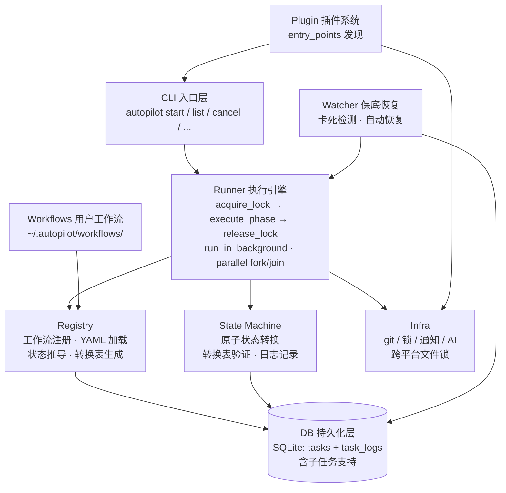
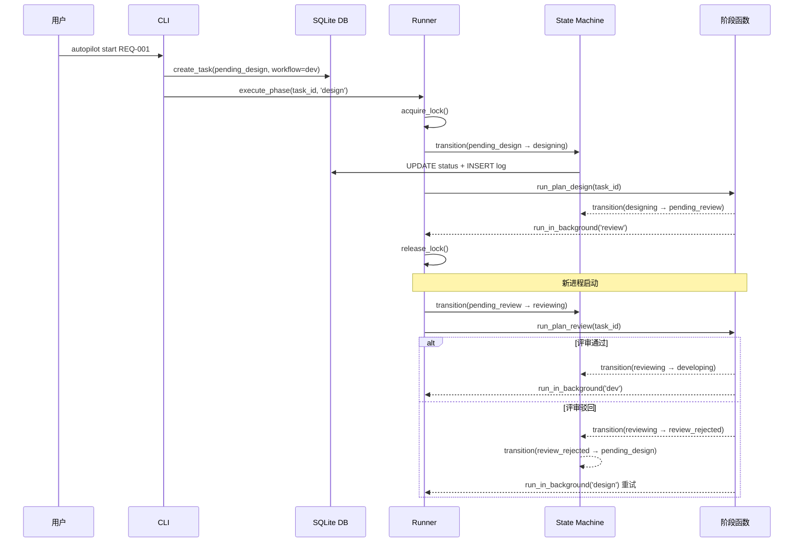

[中文](architecture.md) | [English](en/architecture.md)

# 架构总览

## 整体架构



<details>
<summary>ASCII 版本（终端 / 离线查看）</summary>

```
┌─────────────────────────────────────────────────────────────┐
│                      CLI 入口层                               │
│              autopilot start / list / cancel / ...           │
└──────┬──────────────────┬──────────────┬──────────────┬─────┘
       │                  │              │              │
┌──────▼──────────────────▼──────────────▼──────────────▼─────┐
│                      Runner（执行引擎）                       │
│  acquire_lock → execute_phase → release_lock                │
│  run_in_background（Push 推进下一阶段）                       │
│  execute_parallel_phase / check_parallel_completion（并行）   │
└──────┬──────────────────┬──────────────────────┬────────────┘
       │                  │                      │
┌──────▼───────┐  ┌───────▼──────────┐  ┌───────▼──────────┐
│  Registry    │  │  State Machine   │  │     Infra        │
│  工作流注册   │  │  原子状态转换     │  │  git/锁/通知/AI  │
│  YAML 加载   │  │  转换表验证       │  │  跨平台文件锁    │
│  状态推导     │  │  日志记录         │  │  AI CLI 调用     │
│  转换表生成   │  │                   │  │                  │
└──────┬───────┘  └───────┬──────────┘  └──────────────────┘
       │                  │
┌──────▼──────────────────▼──────────────────────────────────┐
│                     DB（持久化层）                           │
│  SQLite: tasks 表 + task_logs 表（含子任务支持）             │
└────────────────────────────────────────────────────────────┘
       │
┌──────▼────────────────────────────────────────────────────┐
│                   Workflows（插件层）                       │
│  dev/           完整开发流程（5 阶段，YAML + Python）       │
│  req_review/    需求评审（2 阶段，YAML + Python）           │
│  your_flow/     自定义工作流...                             │
└───────────────────────────────────────────────────────────┘
```

</details>

## 核心模块职责

### registry.py — 工作流注册中心

- 启动时自动扫描 `AUTOPILOT_HOME/workflows/` 目录
- 支持两种工作流格式：
  - **YAML + Python**（推荐）：子目录下 `workflow.yaml` + `workflow.py`
  - **单文件 Python**：`.py` 文件导出 `WORKFLOW` 字典
- 使用 `importlib.util.spec_from_file_location` 动态加载模块
- 从 phase `name` 自动推导 pending/running/trigger 等状态
- 支持 `parallel:` 并行阶段定义，生成 fork/join 转换

核心接口：

| 函数 | 用途 |
|------|------|
| `discover()` | 扫描并注册所有工作流模块 |
| `get_workflow(name)` | 获取工作流定义字典 |
| `get_phase_func(workflow, phase)` | 获取阶段执行函数 |
| `get_next_phase(workflow, phase)` | 获取下一阶段名 |
| `build_transitions(workflow)` | 生成或获取状态转换表 |
| `list_workflows()` | 列出已注册工作流及描述 |
| `load_yaml_workflow(wf_dir)` | 从目录加载 YAML 工作流 |
| `get_parallel_def(workflow, group)` | 获取并行组定义 |

### plugin.py — 插件系统

- 通过 `importlib.metadata.entry_points(group="autopilot.plugins")` 发现第三方插件
- 三个扩展点：通知后端（`notify_backends`）、CLI 命令（`cli_commands`）、全局钩子（`global_hooks`）
- 鸭子类型提取，不要求继承基类
- 幂等发现，失败隔离（单个插件加载失败只记日志）

核心接口：

| 函数 | 用途 |
|------|------|
| `discover()` | 扫描 entry_points 并注册扩展（幂等） |
| `get_notify_backend(type)` | 查询插件注册的通知后端 |
| `get_all_notify_backend_types()` | 所有插件通知类型名 |
| `get_cli_commands()` | 所有插件 CLI 命令 |
| `get_global_hooks(name)` | 指定名称的全局钩子列表 |

详见 [插件开发指南](plugin-development.md)。

### state_machine.py — 状态机

- 管理所有状态转换的合法性验证
- 使用 SQLite `BEGIN IMMEDIATE` 事务保证原子性
- 动态从 registry 加载转换表（支持多工作流）
- 每次转换自动写入 `task_logs` 审计表

核心接口：

| 函数 | 用途 |
|------|------|
| `transition(task_id, trigger)` | 执行原子状态转换 |
| `can_transition(task_id, trigger)` | 检查转换是否合法 |
| `get_available_triggers(task_id)` | 列出当前状态可用触发器名 |

### runner.py — 执行引擎

- `execute_phase()`：获取锁 → 查找阶段定义 → 执行转换 → 调用阶段函数 → 释放锁
- `run_in_background()`：通过 `subprocess.Popen` 非阻塞启动下一阶段
- `execute_parallel_phase()`：fork 创建子任务并行执行
- `check_parallel_completion()`：join 检查子任务完成状态
- 异常处理：捕获异常、记录 `failure_count`、通知用户

### infra.py — 基础设施

| 功能 | 函数 | 说明 |
|------|------|------|
| 文件锁 | `acquire_lock(task_id)` | 跨平台非阻塞排他锁 |
| | `release_lock(task_id)` | 释放锁 |
| | `is_locked(task_id)` | 检查锁状态 |
| 通知 | `notify(task, message)` | 调度通知（委托工作流 notify_func 或 notify 后端） |

### db.py — 数据库

- SQLite 持久化，WAL 模式
- `tasks` 表：精简 schema，只保留框架核心列（id, title, workflow, status, failure_count, channel, notify_target, extra, 时间戳, 并行字段）
- `extra` TEXT 列：JSON 格式，存储工作流自定义字段（如 req_id, project, repo_path 等）
- `get_task()` 自动将 extra JSON 合并到返回 dict，调用方直接 `task["repo_path"]` 无需关心存储位置
- `create_task(task_id, title, workflow, **extra)` — 非核心字段自动存入 extra JSON
- `update_task(task_id, **fields)` — 透明更新，框架自动区分列字段 vs extra
- `task_logs` 表：状态转换审计日志
- 子任务 CRUD：`create_sub_task()`、`get_sub_tasks()`、`all_sub_tasks_done()`

### logger.py — 日志

- 阶段标签格式：`YYYY-MM-DD HH:MM:SS [LEVEL] [PHASE_TAG] message`
- 支持同时输出到控制台和任务目录下的 `workflow.log`
- 阶段标签动态切换（从工作流定义的 `label` 字段获取）

### watcher.py — 保底恢复

- 检测条件：活跃状态 + 无锁 + 超过 600s
- 恢复策略：
  - 运行态：触发 `fail_trigger` 回退到 pending，重新执行
  - 等待态：直接重新执行阶段
  - `failure_count >= 3`：放弃重试，通知用户
- 并行支持：`waiting_*` 状态的父任务检查子任务卡死，不检查父任务本身

## 数据流：任务完整生命周期

以 `dev` 工作流为例：



<details>
<summary>文本版本（终端 / 离线查看）</summary>

```
用户执行: autopilot start <req_id> --project my-project
    │
    ▼
[1] 创建任务记录 (status: pending_design, workflow: dev)
    │
    ▼
[2] execute_phase(task_id, 'design')
    ├── acquire_lock ✓
    ├── transition: pending_design ──[start_design]──→ designing
    ├── run_plan_design(task_id)
    │   ├── 获取需求
    │   ├── 调用 AI 生成方案 → plan.md
    │   ├── transition: designing ──[design_complete]──→ pending_review
    │   └── run_in_background(task_id, 'review')  ← Push!
    └── release_lock
    │
    ▼ (新进程)
[3] execute_phase(task_id, 'review')
    ├── acquire_lock ✓
    ├── transition: pending_review ──[start_review]──→ reviewing
    ├── run_plan_review(task_id)
    │   ├── 读取 plan.md
    │   ├── 调用 AI 评审
    │   ├── 解析 REVIEW_RESULT: PASS / REJECT
    │   ├── 通过: transition ──[review_pass]──→ developing
    │   │   └── run_in_background(task_id, 'dev')  ← Push!
    │   └── 驳回: transition ──[review_reject]──→ review_rejected
    │       └── transition ──[retry_design]──→ pending_design
    │           └── run_in_background(task_id, 'design')  ← 重试!
    └── release_lock
    │
    ▼ (新进程，仅通过时)
[4-6] dev → code_review → pr → pr_submitted ✓
```

</details>

## 设计决策：Push 模型 vs 轮询模型

### 为什么选择 Push 模型？

**轮询模型**的问题：
- 需要一个长驻进程不断扫描数据库
- 轮询间隔带来延迟（间隔短浪费资源，间隔长响应慢）
- 嵌套超时难以管理

**Push 模型**的优势：
- **即时推进**：阶段完成后立刻启动下一阶段，零延迟
- **无长驻进程**：每个阶段是独立子进程，执行完即退出
- **资源高效**：不占用空闲时 CPU，只在有任务时消耗资源
- **天然隔离**：每个阶段进程独立，一个阶段崩溃不影响其他任务
- **简化超时**：每个进程只管自己的超时，不需要嵌套计算

**Watcher 作为保底**：Push 偶尔可能失败（进程启动失败），Watcher 定期扫描卡死任务并恢复，补偿了 Push 的不可靠性。

### 并发控制

文件锁 + SQLite 事务双重保障：

1. **文件锁**（`infra.acquire_lock`）：防止同一任务被多个进程同时执行
2. **SQLite 事务**（`BEGIN IMMEDIATE`）：防止状态转换竞态条件

两者缺一不可：
- 只有文件锁：状态读取和更新之间仍可能被打断
- 只有数据库事务：两个进程可能同时进入阶段函数执行重复工作
