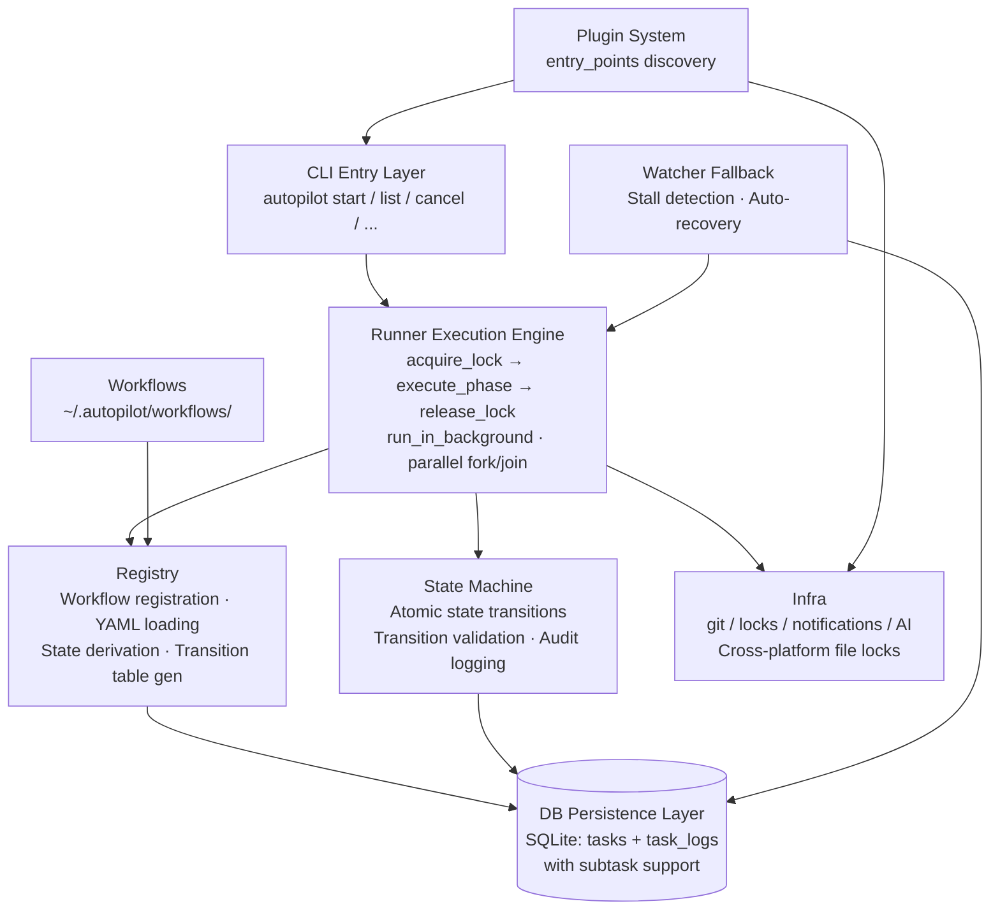
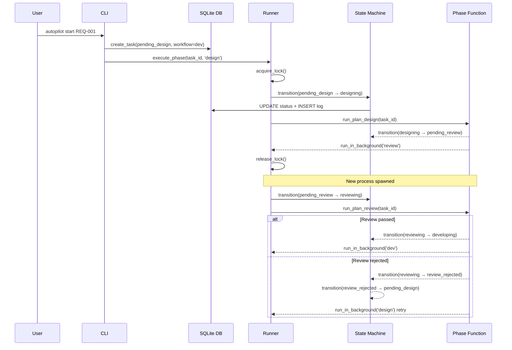

[中文](../architecture.md) | [English](architecture.md)

# Architecture Overview

## Overall Architecture



<details>
<summary>ASCII version (terminal / offline viewing)</summary>

```
┌─────────────────────────────────────────────────────────────┐
│                      CLI Entry Layer                          │
│              autopilot start / list / cancel / ...           │
└──────┬──────────────────┬──────────────┬──────────────┬─────┘
       │                  │              │              │
┌──────▼──────────────────▼──────────────▼──────────────▼─────┐
│                    Runner (Execution Engine)                   │
│  acquire_lock → execute_phase → release_lock                │
│  run_in_background (Push to next phase)                      │
│  execute_parallel_phase / check_parallel_completion (parallel)│
└──────┬──────────────────┬──────────────────────┬────────────┘
       │                  │                      │
┌──────▼───────┐  ┌───────▼──────────┐  ┌───────▼──────────┐
│  Registry    │  │  State Machine   │  │     Infra        │
│  Workflow    │  │  Atomic state    │  │  git/locks/      │
│  registration│  │  transitions     │  │  notifications/AI│
│  YAML loading│  │  Transition      │  │  Cross-platform  │
│  State       │  │  validation      │  │  file locks      │
│  derivation  │  │  Audit logging   │  │  AI CLI calls    │
│  Transition  │  │                   │  │                  │
│  table gen   │  │                   │  │                  │
└──────┬───────┘  └───────┬──────────┘  └──────────────────┘
       │                  │
┌──────▼──────────────────▼──────────────────────────────────┐
│                     DB (Persistence Layer)                    │
│  SQLite: tasks table + task_logs table (with subtask support)│
└────────────────────────────────────────────────────────────┘
       │
┌──────▼────────────────────────────────────────────────────┐
│                   Workflows (Plugin Layer)                   │
│  dev/           Full dev workflow (5 phases, YAML + Python) │
│  req_review/    Requirements review (2 phases, YAML + Python)│
│  your_flow/     Custom workflows...                         │
└───────────────────────────────────────────────────────────┘
```

</details>

## Core Module Responsibilities

### registry.py — Workflow Registry

- Automatically scans `AUTOPILOT_HOME/workflows/` directory on startup
- Supports two workflow formats:
  - **YAML + Python** (recommended): `workflow.yaml` + `workflow.py` in a subdirectory
  - **Single-file Python**: `.py` file exporting a `WORKFLOW` dictionary
- Uses `importlib.util.spec_from_file_location` for dynamic module loading
- Auto-derives pending/running/trigger states from phase `name`
- Supports `parallel:` parallel phase definitions, generating fork/join transitions

Core interface:

| Function | Purpose |
|----------|---------|
| `discover()` | Scan and register all workflow modules |
| `get_workflow(name)` | Get workflow definition dictionary |
| `get_phase_func(workflow, phase)` | Get phase execution function |
| `get_next_phase(workflow, phase)` | Get next phase name |
| `build_transitions(workflow)` | Generate or retrieve state transition table |
| `list_workflows()` | List registered workflows with descriptions |
| `load_yaml_workflow(wf_dir)` | Load YAML workflow from directory |
| `get_parallel_def(workflow, group)` | Get parallel group definition |

### plugin.py — Plugin System

- Discovers third-party plugins via `importlib.metadata.entry_points(group="autopilot.plugins")`
- Three extension points: notification backends (`notify_backends`), CLI commands (`cli_commands`), global hooks (`global_hooks`)
- Duck typing extraction, no base class inheritance required
- Idempotent discovery, failure isolation (single plugin load failure only logs a warning)

Core interface:

| Function | Purpose |
|----------|---------|
| `discover()` | Scan entry_points and register extensions (idempotent) |
| `get_notify_backend(type)` | Query plugin-registered notification backend |
| `get_all_notify_backend_types()` | All plugin notification type names |
| `get_cli_commands()` | All plugin CLI commands |
| `get_global_hooks(name)` | List of global hooks for a given name |

See [Plugin Development Guide](plugin-development.md) for details.

### state_machine.py — State Machine

- Manages validity verification of all state transitions
- Uses SQLite `BEGIN IMMEDIATE` transactions for atomicity
- Dynamically loads transition tables from registry (supports multiple workflows)
- Each transition automatically writes to the `task_logs` audit table

Core interface:

| Function | Purpose |
|----------|---------|
| `transition(task_id, trigger)` | Execute atomic state transition |
| `can_transition(task_id, trigger)` | Check if transition is valid |
| `get_available_triggers(task_id)` | List available trigger names for current state |

### runner.py — Execution Engine

- `execute_phase()`: acquire lock -> find phase definition -> execute transition -> call phase function -> release lock
- `run_in_background()`: non-blocking launch of next phase via `subprocess.Popen`
- `execute_parallel_phase()`: fork to create subtasks for parallel execution
- `check_parallel_completion()`: join to check subtask completion status
- Exception handling: catches exceptions, records `failure_count`, notifies user

### infra.py — Infrastructure

| Feature | Function | Description |
|---------|----------|-------------|
| File locks | `acquire_lock(task_id)` | Cross-platform non-blocking exclusive lock |
| | `release_lock(task_id)` | Release lock |
| | `is_locked(task_id)` | Check lock status |
| Notifications | `notify(task, message)` | Dispatch notification (delegates to workflow notify_func or notify backends) |

### db.py — Database

- SQLite persistence, WAL mode
- `tasks` table: minimal schema, only framework core columns (id, title, workflow, status, failure_count, channel, notify_target, extra, timestamps, parallel fields)
- `extra` TEXT column: JSON format, stores workflow-specific fields (e.g., req_id, project, repo_path)
- `get_task()` automatically merges extra JSON into returned dict, callers use `task["repo_path"]` directly without worrying about storage location
- `create_task(task_id, title, workflow, **extra)` — non-core fields automatically stored in extra JSON
- `update_task(task_id, **fields)` — transparent updates, framework auto-distinguishes column fields vs extra
- `task_logs` table: state transition audit logs
- Subtask CRUD: `create_sub_task()`, `get_sub_tasks()`, `all_sub_tasks_done()`

### logger.py — Logging

- Phase tag format: `YYYY-MM-DD HH:MM:SS [LEVEL] [PHASE_TAG] message`
- Supports simultaneous output to console and `workflow.log` in the task directory
- Dynamic phase tag switching (from workflow definition's `label` field)

### watcher.py — Fallback Recovery

- Detection criteria: active state + no lock + over 600s
- Recovery strategies:
  - Running state: trigger `fail_trigger` to roll back to pending, re-execute
  - Waiting state: directly re-execute the phase
  - `failure_count >= 3`: give up retrying, notify user
- Parallel support: parent tasks in `waiting_*` state check subtask stalls, not the parent task itself

## Data Flow: Complete Task Lifecycle

Using the `dev` workflow as an example:



<details>
<summary>Text version (terminal / offline viewing)</summary>

```
User executes: autopilot start <req_id> --project my-project
    │
    ▼
[1] Create task record (status: pending_design, workflow: dev)
    │
    ▼
[2] execute_phase(task_id, 'design')
    ├── acquire_lock ✓
    ├── transition: pending_design ──[start_design]──→ designing
    ├── run_plan_design(task_id)
    │   ├── Fetch requirements
    │   ├── Call AI to generate plan → plan.md
    │   ├── transition: designing ──[design_complete]──→ pending_review
    │   └── run_in_background(task_id, 'review')  ← Push!
    └── release_lock
    │
    ▼ (new process)
[3] execute_phase(task_id, 'review')
    ├── acquire_lock ✓
    ├── transition: pending_review ──[start_review]──→ reviewing
    ├── run_plan_review(task_id)
    │   ├── Read plan.md
    │   ├── Call AI for review
    │   ├── Parse REVIEW_RESULT: PASS / REJECT
    │   ├── Pass: transition ──[review_pass]──→ developing
    │   │   └── run_in_background(task_id, 'dev')  ← Push!
    │   └── Reject: transition ──[review_reject]──→ review_rejected
    │       └── transition ──[retry_design]──→ pending_design
    │           └── run_in_background(task_id, 'design')  ← Retry!
    └── release_lock
    │
    ▼ (new process, only on pass)
[4-6] dev → code_review → pr → pr_submitted ✓
```

</details>

## Design Decisions: Push Model vs Polling Model

### Why Push Model?

Problems with the **Polling Model**:
- Requires a long-running process to continuously scan the database
- Polling interval introduces latency (short intervals waste resources, long intervals slow response)
- Nested timeouts are difficult to manage

Advantages of the **Push Model**:
- **Instant progression**: next phase starts immediately after completion, zero delay
- **No long-running process**: each phase is an independent subprocess that exits after execution
- **Resource efficient**: no idle CPU usage, resources consumed only when tasks exist
- **Natural isolation**: each phase process is independent, one phase crash doesn't affect other tasks
- **Simplified timeouts**: each process manages only its own timeout, no nested calculations needed

**Watcher as fallback**: Push may occasionally fail (process launch failure), Watcher periodically scans for stalled tasks and recovers them, compensating for Push unreliability.

### Concurrency Control

File locks + SQLite transactions for dual protection:

1. **File locks** (`infra.acquire_lock`): prevent the same task from being executed by multiple processes simultaneously
2. **SQLite transactions** (`BEGIN IMMEDIATE`): prevent state transition race conditions

Both are essential:
- File locks only: state read and update can still be interrupted
- Database transactions only: two processes may simultaneously enter the phase function and perform duplicate work
