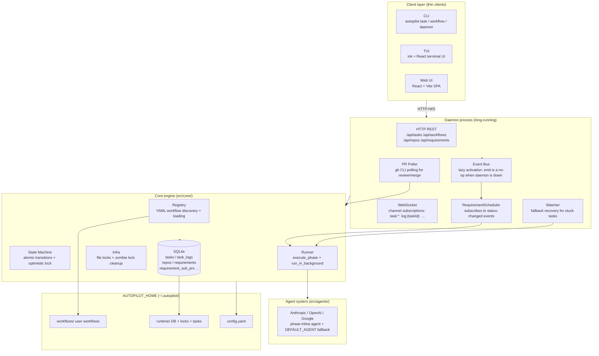
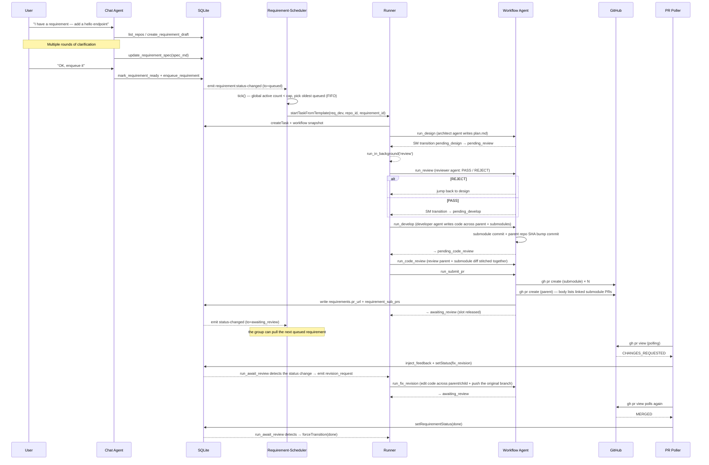

[中文](../architecture.md) | [English](architecture.md)

# Architecture Overview

autopilot is a **lightweight multi-phase task orchestration engine**, built on a state machine + Push model + pluggable workflows. The runtime is Bun + TypeScript (the early Python version has been retired).

## Core positioning

It splits a "long-running development task" (design → review → code → code review → submit PR → await review → revise → merge) into **discrete phases**, driven by a state machine that advances them in order. Each phase is an independent subprocess that can attach an AI agent to do the actual work. The framework itself **holds no business logic** — all business lives in user workflows.

## Overall architecture


```mermaid
graph TB
    subgraph Clients["Client layer (thin clients)"]
      CLI["CLI<br/>autopilot task / workflow / daemon"]
      TUI["TUI<br/>ink + React terminal UI"]
      WEB["Web UI<br/>React + Vite SPA"]
    end

    subgraph Daemon["Daemon process (long-running)"]
      HTTP["HTTP REST<br/>/api/tasks /api/workflows<br/>/api/repos /api/requirements"]
      WS["WebSocket<br/>channel subscriptions: task:*  log:{taskId}  ..."]
      EB["Event Bus<br/>lazy activation: emit is a no-op when daemon is down"]
      RS["RequirementScheduler<br/>subscribes to status-changed events"]
      PRP["PR Poller<br/>gh CLI polling for review/merge"]
      WCH["Watcher<br/>fallback recovery for stuck tasks"]
    end

    subgraph Core["Core engine (src/core/)"]
      Registry["Registry<br/>YAML workflow discovery + loading"]
      SM["State Machine<br/>atomic transitions + optimistic lock"]
      Runner["Runner<br/>execute_phase + run_in_background"]
      Infra["Infra<br/>file locks + zombie lock cleanup"]
      DB[("SQLite<br/>tasks / task_logs<br/>repos / requirements<br/>requirement_sub_prs ...")]
    end

    subgraph Agents["Agent system (src/agents/)"]
      AG["Anthropic / OpenAI / Google<br/>phase-inline agent + DEFAULT_AGENT fallback"]
    end

    subgraph Home["AUTOPILOT_HOME (~/.autopilot/)"]
      WF["workflows/ user workflows"]
      RT["runtime/ DB + locks + tasks"]
      CFG["config.yaml"]
    end

    Clients -->|HTTP+WS| Daemon
    Daemon --> Core
    Runner --> Agents
    Core --> DB
    Daemon --> EB
    EB --> RS
    RS --> Runner
    PRP --> Core
    WCH --> Runner
    Registry --> WF
    DB --> RT
    Core --> CFG
```

**Two levels of decoupling**:

1. **Daemon vs clients** — the core engine runs only in the daemon process; CLI/TUI/Web are all HTTP+WS clients, with no notion of "only this UI can do that"
2. **Core engine vs workflows** — `src/core/` contains no business knowledge; workflows are installed as directories under `AUTOPILOT_HOME/workflows/<name>/` (YAML + TS)

## Process model

```
autopilot daemon start
  └─ supervisor process (keep-alive / auto-restart)
       └─ daemon process
            ├─ Bun.serve()  HTTP + WebSocket on one port
            ├─ Event Bus    in-memory event bus
            ├─ Watcher      periodically scans stuck tasks
            ├─ Requirement-Scheduler  subscribes to events, creates tasks on demand
            └─ PR Poller    periodically polls GitHub PR review/merge

autopilot task start <req-id>  ← CLI is a thin client, calls daemon over HTTP
autopilot tui                   ← terminal UI, connects to daemon over WebSocket
autopilot dashboard             ← browser opens the SPA served by the daemon
```

Each **phase function** still follows the Push model: when a phase completes, `runInBackground()` spawns a new subprocess to run the next phase; after the subprocess exits, the daemon keeps processing events.

## Core module responsibilities

### `src/core/` (framework engine, zero business knowledge)

| Module | Responsibility |
|---|---|
| `db.ts` | SQLite persistence, CRUD for `tasks` / `task_logs` and other tables; emits `task:created/updated`; exports `TABLE_COLUMNS` / `PROTECTED_COLUMNS` for upper-layer validation |
| `state-machine.ts` | Atomic state transitions; dynamically loads the transition table from the registry; `db.transaction()` transactions + optimistic lock; emits `task:transition` |
| `runner.ts` | Execution engine: `execute_phase` acquires the lock → runs the phase function → releases; `run_in_background` non-blockingly spawns the next phase; emits `phase:started/completed/error` |
| `registry.ts` | At startup scans `AUTOPILOT_HOME/workflows/`; loads `workflow.yaml` + the same-named TS module; auto-derives `pending/running/trigger` state names; parses `parallel:` blocks into fork/join transitions |
| `infra.ts` | Cross-platform file locks; checks PID liveness at startup to clear zombie locks |
| `watcher.ts` | Periodically scans tasks in `running_*` state + no lock + timed out; recovers per policy (retry or fail); emits `watcher:recovery` |
| `logger.ts` | Phase-tagged logging; emits `log:entry` for WS clients to subscribe in real time |
| `migrate.ts` | DB migration engine: scans `src/migrations/NNN-*.ts`, runs them in order by filename prefix version; tracks applied versions with the `schema_version` table |
| `config.ts` | Loads `config.yaml`, extracts the `providers / daemon / workspace_retention` sections |
| `task-factory.ts` | High-level factory: `startTaskFromTemplate` creates the task row + prepares the workspace + starts the first phase |
| `workspace.ts` | Manages the `<HOME>/runtime/tasks/<id>/workspace/` directory + template copying; path traversal protection |
| `manifest.ts` | Snapshots the current workflow definition into the task row at creation time (so old tasks still read the correct state machine after workflow changes) |
| `repos.ts` / `repo-health.ts` | Repository registry + git/origin health check; `listRepos()` filters out submodules by default |
| `submodules.ts` / `gitmodules-parser.ts` | `.gitmodules` parsing + auto-registering submodules as repos rows with `parent_repo_id` |
| `requirements.ts` / `requirement-feedbacks.ts` / `requirement-sub-prs.ts` | Requirement queue: state machine (10 states) + feedback history + submodule PR association table |
| `notify.ts` | Notification dispatch (delegates to the workflow's `notify_func` or a global notification backend) |

### `src/daemon/` (HTTP + WS + event subscribers)

| Module | Responsibility |
|---|---|
| `index.ts` | Daemon entry: `init → server → watcher → signal handling` |
| `server.ts` | Starts `Bun.serve()`; HTTP+WS multiplexed on one port |
| `routes.ts` | REST routes: `/api/tasks /api/workflows /api/repos /api/requirements /api/agents /api/sessions` ... |
| `ws.ts` | WebSocket connection management + channel subscription dispatch; takes events from the event-bus and pushes to clients by channel |
| `event-bus.ts` | In-process event bus; `enableBus()` lazy activation — core modules emitting when the daemon is not up does not error |
| `protocol.ts` | JSON protocol type definitions (the `AutopilotEvent` union type) |
| `pid.ts` | PID file management + persisting listen info (host/port) |
| `supervisor.ts` | Subprocess keep-alive (auto-restart when the daemon exits abnormally) |
| `requirement-scheduler.ts` | Subscribes to `requirement:status-changed` events; `tick()` is a pure global-cap FIFO (active = count of running\|fix_revision ≤ `scheduler.max_concurrent_tasks`; queued requirements start in created_at order; per-repo serialization was removed since sandboxed clones make repos non-conflicting); also runs a catch-up tick on daemon startup to pick up stale queued requirements |
| `pr-poller.ts` | Periodically runs `gh pr view` to fetch parent PR status for all requirements in `awaiting_review`: `CHANGES_REQUESTED` → `inject_feedback`; `MERGED` → `transition req → done` |

### `src/agents/` (LLM call wrappers)

| Module | Responsibility |
|---|---|
| `agent.ts` | Agent base class (spawns the provider CLI + collects output + parses usage) |
| `providers/anthropic.ts / openai.ts / google.ts` | The three provider subclasses (credentials are managed by each CLI itself; autopilot stores no tokens) |
| `registry.ts` | Agent instance cache (keyed by `workflow:phase`); resolves each phase's inline `agent:` object, falling back to the built-in `DEFAULT_AGENT` when omitted, and falling back to `providers.<provider>.default_model` when `model` is unset |
| `tools.ts` | Tool set for the chat agent (`list_repos / create_requirement_draft / inject_feedback / start_task ...`) + the `ask_user` tool for workflow agents |
| `pending-questions.ts` | Registry of pending promises for the `ask_user` tool; resolved after the user answers in the UI |

## Data flow: full req_dev workflow lifecycle

Take "a user proposes a cross frontend/backend requirement for reverse-bot-gui in chat" as an example:


```mermaid
sequenceDiagram
    participant U as User
    participant Chat as Chat Agent
    participant DB as SQLite
    participant Sch as Requirement-Scheduler
    participant R as Runner
    participant A as Workflow Agent
    participant GH as GitHub
    participant PRP as PR Poller

    U->>Chat: "I have a requirement — add a hello endpoint"
    Chat->>DB: list_repos / create_requirement_draft
    Note over Chat,U: Multiple rounds of clarification
    Chat->>DB: update_requirement_spec(spec_md)
    U->>Chat: "OK, enqueue it"
    Chat->>DB: mark_requirement_ready + enqueue_requirement
    DB-->>Sch: emit requirement:status-changed (to=queued)

    Sch->>Sch: tick() — global active count < cap, pick oldest queued (FIFO)
    Sch->>R: startTaskFromTemplate(req_dev, repo_id, requirement_id)
    R->>DB: createTask + workflow snapshot
    R->>A: run_design (architect agent writes plan.md)
    A-->>R: SM transition pending_design → pending_review
    R-->>R: run_in_background('review')

    R->>A: run_review (reviewer agent: PASS / REJECT)
    alt REJECT
        A-->>R: jump back to design
    else PASS
        A-->>R: SM transition → pending_develop
    end

    R->>A: run_develop (developer agent writes code across parent + submodules)
    A->>A: submodule commit + parent repo SHA bump commit
    A-->>R: → pending_code_review

    R->>A: run_code_review (review parent + submodule diff stitched together)
    R->>A: run_submit_pr
    A->>GH: gh pr create (submodule) × N
    A->>GH: gh pr create (parent) — body lists linked submodule PRs
    A->>DB: write requirements.pr_url + requirement_sub_prs

    A-->>R: → awaiting_review (slot released)
    DB-->>Sch: emit status-changed (to=awaiting_review)
    Note over Sch: the group can pull the next queued requirement

    PRP->>GH: gh pr view (polling)
    GH-->>PRP: CHANGES_REQUESTED
    PRP->>DB: inject_feedback + setStatus(fix_revision)
    DB-->>R: run_await_review detects the status change → emit revision_request
    R->>A: run_fix_revision (edit code across parent/child + push the original branch)
    A-->>R: → awaiting_review

    PRP->>GH: gh pr view polls again
    GH-->>PRP: MERGED
    PRP->>DB: setRequirementStatus(done)
    DB-->>R: run_await_review detects → forceTransition(done)
```

Key points:
- **The scheduler does not call the runner directly** — it reacts to events, takes a candidate, and calls `task-factory.startTaskFromTemplate` to create the task; subsequent phase advancement flows naturally through the Runner's Push model
- **Proposing a requirement in chat is decoupled from task execution** — a requirement is a user-facing object (with a status line + feedback history + linked PRs); a task is a workflow-execution-facing object. One-to-one mapping but independent lifecycles
- **The PR Poller is one-directional** — it only reads GitHub state and writes back to the DB; it does not directly drive task transitions. The runner's `run_await_review` phase function polls the DB for status changes itself to trigger the jump

## State-machine driven

Each workflow defines a set of phases, and autopilot automatically derives 4 kinds of states per phase:

```yaml
- name: develop
  timeout: 1800
  reject: design   # syntactic sugar: auto-generates jump_trigger + jump_target
```

→ automatically expands to:
- `pending_develop` (the pre-state, waiting for the next phase to be scheduled)
- `running_develop` (the phase function is executing)
- transitions: `pending_develop --[start_develop]--> running_develop --[develop_complete]--> pending_<next>`
- reject: `running_develop --[develop_reject]--> review_rejected_develop --[retry_design]--> pending_design`

Parallel blocks (`parallel:` blocks) generate fork/join transitions; the main task waits for all subtasks to complete.

See the [state machine doc](state-machine.md) for details.

## User space: AUTOPILOT_HOME

Framework code and user data are strictly separated:

```
~/.autopilot/                    # default; overridable via the AUTOPILOT_HOME env var
├── config.yaml                  # providers / daemon / workspace_retention
├── workflows/                   # user workflows
│   └── req_dev/
│       ├── workflow.yaml        # phase definitions (derived states + transitions)
│       └── workflow.ts          # phase functions + setup_func + (optional) notify_func
├── prompts/                     # user prompt templates
└── runtime/
    ├── workflow.db              # SQLite
    ├── daemon.pid               # PID + listen info
    ├── locks/                   # file locks
    └── tasks/<task-id>/workspace/  # task workspace (templated)
```

**Upgrade flow**: `git pull` the framework code → `bun run dev upgrade` runs new migrations; user data is preserved in place.

## Design decisions

### Why the Push model instead of an event-loop driver?

The Push model with an independent subprocess per phase gives us:
- **Natural isolation**: a single phase crash does not affect other tasks
- **Simplified timeouts**: each process manages only its own timeout, no nesting
- **Resource efficient**: 0 CPU when idle, and the daemon is just an event subscriber

The event bus (layered on top of Push) solves:
- WS real-time push to clients
- the requirement-scheduler reacting to `status-changed` events to create tasks
- the pr-poller asynchronously injecting GitHub state back into the DB

### Concurrency control: file locks + transactions for double protection

1. **File locks** (`infra.acquireLock`) prevent the same task from being executed concurrently by multiple phase processes
2. **SQLite `db.transaction()` transactions** (the synchronous transaction wrapper of bun:sqlite) prevent races between reading and updating state

File locks also have PID liveness detection: at daemon startup, ownerless zombie locks are cleared to avoid deadlock after a prior crash.

### Watcher as the Push fallback

Push occasionally fails (process spawn failure / OOM killing the subprocess / phase function hang). The Watcher periodically scans tasks in `running_*` state + with no lock file + exceeding the time threshold → triggers `fail_trigger` to retry or → marks `failed`.

### Single daemon process: simplified shared state

The requirement queue, submodule group-level locks, active task counts, etc. all need a "consistent view". A single daemon process makes the event-bus and in-memory data structures (like pending-questions) naturally singular. Multi-machine scaling (if that day comes) goes the "daemon cluster + DB lock" route.

### Zero business knowledge in the framework

`src/core/` is not allowed to reference any workflow-specific constants (such as phase names `design / develop`). All req_dev business lives in `examples/workflows/req_dev/workflow.ts` — including cross parent/child git operations, `gh pr create`, submodule branching, and PR body formatting. Switch workflows by switching directories; the framework stays unchanged.

See the [workflow development guide](workflow-development.md) for details.

---

## Related docs

| Doc | Description |
|---|---|
| [5-minute quickstart](quickstart.md) | From install to running the first demo |
| [Requirement Queue working model guide](requirement-queue.md) | The primary working model: propose in chat → automatic PR |
| [req_dev workflow guide](req-dev-workflow.md) | Details of the built-in workflow's 7 phases |
| [State machine deep dive](state-machine.md) | State derivation rules, reject mechanism, full state diagram |
| [Workflow development guide](workflow-development.md) | YAML field reference, phase function authoring conventions |
| [Requirement Queue design doc](../superpowers/specs/2026-05-06-requirement-queue-design.md) | Design rationale for the requirement queue model |
| [Submodule support design doc](../superpowers/specs/2026-05-07-submodule-support-design.md) | Design rationale for P5 git submodule integration |
| [FAQ & troubleshooting](faq.md) | Common questions and solutions |
