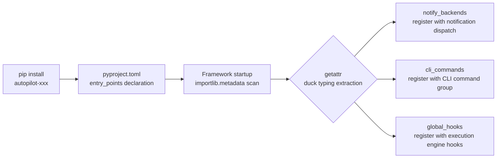
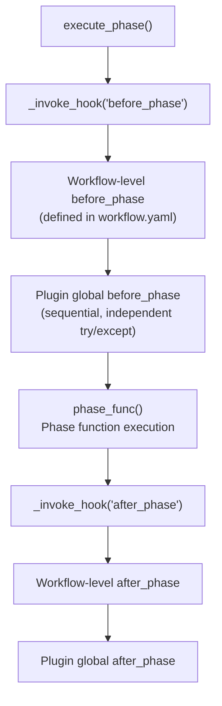

[中文](../plugin-development.md) | [English](plugin-development.md)

# Plugin Development Guide

This document guides you through developing third-party plugins for autopilot, which are auto-registered via `pip install` without modifying framework code.

## How It Works



<details>
<summary>Text version (terminal / offline viewing)</summary>

```
pip install autopilot-openclaw
        │
        ▼
  pyproject.toml declares entry_points
        │
        ▼
  Framework startup: importlib.metadata.entry_points(group="autopilot.plugins")
        │
        ▼
  Load plugin module, extract extensions via duck typing
        │
        ├── notify_backends → register with notification dispatch
        ├── cli_commands    → register with CLI command group
        └── global_hooks    → register with execution engine hooks
```

</details>

The framework automatically calls `discover_plugins()` in `core/workflows/__init__.py`, scanning all installed packages for `autopilot.plugins` entry_points. The discovery process is **idempotent**; a single plugin load failure only logs a warning without affecting other plugins or framework operation.

## Three Extension Points

| Extension Point | Attribute Name | Type | Description |
|----------------|----------------|------|-------------|
| Notification backends | `notify_backends` | `dict[str, Callable]` | Register new notification types (extend webhook/command) |
| CLI commands | `cli_commands` | `list[click.BaseCommand]` | Register new `autopilot` subcommands |
| Global hooks | `global_hooks` | `dict[str, Callable]` | Register cross-workflow phase hooks |

All attributes are **optional**; a plugin can implement just one or more of them.

## Quick Start

### 1. Project Structure

```
autopilot-openclaw/
├── pyproject.toml
└── autopilot_openclaw/
    ├── __init__.py          # Plugin entry module
    ├── notify.py            # Notification backend implementation (optional)
    ├── commands.py          # CLI command implementation (optional)
    └── hooks.py             # Global hook implementation (optional)
```

### 2. pyproject.toml

```toml
[project]
name = "autopilot-openclaw"
version = "0.1.0"
dependencies = ["autopilot"]

[project.entry-points."autopilot.plugins"]
openclaw = "autopilot_openclaw"
```

The `entry_points` key (`openclaw`) is the plugin name, and the value points to the plugin entry module.

### 3. Plugin Entry Module

```python
# autopilot_openclaw/__init__.py

from autopilot_openclaw.notify import send_openclaw
from autopilot_openclaw.commands import status_cmd
from autopilot_openclaw.hooks import audit_hook

# Notification backends: key is backend type name, value is send function
notify_backends = {
    "openclaw": send_openclaw,
}

# CLI commands: list of click command objects
cli_commands = [status_cmd]

# Global hooks: key must be before_phase / after_phase / on_phase_error
global_hooks = {
    "after_phase": audit_hook,
}
```

---

## Extension Point Details

### Notification Backends

Register new notification types; workflows use custom `type` in `notify_backends` configuration.

**Function signature:**

```python
def send_openclaw(backend: dict, variables: dict[str, str]) -> None:
    """
    Args:
        backend: Backend config dict from workflow notify_backends, containing type and custom fields
        variables: Template variables including message, event, task_id, title, workflow, etc.
    """
```

**Workflow configuration example:**

```yaml
notify_backends:
  - type: openclaw           # Matches plugin-registered type name
    api_key: "${OPENCLAW_KEY}"
    channel: "dev-alerts"
    events: ["success", "error"]
```

**Implementation example:**

```python
# autopilot_openclaw/notify.py
import urllib.request
import json

from core.notify import expand_env_vars

def send_openclaw(backend: dict, variables: dict[str, str]) -> None:
    # Plugins must call expand_env_vars() themselves to expand ${VAR} references
    api_key = expand_env_vars(backend.get("api_key", ""))
    channel = backend.get("channel", "default")
    payload = json.dumps({
        "channel": channel,
        "text": variables.get("message", ""),
        "task_id": variables.get("task_id", ""),
    }).encode()

    req = urllib.request.Request(
        "https://api.openclaw.dev/notify",
        data=payload,
        headers={"Authorization": f"Bearer {api_key}", "Content-Type": "application/json"},
    )
    urllib.request.urlopen(req, timeout=10)
```

Notification dispatch flow: `core/notify.dispatch()` first checks built-in types (webhook/command); if no match, it queries plugin-registered backends. Plugin backend types are also recognized as valid by `validate_backends()`.

> **Note**: Built-in webhook/command backends automatically expand `${VAR}` environment variables, but plugin backends receive the **raw config dictionary** and must call `expand_env_vars()` themselves.

### CLI Commands

Register new `autopilot` subcommands based on the [click](https://click.palletsprojects.com/) framework.

**Implementation example:**

```python
# autopilot_openclaw/commands.py
import click

@click.command("openclaw")
@click.argument("action", type=click.Choice(["status", "config"]))
def status_cmd(action):
    """OpenClaw plugin management"""
    if action == "status":
        click.echo("OpenClaw connection OK")
    elif action == "config":
        click.echo("Current config: ...")
```

You can also register command groups:

```python
@click.group("openclaw")
def openclaw_group():
    """OpenClaw plugin"""
    pass

@openclaw_group.command()
def status():
    """Check OpenClaw status"""
    click.echo("OK")

@openclaw_group.command()
def sync():
    """Sync data"""
    click.echo("Syncing...")

# In entry module
cli_commands = [openclaw_group]
```

Once registered, they are available:

```bash
autopilot openclaw status
autopilot openclaw sync
```

### Global Hooks

Register `before_phase` / `after_phase` / `on_phase_error` hooks across **all workflows**.

Global hooks execute **after** workflow-level hooks. Each hook has independent `try/except`; exceptions are only logged and do not interrupt the main flow.

**Function signatures:**

```python
def my_before_phase(task_id: str, phase: str) -> None: ...
def my_after_phase(task_id: str, phase: str) -> None: ...
def my_on_phase_error(task_id: str, phase: str, error: Exception) -> None: ...
```

**Implementation example:**

```python
# autopilot_openclaw/hooks.py
from core.db import get_task
from core.logger import get_logger

log = get_logger()

def audit_hook(task_id: str, phase: str) -> None:
    """Record audit log after phase completion"""
    task = get_task(task_id)
    if not task:
        return
    log.info("[Audit] Task %s completed phase %s, current status: %s",
             task_id, phase, task["status"])
```

**Execution order:**



<details>
<summary>Text version (terminal / offline viewing)</summary>

```
execute_phase()
  │
  ├── _invoke_hook("before_phase")
  │     ├── workflow hooks.before_phase()     ← Workflow-level (defined in workflow.yaml)
  │     └── plugin global_hooks.before_phase  ← Plugin global hooks (sequential, independent try/except)
  │
  ├── phase_func()                            ← Phase function execution
  │
  └── _invoke_hook("after_phase")
        ├── workflow hooks.after_phase()
        └── plugin global_hooks.after_phase
```

</details>

---

## Accessing Framework API from Plugins

Plugins are regular Python packages and can directly import framework modules:

```python
from core.db import get_task, list_tasks, get_active_tasks, get_task_stats, get_sub_tasks, get_task_logs
from core.registry import get_workflow, list_workflows
from core.notify import expand_env_vars
from core.config import load_config
from core.logger import get_logger
```

**Common query APIs:**

| Function | Purpose |
|----------|---------|
| `get_task(task_id)` | Get single task details (including extra fields) |
| `list_tasks(status, workflow, limit)` | Query task list by criteria |
| `get_active_tasks()` | Get all active (non-terminal) tasks |
| `get_task_stats()` | Task statistics (total, success rate, duration, distribution) |
| `get_sub_tasks(parent_id)` | Get parallel subtask list |
| `get_task_logs(task_id, limit)` | Get state change logs |
| `get_workflow(name)` | Get workflow definition |
| `list_workflows()` | List all registered workflows |

---

## Plugin Query API

The `core/plugin` module provides interfaces to query registered plugin extensions:

| Function | Return Type | Purpose |
|----------|-------------|---------|
| `get_notify_backend(type)` | `Callable \| None` | Query notification backend by type |
| `get_all_notify_backend_types()` | `set[str]` | All plugin-registered notification type names |
| `get_cli_commands()` | `list` | All plugin-registered CLI commands |
| `get_global_hooks(name)` | `list[Callable]` | List of global hooks for a given name |

---

## Testing Plugins

### Unit Testing

Use `_reset()` to isolate plugin state between tests (the framework's `tests/conftest.py` includes an autouse fixture):

```python
from core.plugin import _register_plugin, _reset, get_notify_backend
from types import SimpleNamespace
from unittest.mock import MagicMock

def test_my_backend():
    handler = MagicMock()
    module = SimpleNamespace(notify_backends={"openclaw": handler})
    _register_plugin("test", module)

    assert get_notify_backend("openclaw") is handler

    # _reset() is automatically called after each test (autouse fixture)
```

### Integration Testing

Verify the discovery mechanism after installing the plugin:

```python
from core.plugin import discover, get_all_notify_backend_types

discover()
assert "openclaw" in get_all_notify_backend_types()
```

---

## Important Notes

- **Idempotent discovery**: `discover()` only scans once across multiple calls; use `_reset()` to re-discover
- **Failure isolation**: a single plugin load failure only logs a warning, without affecting the framework or other plugins
- **Hook name whitelist**: `global_hooks` keys must be `before_phase`, `after_phase`, or `on_phase_error`; other names are ignored
- **Duck typing**: the framework extracts extension attributes via `getattr`, no base class inheritance or Protocol implementation required
- **Python compatibility**: `importlib.metadata.entry_points` is compatible with Python 3.10+ (consistent with framework requirements)
- **Environment variable expansion**: the framework does not automatically expand `${VAR}` for plugin backends; plugins must call `expand_env_vars()` themselves

## Complete Reference Implementation

See [`examples/plugins/autopilot-webui/`](../examples/plugins/autopilot-webui/): a stdlib-based WebUI management interface plugin that demonstrates the complete usage of the `cli_commands` extension point (`pyproject.toml` registration + `__init__.py` export + CLI command implementation).

<!-- TODO: Add WebUI screenshots

-->

---

## Related Documentation

| Document | Description |
|----------|-------------|
| [5-Minute Quickstart](quickstart.md) | From installation to running your first demo |
| [Architecture Overview](architecture.md) | Overall architecture, module responsibilities, data flow |
| [Workflow Development Guide](workflow-development.md) | YAML syntax, phase function guidelines |
| [State Machine Details](state-machine.md) | Transition tables, rejection mechanism, state diagrams |
| [FAQ & Troubleshooting](faq.md) | Common issues and solutions |
