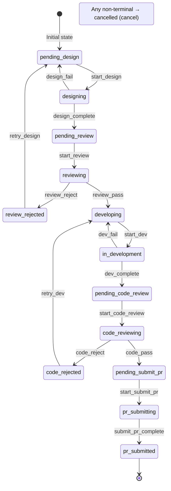
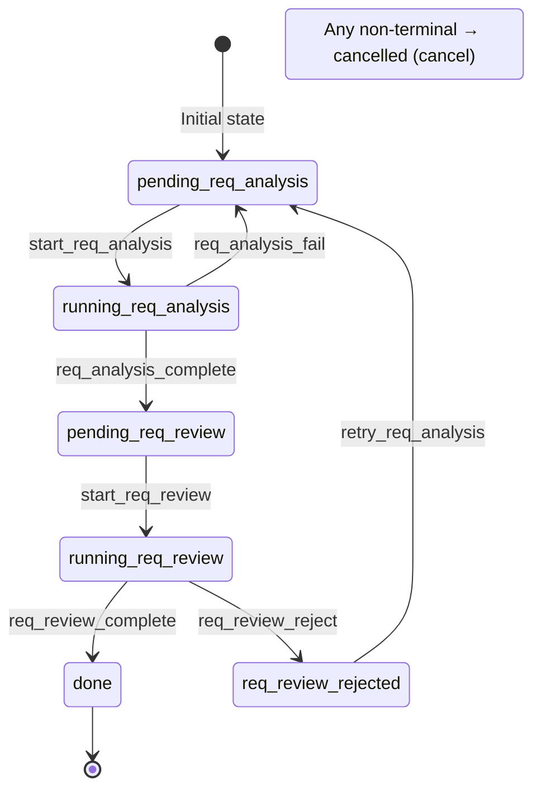
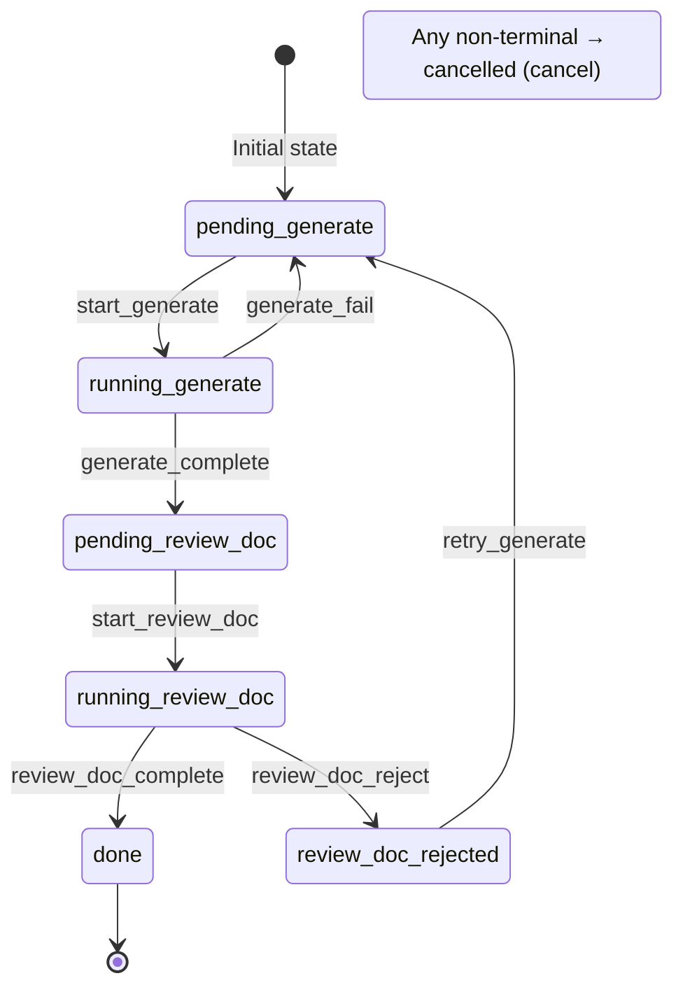

[中文](../state-machine.md) | [English](state-machine.md)

# State Machine Details

## Transition Table Structure

The transition table is a dictionary where keys are current states and values are lists of `(trigger, target_state)` tuples available from that state:

```python
{
    'state_a': [
        ('trigger_1', 'state_b'),   # state_a + trigger_1 → state_b
        ('trigger_2', 'state_c'),   # state_a + trigger_2 → state_c
        ('cancel', 'cancelled'),    # Any non-terminal state can be cancelled
    ],
    'state_b': [
        ('trigger_3', 'state_d'),
        ('cancel', 'cancelled'),
    ],
    # ...
}
```

## Dynamic Transition Table Lookup

The state machine dynamically loads the transition table on each transition:

```
transition(task_id, trigger)
    │
    ▼
_resolve_transitions(task_id, conn)
    ├── Query task.workflow field
    ├── registry.build_transitions(workflow_name)
    │   ├── Workflow has 'transitions' field? → return directly
    │   └── Otherwise auto-generate from 'phases'
    └── Fallback: return empty transition table {}
```

This means:
- Different workflows can have completely different state spaces
- Adding new workflows requires no changes to `state_machine.py`
- Transition table validation occurs at runtime

## Atomic Transition Process

Each `transition()` call performs the following atomic operations:

```sql
BEGIN IMMEDIATE;                              -- Acquire exclusive write lock
SELECT status, workflow FROM tasks WHERE id = ?;  -- Read current state
-- Python: verify (current_state, trigger) exists in transition table
UPDATE tasks SET status = ?, updated_at = ?, ...  -- Update state
    WHERE id = ?;
INSERT INTO task_logs (task_id, from_status,       -- Write audit log
    to_status, trigger, note, created_at) VALUES ...;
COMMIT;                                        -- Commit (all succeed or all rollback)
```

If the trigger is invalid, an `InvalidTransitionError` is raised and the transaction rolls back.

## Jump Mechanism

The underlying implementation uses `jump_trigger` / `jump_target` for direction-agnostic phase jumping.

### reject Syntactic Sugar

`reject` is syntactic sugar for jump, only allowing backward jumps (target must be before the current phase):

```yaml
- name: review
  reject: design     # Syntactic sugar, expands to jump_trigger + jump_target
```

Expands to the equivalent:
```yaml
- name: review
  jump_trigger: review_reject
  jump_target: design
```

### Rejection Transition Process

Rejection is a two-step transition process:

```
reviewing ──[review_reject]──→ review_rejected ──[retry_design]──→ pending_design
   │                                                                     │
   │            Step 1: Mark as rejected state                           │
   │                                                                     │
   └─── Step 2: Roll back from rejected state to target phase's ────────┘
        pending state
```

### Direct Jump

Using `jump_trigger` / `jump_target` directly allows jumping to any phase (both forward and backward):

```yaml
- name: step1
  jump_trigger: step1_jump
  jump_target: step3    # Can jump to a later phase
```

### Rejection Count

- `rejection_counts` is a JSON field: `{"design": 2, "code": 0}`
- Each rejection increments the corresponding phase count
- Exceeding `max_rejections` (default 10) automatically cancels the task

### Compatibility

Legacy fields `reject_trigger` / `retry_target` can still be used and are automatically mapped to `jump_trigger` / `jump_target`.

## Terminal States and Active States

**Terminal states**: once a task reaches a terminal state, no further transitions are allowed (`cancel` included — terminal states themselves cannot be cancelled).

Determination method:
```python
# Workflow-defined terminal states
terminal_states = registry.get_terminal_states(workflow_name)
# e.g.: ['pr_submitted', 'cancelled']

# Active states = all states - terminal states
active_states = [s for s in all_states if s not in terminal_states]
```

Watcher only monitors tasks in active states.

## dev Workflow Complete State Diagram



<details>
<summary>ASCII version (terminal / offline viewing)</summary>

```
                                    ┌──────────────────┐
                                    │  pending_design   │ ← Initial state
                                    └────────┬─────────┘
                                             │ start_design
                                    ┌────────▼─────────┐
                              ┌─────│    designing      │
                              │     └────────┬─────────┘
                   design_fail│              │ design_complete
                              │     ┌────────▼─────────┐
                              └────→│  pending_review   │
                                    └────────┬─────────┘
                                             │ start_review
                                    ┌────────▼─────────┐
                              ┌─────│    reviewing      │─────┐
                              │     └──────────────────┘     │
                   review_reject                              │ review_pass
                              │                               │
                    ┌─────────▼────────┐             ┌───────▼─────────┐
                    │ review_rejected   │             │   developing     │
                    └─────────┬────────┘             └───────┬─────────┘
                              │ retry_design                  │ start_dev
                              │                      ┌───────▼─────────┐
                    ┌─────────▼──────┐         ┌─────│ in_development   │
                    │ pending_design  │         │     └───────┬─────────┘
                    └────────────────┘  dev_fail│             │ dev_complete
                                               │     ┌───────▼─────────┐
                                               └────→│ code_reviewing   │─────┐
                                                      └───────┬─────────┘     │
                                                   code_reject│               │ code_pass
                                                      ┌───────▼─────────┐     │
                                                      │ code_rejected    │     │
                                                      └───────┬─────────┘     │
                                                              │ retry_dev     │
                                                      ┌───────▼─────────┐     │
                                                      │ in_development   │     │
                                                      └─────────────────┘     │
                                                                              │
                                                                     ┌───────▼─────────┐
                                                                     │  pr_submitting   │
                                                                     └───────┬─────────┘
                                                                             │
                                                                     ┌───────▼─────────┐
                                                                     │  pr_submitted ✓  │ ← Terminal state
                                                                     └─────────────────┘

                        Any non-terminal state ──[cancel]──→ cancelled ✓  ← Terminal state
```

</details>

## req_review Workflow Complete State Diagram



<details>
<summary>ASCII version (terminal / offline viewing)</summary>

```
                                    ┌──────────────────────┐
                                    │  pending_analysis     │ ← Initial state
                                    └────────┬─────────────┘
                                             │ start_analysis
                                    ┌────────▼─────────────┐
                              ┌─────│    analyzing          │
                              │     └────────┬─────────────┘
                 analysis_fail│              │ analysis_complete
                              │     ┌────────▼─────────────┐
                              └────→│ pending_req_review    │
                                    └────────┬─────────────┘
                                             │ start_req_review
                                    ┌────────▼─────────────┐
                              ┌─────│  req_reviewing        │─────┐
                              │     └──────────────────────┘     │
                 req_review_reject                                │ req_review_pass
                              │                                   │
                    ┌─────────▼──────────────┐          ┌────────▼──────────┐
                    │ req_review_rejected     │          │ req_review_done ✓ │ ← Terminal state
                    └─────────┬──────────────┘          └───────────────────┘
                              │ retry_req_analysis
                              │
                    ┌─────────▼──────────────┐
                    │  pending_analysis       │
                    └────────────────────────┘

                        Any non-terminal state ──[cancel]──→ cancelled ✓  ← Terminal state
```

</details>

## doc_gen Workflow State Diagram



## Common Operations

### Query Available Actions for a Task

```python
from core.state_machine import get_available_triggers

triggers = get_available_triggers(task_id)
# Returns e.g.: ['start_design', 'cancel']
```

### Check Transition Validity

```python
from core.state_machine import can_transition

if can_transition(task_id, 'review_pass'):
    transition(task_id, 'review_pass')
```

### Manually Cancel a Task

```python
from core.state_machine import transition

transition(task_id, 'cancel', note='Manually cancelled by user')
```
