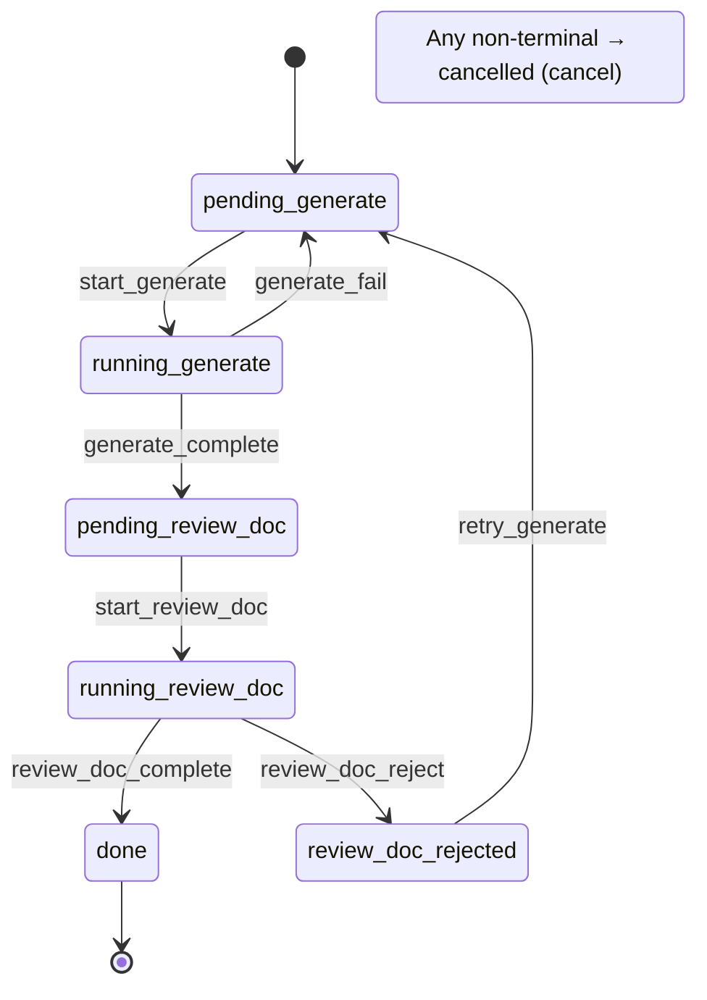

[中文](../workflow-development.md) | [English](workflow-development.md)

# Workflow Development Guide

This document guides you through creating custom workflows for autopilot.

## Two Definition Approaches

### Approach 1: YAML Workflow (Recommended)

Directory-paired format, one directory per workflow:

```
~/.autopilot/workflows/
├── my_workflow/
│   ├── workflow.yaml    # Workflow definition (structure, phases, states)
│   └── workflow.py      # Phase functions (Python code)
```

### Approach 2: Single-file Python Workflow

A single `.py` file placed in `~/.autopilot/workflows/`, exporting a `WORKFLOW` dictionary.

---

## YAML Workflow Definition

### Minimal Syntax (Auto-derived States)

```yaml
name: doc_gen
description: Automatic document generation and review

phases:
  - name: generate
    timeout: 600

  - name: review_doc
    timeout: 600
    reject: generate        # Syntactic sugar: auto-generates rejection + retry logic
    max_rejections: 5
```

Equivalent full syntax:

```yaml
name: doc_gen
description: Automatic document generation and review
initial_state: pending_generate
terminal_states: [done, cancelled]

phases:
  - name: generate
    label: GENERATE
    pending_state: pending_generate
    running_state: running_generate
    trigger: start_generate
    complete_trigger: generate_complete
    fail_trigger: generate_fail
    timeout: 600
    func: run_generate

  - name: review_doc
    label: REVIEW_DOC
    pending_state: pending_review_doc
    running_state: running_review_doc
    trigger: start_review_doc
    complete_trigger: review_doc_complete
    jump_trigger: review_doc_reject
    jump_target: generate
    max_rejections: 5
    timeout: 600
    func: run_review_doc
```

### Auto-derivation Rules

Auto-generated from phase `name` (using `design` as an example):

| Field | Derived Value |
|-------|--------------|
| `pending_state` | `pending_design` |
| `running_state` | `running_design` |
| `trigger` | `start_design` |
| `complete_trigger` | `design_complete` |
| `fail_trigger` | `design_fail` |
| `label` | `DESIGN` |
| `func` | `run_design` (looked up in workflow.py) |

Workflow-level derivation:
- `initial_state`: defaults to the first phase's `pending_state` if not specified
- `terminal_states`: defaults to `[done, cancelled]` if not specified

### `reject` Syntactic Sugar (Backward Jump Only)

```yaml
- name: review
  reject: design
  max_rejections: 10
```

Auto-expands to:
```yaml
- name: review
  jump_trigger: review_reject
  jump_target: design
  max_rejections: 10
```

Note: the `reject` target must be before the current phase; otherwise validation will fail.

### `jump_trigger` / `jump_target` (Any Direction Jump)

Using the underlying fields directly allows jumping to any phase (forward or backward):

```yaml
- name: step2
  jump_trigger: step2_skip
  jump_target: step4    # Can jump forward
```

### Legacy Field Compatibility

Legacy fields `reject_trigger` / `retry_target` can still be used and are automatically mapped to `jump_trigger` / `jump_target`.

### Function Binding

The `func` field in YAML is a string corresponding to a function name in `workflow.py`:

```yaml
func: my_custom_func    # → my_custom_func() in workflow.py
```

When `func` is omitted, the `run_{phase_name}` convention is used automatically.

Supported function binding fields:
- `phases[].func` — phase execution function
- `setup_func` — task initialization hook
- `notify_func` — notification function
- `hooks.before_phase` / `hooks.after_phase` / `hooks.on_phase_error`

### transitions Format

When writing transitions manually in YAML, use list format:

```yaml
transitions:
  pending_design:
    - [start_design, designing]
    - [cancel, cancelled]
  designing:
    - [design_complete, pending_review]
    - [design_fail, pending_design]
    - [cancel, cancelled]
```

When the `transitions` field is not provided, transitions are auto-generated from `phases` (recommended).

---

## Parallel Phases

### YAML Syntax

```yaml
phases:
  - name: design
    timeout: 900

  - parallel:
      name: development              # Parallel group name
      fail_strategy: cancel_all      # cancel_all (default) | continue
      phases:
        - name: frontend
          timeout: 1800
        - name: backend
          timeout: 1800

  - name: code_review
    timeout: 1200
```

### Execution Flow

1. When the parent task reaches the parallel group, its status transitions to `waiting_{group_name}`
2. Independent subtasks are created for each sub-phase (subtask ID: `{parent_id}__{phase_name}`)
3. Subtasks execute in parallel, each with independent lock, status, and logs
4. All subtasks complete -> parent task automatically transitions to the next phase
5. If any subtask fails:
   - `fail_strategy: cancel_all` (default) -> cancel all sibling subtasks, parent task rolls back
   - `fail_strategy: continue` -> wait for other subtasks to complete

### Database Fields

Subtasks use the tasks table's core columns:
- `parent_task_id` — parent task ID
- `parallel_index` — index within the parallel group
- `parallel_group` — parallel group name

Subtasks automatically inherit the parent task's `extra` JSON field.

### CLI Behavior

- `list`: subtasks are hidden by default; use `--all` to show them
- `show`: for parent tasks, displays subtask list; for subtasks, displays parent task ID
- `cancel`: cancelling a parent task cascades to cancel all subtasks

---

## WORKFLOW Dictionary Structure (Single-file Python Workflow)

```python
WORKFLOW = {
    # === Required ===
    'name': str,                # Unique workflow identifier
    'phases': list[dict],       # Phase definition list

    # === Optional ===
    'description': str,
    'initial_state': str,       # Default: first phase's pending_state
    'terminal_states': list,    # Default: ['done', 'cancelled']
    'transitions': dict,        # Auto-generated if not provided
    'setup_func': callable,     # Task initialization hook
    'notify_func': callable,    # Notification implementation
    'notify_backends': list,    # Multi-backend notification config
    'hooks': dict,              # before_phase / after_phase / on_phase_error
    'retry_policy': dict,       # Retry policy
}
```

## Phase Definition Fields

```python
{
    'name': str,                # Phase identifier
    'label': str,               # Log tag (YAML auto-derives as NAME.upper())
    'trigger': str | None,      # Trigger to enter running state
    'pending_state': str,       # Pending state name
    'running_state': str,       # Running state name
    'complete_trigger': str,    # Completion trigger
    'fail_trigger': str | None, # Failure trigger (returns to pending for retry)
    'jump_trigger': str | None,     # Jump trigger (generated from reject syntactic sugar)
    'jump_target': str | None,      # Jump target phase name
    'max_rejections': int,      # Maximum rejection count (default 10)
    'func': callable,           # Phase execution function
}
```

## Transition Table: Auto-generated vs Manual

### Auto-generated (Recommended)

When `transitions` field is not provided, `registry.build_transitions()` auto-generates from `phases`:

- `pending_state` -> `(trigger, running_state)`
- `running_state` -> `(complete_trigger, next_pending_state)`
- With `fail_trigger`: `running_state` -> `(fail_trigger, pending_state)`
- With `jump_trigger`: generates rejection and retry transitions
- All non-terminal states include `(cancel, cancelled)`
- `parallel` phases auto-generate fork/join transitions

### Manual

Only needed for complex flows requiring non-linear routing:

```yaml
transitions:
  state_a:
    - [trigger1, state_b]
    - [trigger2, state_c]  # Conditional branching
```

## Task Data Storage

The framework schema retains only core columns; workflow-specific fields are stored in `extra` JSON:

```python
# Create task: core fields passed explicitly, rest auto-stored in extra
create_task(
    task_id="T001",
    title="My Task",
    workflow="dev",
    channel="telegram",
    notify_target="chat-id",
    # Everything below stored in extra JSON
    req_id="REQ-001",
    project="my-project",
    repo_path="/path/to/repo",
    branch="feat/T001",
    agents={"dev": "claude"},
)

# Read: extra fields auto-expanded, direct access
task = get_task("T001")
task["repo_path"]  # Directly accessible, no need to worry about storage location
task["project"]    # Same

# Update: transparent distinction between column fields vs extra
update_task("T001", pr_url="https://...", failure_count=1)
```

## Phase Function Writing Guidelines

### Writing Pattern

```python
def run_my_phase(task_id: str) -> None:
    # 1. Get task info (extra fields auto-expanded)
    task = get_task(task_id)

    # 2. Prepare inputs
    plan = (task_dir / "plan.md").read_text()

    # 3. Execute core logic (direct access to extra fields)
    result = my_execute(prompt, repo_path=task['repo_path'])

    # 4. Save artifacts
    (task_dir / "output.md").write_text(result)

    # 5. State transition (extra_updates also transparently distinguished)
    transition(task_id, 'my_phase_complete')

    # 6. Push next phase
    run_in_background(task_id, 'next_phase')
```

### Important Notes

- **Do not manually manage locks**: `execute_phase()` acquires locks automatically
- **Do not swallow exceptions**: let exceptions propagate; Runner will catch and log them
- **Transition before Push**: call `transition()` before `run_in_background()`
- **Transparent field storage**: `get_task()` auto-expands extra; developers need not worry about whether a field is in a column or JSON

## Human-in-the-loop (Gate & ask_user)

Workflows are fully automatic by default — all phases run end to end. But sometimes you need a human in the loop. autopilot ships two built-in mechanisms, and **workflow authors barely have to write any code**.

### Gate: manual approval of phase artifacts

**When to use**: a human reviews and gates the next phase after a phase finishes (e.g. plan sign-off / before a high-risk push / final acceptance).

**Usage**: add `gate: true` to a phase in `workflow.yaml`:

```yaml
phases:
  - name: design
    agent: architect
    gate: true                              # ← suspend after run, wait for human decision
    gate_message: "Please review the technical plan"   # ← optional, UI banner prompt text
  - name: develop
    agent: developer
```

**Framework's automatic behavior**:
1. The design phase function finishes → status becomes `awaiting_design`
2. The UI shows an orange banner: [Pass] / [Reject (reason required)] / [Cancel task]
3. Pass → enter develop; reject → jump back to the reject target (`reject:` field, defaults to the same phase); cancel → cancelled

**To let the agent see the rejection reason on retry**, the phase function reads `task.last_user_decision`:

```ts
const lastDecisionRaw = task["last_user_decision"] as string | undefined;
if (lastDecisionRaw) {
  const d = JSON.parse(lastDecisionRaw) as {
    phase: string;
    decision: "pass" | "reject" | "cancel";
    note: string;
    ts: string;
  };
  if (d.phase === "design" && d.decision === "reject") {
    rejectionHistory += `\n\n## Last manual rejection note (${d.ts})\n${d.note}`;
  }
}
```

**Important**: when using gate, **do not** manually call `transition('xxx_complete')` + `runInBackground('next')` at the end of the phase function. The runner only triggers the await when the state is still `running_<phase>` + `gate: true`; advancing inside the phase function bypasses the gate.

### ask_user: agent asks mid-run

**When to use**: an agent gets halfway and finds the direction uncertain (e.g. choose between A/B implementation paths / fuzzy goal scope / confirm before a sensitive operation) and needs human help to decide.

**Usage**: nothing to configure. The framework auto-injects the `mcp__autopilot_workflow__ask_user` tool into every anthropic agent. **Make the agent want to use it** — drop a hint in the prompt:

```ts
const prompt =
  `You are a senior architect.\n\n` +
  `## Requirement\n${requirement}\n\n` +
  `Before you start, if there are critical decisions where the direction is unclear, you may use the ask_user tool to ask the user before continuing.\n` +
  `Don't ask frequently for trivia — only when you are truly stuck.\n\n` +
  `Please produce the technical plan: ...`;
```

Agent invocation form:

```
ask_user({
  question: "Do you prefer A (extra field) or B (separate tag table)?",
  options: ["A: extra field", "B: separate tag table"]   // optional, UI renders buttons; omit for free-text answer
})
```

**Task behavior**:
- status stays `running_<phase>` (the agent is still running, the phase function is awaiting pending)
- the question is written to the `task.pending_question` field
- the UI shows a blue banner: option buttons / Textarea
- user answers → agent receives the answer and continues

### Quick comparison

| Dimension | Gate | ask_user |
|---|---|---|
| Triggered by | runner (auto on phase completion) | agent (actively called during run) |
| Configuration | `workflow.yaml` `gate: true` | none |
| Code in phase function | no (optional read of `last_user_decision`) | no (optional encouragement in prompt) |
| status | `awaiting_<phase>` | `running_<phase>` + non-empty `pending_question` |
| User input | pass / reject / cancel | text / option |
| Timing | "agent done, human approves" | "agent halfway, human assists" |
| Persistence | yes (db field) | no (promise lives in memory, lost on daemon restart) |

### Combined usage

Both can stack. A typical dev flow:

```yaml
phases:
  - name: design       # agent writes the plan, may call ask_user when unsure
    agent: architect
    gate: true         # human reviews the plan after it's written
  - name: develop      # only enters after pass
    agent: developer
    gate: true         # review the code after development
  - name: submit_pr    # only does the real push + opens PR after pass
```

## Complete Examples

See `examples/workflows/dev/` and `examples/workflows/req_review/`:
- `workflow.yaml` — workflow definition
- `workflow.py` — phase function implementation

## doc_gen Workflow State Machine

Using the minimal `doc_gen` workflow (2 phases + rejection) as an example, showing the complete state diagram after auto-derivation:



> For more workflow state diagrams, see [State Machine Details](state-machine.md)

---

## Related Documentation

| Document | Description |
|----------|-------------|
| [5-Minute Quickstart](quickstart.md) | From installation to running your first demo |
| [Architecture Overview](architecture.md) | Overall architecture, module responsibilities, data flow |
| [State Machine Details](state-machine.md) | Transition tables, rejection mechanism, state diagrams |
| [Plugin Development Guide](plugin-development.md) | Third-party plugins, extension points, framework API |
| [FAQ & Troubleshooting](faq.md) | Common issues and solutions |
