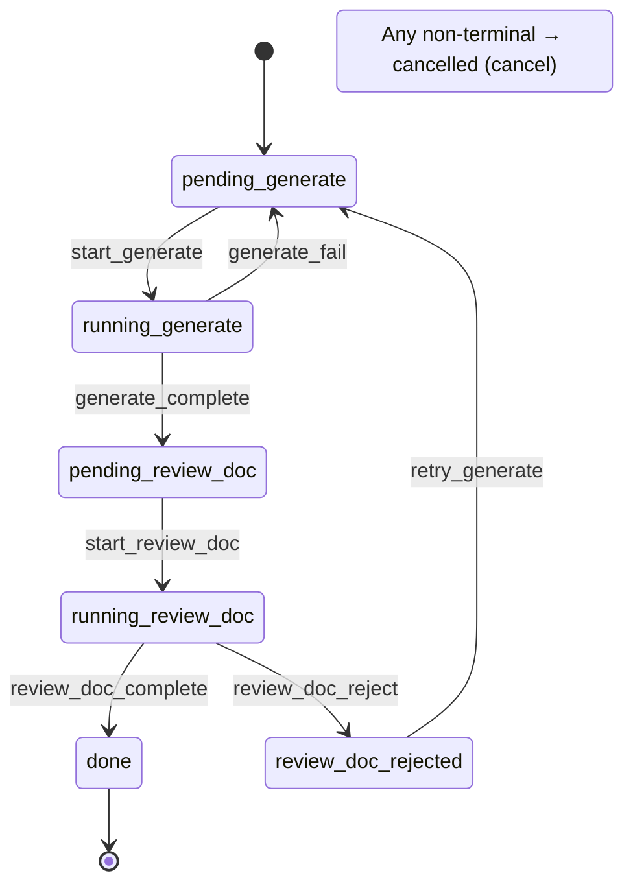

[中文](../workflow-development.md) | [English](workflow-development.md)

# Workflow Development Guide

This document guides you through creating custom workflows for autopilot.

## Definition Approach

YAML workflow (directory-paired format), one directory per workflow:

```
~/.autopilot/workflows/
├── my_workflow/
│   ├── workflow.yaml    # Workflow definition (structure, phases, states)
│   └── workflow.ts      # Phase functions (TypeScript)
```

`workflow.yaml` defines the structure, `workflow.ts` holds only the phase functions; states and transitions are auto-derived from phase names (see below). Simple phases can even use just the yaml `prompt` field, skipping `workflow.ts` entirely.

---

## YAML Workflow Definition

### Minimal Syntax (Auto-derived States)

```yaml
name: doc_gen
description: Automatic document generation and review

phases:
  - name: generate
    timeout: 600

  - name: review_doc
    timeout: 600
    reject: generate        # Syntactic sugar: auto-generates rejection + retry logic
    max_rejections: 5
```

Equivalent full syntax:

```yaml
name: doc_gen
description: Automatic document generation and review
initial_state: pending_generate
terminal_states: [done, cancelled]

phases:
  - name: generate
    label: GENERATE
    pending_state: pending_generate
    running_state: running_generate
    trigger: start_generate
    complete_trigger: generate_complete
    fail_trigger: generate_fail
    timeout: 600
    func: run_generate

  - name: review_doc
    label: REVIEW_DOC
    pending_state: pending_review_doc
    running_state: running_review_doc
    trigger: start_review_doc
    complete_trigger: review_doc_complete
    jump_trigger: review_doc_reject
    jump_target: generate
    max_rejections: 5
    timeout: 600
    func: run_review_doc
```

### Auto-derivation Rules

Auto-generated from phase `name` (using `design` as an example):

| Field | Derived Value |
|-------|--------------|
| `pending_state` | `pending_design` |
| `running_state` | `running_design` |
| `trigger` | `start_design` |
| `complete_trigger` | `design_complete` |
| `fail_trigger` | `design_fail` |
| `label` | `DESIGN` |
| `func` | `run_design` (looked up in workflow.ts) |

Workflow-level derivation:
- `initial_state`: defaults to the first phase's `pending_state` if not specified
- `terminal_states`: defaults to `[done, cancelled]` if not specified

### `reject` Syntactic Sugar (Backward Jump Only)

```yaml
- name: review
  reject: design
  max_rejections: 10
```

Auto-expands to:
```yaml
- name: review
  jump_trigger: review_reject
  jump_target: design
  max_rejections: 10
```

Note: the `reject` target must be before the current phase; otherwise validation will fail.

### `jump_trigger` / `jump_target` (Any Direction Jump)

Using the underlying fields directly allows jumping to any phase (forward or backward):

```yaml
- name: step2
  jump_trigger: step2_skip
  jump_target: step4    # Can jump forward
```

### Legacy Field Compatibility

Legacy fields `reject_trigger` / `retry_target` can still be used and are automatically mapped to `jump_trigger` / `jump_target`.

### Function Binding

The `func` field in YAML is a string corresponding to a function exported from `workflow.ts`:

```yaml
func: my_custom_func    # → my_custom_func() exported from workflow.ts
```

When `func` is omitted, the `run_{phase_name}` convention is used automatically.

Supported function binding fields:
- `phases[].func` — phase execution function
- `setup_func` — task initialization hook
- `notify_func` — notification function
- `hooks.before_phase` / `hooks.after_phase` / `hooks.on_phase_error`

### The `prompt` field (zero-code workflow)

A phase can write a `prompt` directly in yaml, skipping the ts function. When a phase:

- has no corresponding `run_<name>` function (`workflow.ts` missing or absent)
- has a non-empty `prompt` field in yaml

the framework automatically binds the built-in prompt-runner, equivalent to:

```ts
const agent = getAgent(phase.agent || "coder", workflowName);
const result = await agent.run(resolvedPrompt, {
  cwd: getTaskWorkspace(taskId),
  timeout: (phase.timeout ?? 900) * 1000,
});
// output goes to workspace/<NN-phase>/agent_output.md
```

**Variable placeholders** (usable inside the prompt string):

| Syntax | Meaning |
|------|------|
| `${TASK_ID}` | task id |
| `${TASK_TITLE}` | task title |
| `${REQUIREMENT}` | task.requirement (user requirement details) |
| `${PHASE}` | current phase name |
| `${WORKSPACE}` | absolute path of the task workspace |
| `${TASK.field}` | any field left by `setup_func` (e.g. `${TASK.repo_path}`) |
| `$VAR` | shorthand form (no dot notation) |

Unrecognized variables are left as-is to avoid silent failures.

**Priority**:

| ts run_xxx | yaml prompt | Actual execution |
|---|---|---|
| ✓ | — | use the ts function (backward compatible) |
| ✗ | ✓ | framework auto prompt-runner |
| ✓ | ✓ | ts takes priority (prompt field ignored) |
| ✗ | ✗ | throws |

**Applicable scenarios**: simple "call an agent once to run a prompt" tasks (writing / translation / rewriting / summarization / single-round analysis).

**Not applicable**: phases needing reject / parsing a returned conclusion / multi-agent interaction / git and other IO operations — these still require a ts function.

See `examples/workflows/prompt_quick/` for a complete example (no `workflow.ts`, yaml only).

### transitions Format

When writing transitions manually in YAML, use list format:

```yaml
transitions:
  pending_design:
    - [start_design, designing]
    - [cancel, cancelled]
  designing:
    - [design_complete, pending_review]
    - [design_fail, pending_design]
    - [cancel, cancelled]
```

When the `transitions` field is not provided, transitions are auto-generated from `phases` (recommended).

---

## Parallel Phases

### YAML Syntax

```yaml
phases:
  - name: design
    timeout: 900

  - parallel:
      name: development              # Parallel group name
      fail_strategy: cancel_all      # cancel_all (default) | continue
      phases:
        - name: frontend
          timeout: 1800
        - name: backend
          timeout: 1800

  - name: code_review
    timeout: 1200
```

### Execution Flow

1. When the parent task reaches the parallel group, its status transitions to `waiting_{group_name}`
2. Independent subtasks are created for each sub-phase (subtask ID: `{parent_id}__{phase_name}`)
3. Subtasks execute in parallel, each with independent lock, status, and logs
4. All subtasks complete -> parent task automatically transitions to the next phase
5. If any subtask fails:
   - `fail_strategy: cancel_all` (default) -> cancel all sibling subtasks, parent task rolls back
   - `fail_strategy: continue` -> wait for other subtasks to complete

### Database Fields

Subtasks use the tasks table's core columns:
- `parent_task_id` — parent task ID
- `parallel_index` — index within the parallel group
- `parallel_group` — parallel group name

Subtasks automatically inherit the parent task's `extra` JSON field.

### CLI Behavior

- `task status`: subtasks are hidden by default; given a parent task ID it shows the subtask list, given a subtask ID it shows the parent task ID
- `task cancel`: cancelling a parent task cascades to cancel all subtasks

---

## workflow.yaml top-level fields

| Field | Required | Description |
|------|------|------|
| `name` | ✓ | Unique workflow identifier |
| `phases` | ✓ | Phase definition list |
| `description` | | Description |
| `initial_state` | | Default: first phase's `pending_state` |
| `terminal_states` | | Default: `[done, cancelled]` |
| `transitions` | | Auto-generated from `phases` if not provided |
| `setup_func` | | Task initialization hook (function name exported from `workflow.ts`) |
| `notify_func` | | Notification implementation (function name exported from `workflow.ts`) |
| `hooks` | | `before_phase` / `after_phase` / `on_phase_error` (function names) |

## Phase fields

| Field | Description |
|------|------|
| `name` | Phase identifier |
| `label` | Log tag (auto-derived as `NAME.upper()`) |
| `timeout` | Timeout in seconds |
| `func` | Phase execution function name (default `run_<name>`, looked up in `workflow.ts`) |
| `trigger` / `complete_trigger` / `fail_trigger` | Triggers (auto-derived, rarely written by hand) |
| `jump_trigger` / `jump_target` | Jump (generated from `reject` syntactic sugar) |
| `max_rejections` | Maximum rejection count (the task fails once exceeded) |
| `agent` | Bound agent name (for prompt phases / built-in agents) |
| `prompt` | Zero-code prompt (see "the `prompt` field" above) |
| `gate` / `gate_message` | Human approval gate (see "Gate" below) |

## Transition Table: Auto-generated vs Manual

### Auto-generated (Recommended)

When `transitions` field is not provided, the registry auto-generates from `phases`:

- `pending_state` -> `(trigger, running_state)`
- `running_state` -> `(complete_trigger, next_pending_state)`
- With `fail_trigger`: `running_state` -> `(fail_trigger, pending_state)`
- With `jump_trigger`: generates rejection and retry transitions
- All non-terminal states include `(cancel, cancelled)`
- `parallel` phases auto-generate fork/join transitions

### Manual

Only needed for complex flows requiring non-linear routing:

```yaml
transitions:
  state_a:
    - [trigger1, state_b]
    - [trigger2, state_c]  # Conditional branching
```

## Task Data Storage

The framework schema retains only core columns; workflow-specific fields are stored in `extra` JSON:

```typescript
import { createTask, getTask, updateTask } from "src/core/db";

// Create task: core fields passed explicitly, rest auto-stored in extra
createTask({
  task_id: "T001",
  title: "My Task",
  workflow: "dev",
  channel: "telegram",
  notify_target: "chat-id",
  // Everything below stored in extra JSON
  req_id: "REQ-001",
  project: "my-project",
  repo_path: "/path/to/repo",
  branch: "feat/T001",
  agents: { dev: "claude" },
});

// Read: extra fields auto-expanded, direct access
const task = getTask("T001");
task.repo_path;  // Directly accessible, no need to worry about storage location
task.project;    // Same

// Update: transparent distinction between column fields vs extra
updateTask("T001", { pr_url: "https://...", failure_count: 1 });
```

## Phase Function Writing Guidelines

### Writing Pattern

```typescript
export async function run_my_phase(taskId: string): Promise<void> {
  // 1. Get task info (extra fields auto-expanded)
  const task = getTask(taskId);

  // 2. Prepare inputs
  const plan = readFileSync(join(taskDir, "plan.md"), "utf8");

  // 3. Execute core logic (direct access to extra fields)
  const result = await myExecute(prompt, { repoPath: task.repo_path });

  // 4. Save artifacts
  writeFileSync(join(taskDir, "output.md"), result);

  // 5. State transition
  transition(taskId, "my_phase_complete");

  // 6. Push next phase
  runInBackground(taskId, "next_phase");
}
```

### Important Notes

- **Do not manually manage locks**: `execute_phase()` acquires locks automatically
- **Do not swallow exceptions**: let exceptions propagate; Runner will catch and log them
- **Transition before Push**: call `transition()` before `run_in_background()`
- **Transparent field storage**: `getTask()` auto-expands extra; developers need not worry about whether a field is in a column or JSON

## Human-in-the-loop (Gate & ask_user)

Workflows are fully automatic by default — all phases run end to end. But sometimes you need a human in the loop. autopilot ships two built-in mechanisms, and **workflow authors barely have to write any code**.

### Gate: manual approval of phase artifacts

**When to use**: a human reviews and gates the next phase after a phase finishes (e.g. plan sign-off / before a high-risk push / final acceptance).

**Usage**: add `gate: true` to a phase in `workflow.yaml`:

```yaml
phases:
  - name: design
    agent: architect
    gate: true                              # ← suspend after run, wait for human decision
    gate_message: "Please review the technical plan"   # ← optional, UI banner prompt text
  - name: develop
    agent: developer
```

**Framework's automatic behavior**:
1. The design phase function finishes → status becomes `awaiting_design`
2. The UI shows an orange banner: [Pass] / [Reject (reason required)] / [Cancel task]
3. Pass → enter develop; reject → jump back to the reject target (`reject:` field, defaults to the same phase); cancel → cancelled

**To let the agent see the rejection reason on retry**, the phase function reads `task.last_user_decision`:

```ts
const lastDecisionRaw = task["last_user_decision"] as string | undefined;
if (lastDecisionRaw) {
  const d = JSON.parse(lastDecisionRaw) as {
    phase: string;
    decision: "pass" | "reject" | "cancel";
    note: string;
    ts: string;
  };
  if (d.phase === "design" && d.decision === "reject") {
    rejectionHistory += `\n\n## Last manual rejection note (${d.ts})\n${d.note}`;
  }
}
```

**Important**: when using gate, **do not** manually call `transition('xxx_complete')` + `runInBackground('next')` at the end of the phase function. The runner only triggers the await when the state is still `running_<phase>` + `gate: true`; advancing inside the phase function bypasses the gate.

### ask_user: agent asks mid-run

**When to use**: an agent gets halfway and finds the direction uncertain (e.g. choose between A/B implementation paths / fuzzy goal scope / confirm before a sensitive operation) and needs human help to decide.

**Usage**: nothing to configure. The framework auto-injects the `mcp__autopilot_workflow__ask_user` tool into every anthropic agent. **Make the agent want to use it** — drop a hint in the prompt:

```ts
const prompt =
  `You are a senior architect.\n\n` +
  `## Requirement\n${requirement}\n\n` +
  `Before you start, if there are critical decisions where the direction is unclear, you may use the ask_user tool to ask the user before continuing.\n` +
  `Don't ask frequently for trivia — only when you are truly stuck.\n\n` +
  `Please produce the technical plan: ...`;
```

Agent invocation form:

```
ask_user({
  question: "Do you prefer A (extra field) or B (separate tag table)?",
  options: ["A: extra field", "B: separate tag table"]   // optional, UI renders buttons; omit for free-text answer
})
```

**Task behavior**:
- status stays `running_<phase>` (the agent is still running, the phase function is awaiting pending)
- the question is written to the `task.pending_question` field
- the UI shows a blue banner: option buttons / Textarea
- user answers → agent receives the answer and continues

### Quick comparison

| Dimension | Gate | ask_user |
|---|---|---|
| Triggered by | runner (auto on phase completion) | agent (actively called during run) |
| Configuration | `workflow.yaml` `gate: true` | none |
| Code in phase function | no (optional read of `last_user_decision`) | no (optional encouragement in prompt) |
| status | `awaiting_<phase>` | `running_<phase>` + non-empty `pending_question` |
| User input | pass / reject / cancel | text / option |
| Timing | "agent done, human approves" | "agent halfway, human assists" |
| Persistence | yes (db field) | no (promise lives in memory, lost on daemon restart) |

### Combined usage

Both can stack. A typical dev flow:

```yaml
phases:
  - name: design       # agent writes the plan, may call ask_user when unsure
    agent: architect
    gate: true         # human reviews the plan after it's written
  - name: develop      # only enters after pass
    agent: developer
    gate: true         # review the code after development
  - name: submit_pr    # only does the real push + opens PR after pass
```

## Complete Examples

See `examples/workflows/dev/` and `examples/workflows/req_review/`:
- `workflow.yaml` — workflow definition
- `workflow.ts` — phase function implementation

## doc_gen Workflow State Machine

Using the minimal `doc_gen` workflow (2 phases + rejection) as an example, showing the complete state diagram after auto-derivation:


```mermaid
stateDiagram-v2
    [*] --> pending_generate

    pending_generate --> running_generate : start_generate
    running_generate --> pending_review_doc : generate_complete
    running_generate --> pending_generate : generate_fail

    pending_review_doc --> running_review_doc : start_review_doc
    running_review_doc --> done : review_doc_complete
    running_review_doc --> review_doc_rejected : review_doc_reject
    review_doc_rejected --> pending_generate : retry_generate

    done --> [*]

    state "Any non-terminal → cancelled (cancel)" as cancel_note
```

> For more workflow state diagrams, see [State Machine Details](state-machine.md)

---

## Workspace configuration (`workspace:` section in workflow.yaml)

Every task has an independent workspace directory (`AUTOPILOT_HOME/runtime/tasks/<task-id>/workspace/`).
A workflow can declare how the workspace is initialized:

```yaml
workspace:
  template: workspace_template   # Mode A: copy a template directory (relative to the workflow dir)
  git: true                      # Mode B: spin up a git worktree based on the codebase
  branch_prefix: "autopilot/"    # optional, used with git=true, default "autopilot/"
  base: "main"                   # optional, used with git=true, default codebase.default_branch
```

**Three modes**:

| Config | Behavior |
|------|------|
| neither | empty directory |
| `template: xxx` | recursively copy from `<workflow-dir>/xxx/` into the workspace (with `..` traversal check) |
| `git: true` + a codebase | `git worktree add -b <branch_prefix><taskId> <ws> <base>`; the task's workspace is a temporary branch on the codebase |

**git mode details**:

- The caller (`task-factory` / `tools.start_task`) looks up `task.extra.codebase_id` to get codebase info and passes it to `ensureTaskWorkspace`.
- Branch name: `${branch_prefix}${taskId}`; if it already exists, a `-2 / -3` suffix is auto-appended.
- Metadata is written to `runtime/tasks/<taskId>/.worktree.json` (`codebase_id` / `branch` / `base` / `created_at`), so the delete path needs no DB lookup.
- **Degradation**: missing codebase / non-git repo / `git worktree add` failure → warn and fall back to an empty directory, **without blocking task startup**.
- **template and git are mutually exclusive**: when both are configured, `git` wins and `template` is ignored with a warning.
- **Cleanup**: `deleteTaskWorkspace` / `applyRetentionPolicy` automatically call `git worktree remove --force` to remove the temporary branch, with an rmSync fallback. Anything uncommitted past the retention period is garbage and force-removed.

> Compatible with existing (non-git) workspaces: workflows that don't set `git: true` in yaml use the original logic, and the task workspace remains a plain directory.

---

## Prompt phase handoff protocol (`phases[].handoff` in workflow.yaml)

**Applies only to pure yaml prompt phases** (ts phases already have full control and are not forced into the 4-section format). See spec §3.10.

Enable:
```yaml
phases:
  - name: draft
    agent: writer
    handoff: true    # after running, parse agent_output.md to extract 4 sections into handoff.md
    prompt: |
      ${REQUIREMENT}
  - name: polish
    handoff: true
    prompt: |
      Polish based on the previous phase's decisions:
      ${HANDOFF}     # built-in placeholder: concatenates the handoff.md of all prior phases
```

**Runtime behavior of `handoff: true`**:

1. The prompt automatically **appends** 4-section output instructions at the end (fixed format), so you don't repeat them in yaml:
   ```
   ## Handoff (required, for the next phase to read)

   At the end of agent_output.md, output the following 4 sections, each non-empty (write "none" if empty), separated by markdown level-2 headings:
   - ## Decided    what decisions were made (key choices + rationale)
   - ## Files      key file paths (absolute / relative both fine)
   - ## Risks      risks and caveats for the next phase
   - ## Remaining  what's unfinished / left for later
   ```
2. After the phase function finishes, it **parses each of the 4 sections independently** from `agent_output.md` (a missing section does not affect the others) and writes them to `handoff.md` in the same directory.
3. For a missing section it writes a **placeholder** "none (agent did not output)" + emits a `phase:handoff-incomplete` event + writes a task_logs WARN, and **continues the transition** (non-blocking).

**Placeholders**:
- `${HANDOFF}` — concatenates the handoff.md of all **prior** phases (in order, each prefixed with a `## <phase label>` heading); falls back to a degradation note when there is no upstream.
- `${HANDOFF_<PHASE_NAME>}` — fetches a single phase's handoff (uppercased: `${HANDOFF_DRAFT}` fetches the `draft` phase).

**Why ts phases are not forced into handoff**: ts phases already have full control to readFileSync any file (the dev workflow's plan.md / dev_report.md are structured reports that should not be flattened into 4 sections). Only zero-code yaml prompt phases need the protocol constraint.

---

## Agent aliases (`agent_aliases` in config.yaml)

To reuse the same global agent across workflows under a different name, you don't have to copy-paste it into each workflow.yaml's `agents[]` (spec §3.11.1). Write in the global `config.yaml`:

```yaml
agent_aliases:
  code-reviewer: reviewer
  harsh-critic: reviewer
  planner: architect
```

Meaning: when workflow.yaml writes `agent: code-reviewer`, at runtime it is equivalent to `agent: reviewer`.

**Priority**:

1. **workflow.agents[] same name** (highest) — if workflow.yaml has `agents: [{ name: code-reviewer, ... }]` → use that, the alias does not apply
2. **globalAgents same name** — if config.yaml `agents.code-reviewer` exists → use that
3. **alias hit** — neither exists, and `agent_aliases.code-reviewer = reviewer` → use reviewer's global config as the base, **merged.name remains code-reviewer** (UI/logs show the user-facing role)
4. none → throws

**Constraints**:

- **Only one hop allowed**: a chained `a → b → c` jump throws directly, prompting the user to point straight to the final target in config.yaml.
- **No tiers introduced**: autopilot does not copy OMC's HIGH/MEDIUM/LOW tier abstraction (spec §10.X decision record). Write `model:` directly or leave it empty to follow `providers.<name>.default_model` for upgrades.
- **No provider fallback chain**: if the CLI is unavailable, fail loudly (spec §10.X decision record) instead of silently switching to another provider.

**With the web UI**: the `agents.list` RPC returns aliases as virtual entries too, with an `alias_of: <target>` field in the response, so the UI can show a badge indicating "this is an alias".

---

## Related Documentation

| Document | Description |
|----------|-------------|
| [5-Minute Quickstart](quickstart.md) | From installation to running your first demo |
| [Architecture Overview](architecture.md) | Overall architecture, module responsibilities, data flow |
| [State Machine Details](state-machine.md) | Transition tables, rejection mechanism, state diagrams |
| [FAQ & Troubleshooting](faq.md) | Common issues and solutions |
