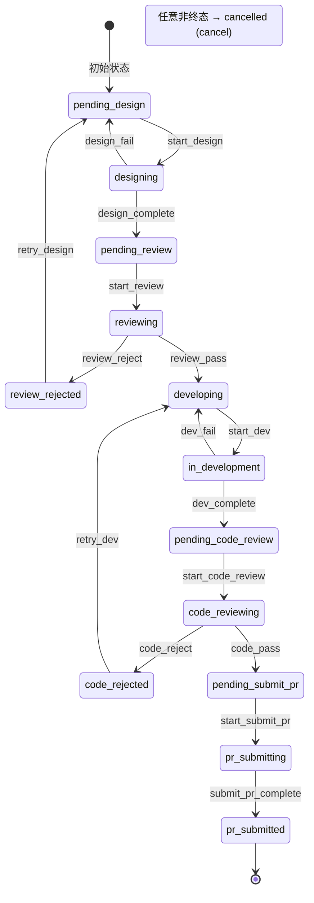
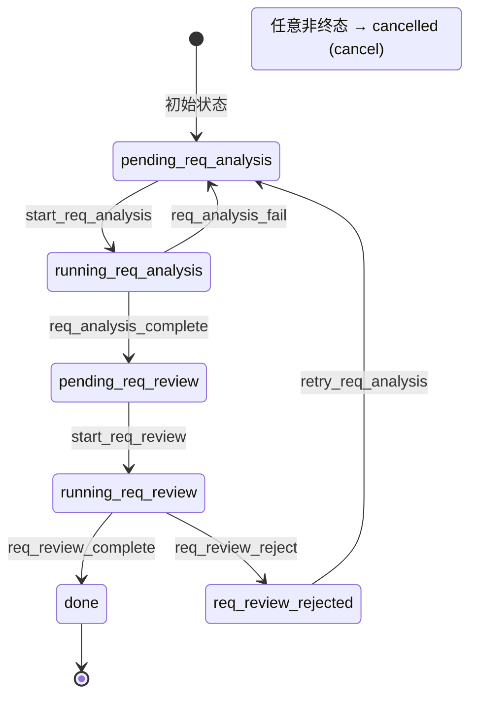
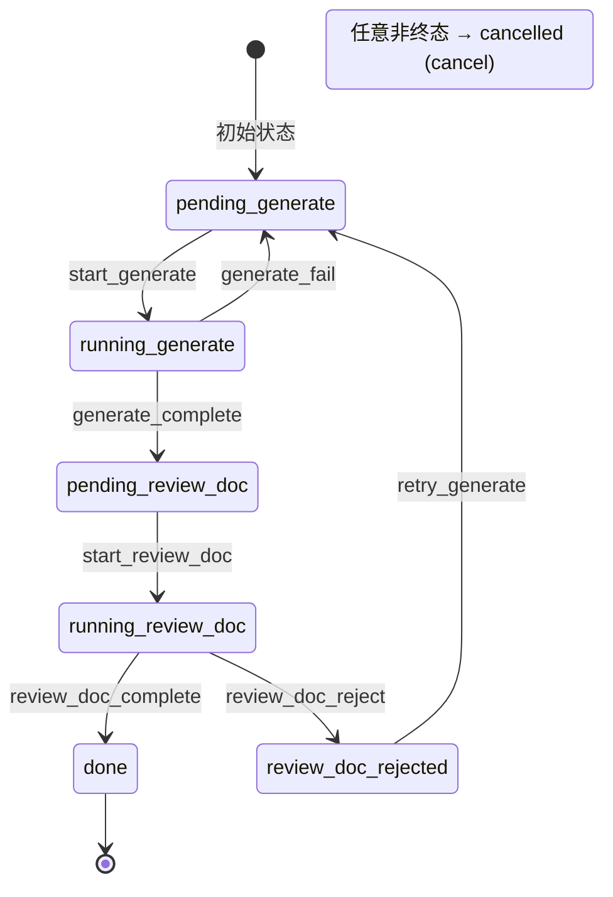

[中文](state-machine.md) | [English](en/state-machine.md)

# 状态机详解

## 状态转换表结构

转换表是一个字典，键为当前状态，值为该状态下可用的 `(trigger, target_state)` 列表：

```python
{
    'state_a': [
        ('trigger_1', 'state_b'),   # state_a + trigger_1 → state_b
        ('trigger_2', 'state_c'),   # state_a + trigger_2 → state_c
        ('cancel', 'cancelled'),    # 任何非终态都可取消
    ],
    'state_b': [
        ('trigger_3', 'state_d'),
        ('cancel', 'cancelled'),
    ],
    # ...
}
```

## 动态转换表查询

状态机在每次转换时动态加载转换表：

```
transition(task_id, trigger)
    │
    ▼
_resolve_transitions(task_id, conn)
    ├── 查询 task.workflow 字段
    ├── registry.build_transitions(workflow_name)
    │   ├── 工作流有 'transitions' 字段？→ 直接返回
    │   └── 否则从 'phases' 自动生成
    └── 回退：返回空转换表 {}
```

这意味着：
- 不同工作流可以有完全不同的状态空间
- 新增工作流无需修改 `state_machine.py`
- 转换表验证在运行时进行

## 原子转换过程

每次 `transition()` 调用执行以下原子操作：

```sql
BEGIN IMMEDIATE;                              -- 获取排他写锁
SELECT status, workflow FROM tasks WHERE id = ?;  -- 读取当前状态
-- Python: 验证 (current_state, trigger) 在转换表中
UPDATE tasks SET status = ?, updated_at = ?, ...  -- 更新状态
    WHERE id = ?;
INSERT INTO task_logs (task_id, from_status,       -- 写入审计日志
    to_status, trigger, note, created_at) VALUES ...;
COMMIT;                                        -- 提交（全部成功或全部回滚）
```

如果触发器不合法，抛出 `InvalidTransitionError`，事务回滚。

## 跳转机制（Jump）

底层使用 `jump_trigger` / `jump_target` 实现方向无关的阶段跳转。

### reject 语法糖

`reject` 是 jump 的语法糖，只允许往回跳（目标必须在当前阶段之前）：

```yaml
- name: review
  reject: design     # 语法糖，展开为 jump_trigger + jump_target
```

展开后等价于：
```yaml
- name: review
  jump_trigger: review_reject
  jump_target: design
```

### 驳回转换过程

驳回是一个两步转换过程：

```
reviewing ──[review_reject]──→ review_rejected ──[retry_design]──→ pending_design
   │                                                                     │
   │            第一步：标记为驳回态                                        │
   │                                                                     │
   └─── 第二步：从驳回态回退到目标阶段的 pending 态 ─────────────────────────┘
```

### 直接跳转

直接使用 `jump_trigger` / `jump_target` 可以跳转到任意阶段（包括前后方向）：

```yaml
- name: step1
  jump_trigger: step1_jump
  jump_target: step3    # 可以跳到后方阶段
```

### 驳回计数

- `rejection_counts` 是 JSON 字段：`{"design": 2, "code": 0}`
- 每次驳回递增对应阶段计数
- 超过 `max_rejections`（默认 10）自动取消任务

### 兼容性

旧字段 `reject_trigger` / `retry_target` 仍可使用，会自动映射为 `jump_trigger` / `jump_target`。

## 终态与活跃状态

**终态**：任务到达终态后不再允许任何转换（`cancel` 除外，终态本身也不可取消）。

判断方式：
```python
# 工作流定义的终态
terminal_states = registry.get_terminal_states(workflow_name)
# 如：['pr_submitted', 'cancelled']

# 活跃状态 = 所有状态 - 终态
active_states = [s for s in all_states if s not in terminal_states]
```

Watcher 只关注活跃状态的任务。

## dev 工作流完整状态图



<details>
<summary>ASCII 版本（终端 / 离线查看）</summary>

```
                                    ┌──────────────────┐
                                    │  pending_design   │ ← 初始状态
                                    └────────┬─────────┘
                                             │ start_design
                                    ┌────────▼─────────┐
                              ┌─────│    designing      │
                              │     └────────┬─────────┘
                   design_fail│              │ design_complete
                              │     ┌────────▼─────────┐
                              └────→│  pending_review   │
                                    └────────┬─────────┘
                                             │ start_review
                                    ┌────────▼─────────┐
                              ┌─────│    reviewing      │─────┐
                              │     └──────────────────┘     │
                   review_reject                              │ review_pass
                              │                               │
                    ┌─────────▼────────┐             ┌───────▼─────────┐
                    │ review_rejected   │             │   developing     │
                    └─────────┬────────┘             └───────┬─────────┘
                              │ retry_design                  │ start_dev
                              │                      ┌───────▼─────────┐
                    ┌─────────▼──────┐         ┌─────│ in_development   │
                    │ pending_design  │         │     └───────┬─────────┘
                    └────────────────┘  dev_fail│             │ dev_complete
                                               │     ┌───────▼─────────┐
                                               └────→│ code_reviewing   │─────┐
                                                      └───────┬─────────┘     │
                                                   code_reject│               │ code_pass
                                                      ┌───────▼─────────┐     │
                                                      │ code_rejected    │     │
                                                      └───────┬─────────┘     │
                                                              │ retry_dev     │
                                                      ┌───────▼─────────┐     │
                                                      │ in_development   │     │
                                                      └─────────────────┘     │
                                                                              │
                                                                     ┌───────▼─────────┐
                                                                     │  pr_submitting   │
                                                                     └───────┬─────────┘
                                                                             │
                                                                     ┌───────▼─────────┐
                                                                     │  pr_submitted ✓  │ ← 终态
                                                                     └─────────────────┘

                        任意非终态 ──[cancel]──→ cancelled ✓  ← 终态
```

</details>

## req_review 工作流完整状态图



<details>
<summary>ASCII 版本（终端 / 离线查看）</summary>

```
                                    ┌──────────────────────┐
                                    │  pending_analysis     │ ← 初始状态
                                    └────────┬─────────────┘
                                             │ start_analysis
                                    ┌────────▼─────────────┐
                              ┌─────│    analyzing          │
                              │     └────────┬─────────────┘
                 analysis_fail│              │ analysis_complete
                              │     ┌────────▼─────────────┐
                              └────→│ pending_req_review    │
                                    └────────┬─────────────┘
                                             │ start_req_review
                                    ┌────────▼─────────────┐
                              ┌─────│  req_reviewing        │─────┐
                              │     └──────────────────────┘     │
                 req_review_reject                                │ req_review_pass
                              │                                   │
                    ┌─────────▼──────────────┐          ┌────────▼──────────┐
                    │ req_review_rejected     │          │ req_review_done ✓ │ ← 终态
                    └─────────┬──────────────┘          └───────────────────┘
                              │ retry_req_analysis
                              │
                    ┌─────────▼──────────────┐
                    │  pending_analysis       │
                    └────────────────────────┘

                        任意非终态 ──[cancel]──→ cancelled ✓  ← 终态
```

</details>

## doc_gen 工作流状态图



## 常见操作

### 查询任务可用操作

```python
from core.state_machine import get_available_triggers

triggers = get_available_triggers(task_id)
# 返回如：['start_design', 'cancel']
```

### 检查转换合法性

```python
from core.state_machine import can_transition

if can_transition(task_id, 'review_pass'):
    transition(task_id, 'review_pass')
```

### 手动取消任务

```python
from core.state_machine import transition

transition(task_id, 'cancel', note='用户手动取消')
```
