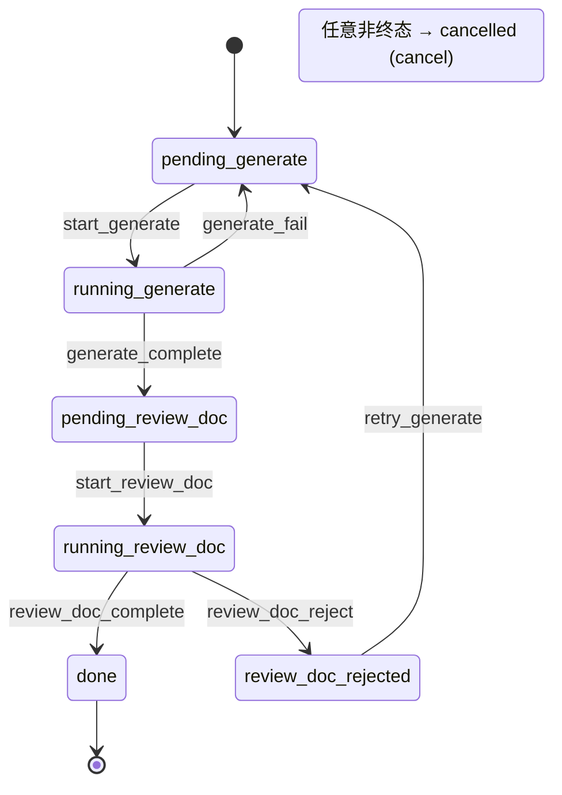

[中文](workflow-development.md) | [English](en/workflow-development.md)

# 工作流开发指南

本文档指导你如何为 autopilot 创建自定义工作流。

## 两种定义方式

### 方式一：YAML 工作流（推荐）

目录配对格式，每个工作流一个目录：

```
~/.autopilot/workflows/
├── my_workflow/
│   ├── workflow.yaml    # 工作流定义（结构、阶段、状态）
│   └── workflow.py      # 阶段函数（Python 代码）
```

### 方式二：单文件 Python 工作流

单个 `.py` 文件放入 `~/.autopilot/workflows/`，导出 `WORKFLOW` 字典。

---

## YAML 工作流定义

### 最简写法（状态自动推导）

```yaml
name: doc_gen
description: 自动文档生成与评审

phases:
  - name: generate
    timeout: 600

  - name: review_doc
    timeout: 600
    reject: generate        # 语法糖：自动生成驳回 + 重试逻辑
    max_rejections: 5
```

等价于完整写法：

```yaml
name: doc_gen
description: 自动文档生成与评审
initial_state: pending_generate
terminal_states: [done, cancelled]

phases:
  - name: generate
    label: GENERATE
    pending_state: pending_generate
    running_state: running_generate
    trigger: start_generate
    complete_trigger: generate_complete
    fail_trigger: generate_fail
    timeout: 600
    func: run_generate

  - name: review_doc
    label: REVIEW_DOC
    pending_state: pending_review_doc
    running_state: running_review_doc
    trigger: start_review_doc
    complete_trigger: review_doc_complete
    jump_trigger: review_doc_reject
    jump_target: generate
    max_rejections: 5
    timeout: 600
    func: run_review_doc
```

### 自动推导规则

从 phase `name` 自动生成（以 `design` 为例）：

| 字段 | 推导值 |
|------|--------|
| `pending_state` | `pending_design` |
| `running_state` | `running_design` |
| `trigger` | `start_design` |
| `complete_trigger` | `design_complete` |
| `fail_trigger` | `design_fail` |
| `label` | `DESIGN` |
| `func` | `run_design`（在 workflow.py 中查找） |

Workflow 级别推导：
- `initial_state`：不写则取第一个 phase 的 `pending_state`
- `terminal_states`：不写则 `[done, cancelled]`

### `reject` 语法糖（只能往回跳）

```yaml
- name: review
  reject: design
  max_rejections: 10
```

自动展开为：
```yaml
- name: review
  jump_trigger: review_reject
  jump_target: design
  max_rejections: 10
```

注意：`reject` 目标必须在当前阶段之前，否则校验报错。

### `jump_trigger` / `jump_target`（任意方向跳转）

直接使用底层字段可以跳转到任意阶段（前/后均可）：

```yaml
- name: step2
  jump_trigger: step2_skip
  jump_target: step4    # 可以向前跳
```

### 兼容旧字段

旧字段 `reject_trigger` / `retry_target` 仍可使用，会自动映射为 `jump_trigger` / `jump_target`。

### 函数绑定

YAML 中 `func` 字段是字符串，对应 `workflow.py` 中的函数名：

```yaml
func: my_custom_func    # → workflow.py 中的 my_custom_func()
```

不写 `func` 时，自动使用 `run_{phase_name}` 约定。

支持绑定的函数字段：
- `phases[].func` — 阶段执行函数
- `setup_func` — 任务初始化钩子
- `notify_func` — 通知函数
- `hooks.before_phase` / `hooks.after_phase` / `hooks.on_phase_error`

### transitions 格式

YAML 中手写 transitions 时使用列表格式：

```yaml
transitions:
  pending_design:
    - [start_design, designing]
    - [cancel, cancelled]
  designing:
    - [design_complete, pending_review]
    - [design_fail, pending_design]
    - [cancel, cancelled]
```

不提供 `transitions` 字段时，从 `phases` 自动生成（推荐）。

---

## 并行阶段（parallel）

### YAML 语法

```yaml
phases:
  - name: design
    timeout: 900

  - parallel:
      name: development              # 并行组名称
      fail_strategy: cancel_all      # cancel_all（默认）| continue
      phases:
        - name: frontend
          timeout: 1800
        - name: backend
          timeout: 1800

  - name: code_review
    timeout: 1200
```

### 执行流程

1. 父任务到达并行组时，状态 → `waiting_{group_name}`
2. 为每个子阶段创建独立子任务（子任务 ID：`{parent_id}__{phase_name}`）
3. 子任务并行执行，各自有独立的 lock、status、logs
4. 全部子任务完成 → 父任务自动 transition 到下一阶段
5. 任一子任务失败：
   - `fail_strategy: cancel_all`（默认）→ 取消所有兄弟子任务，父任务回退
   - `fail_strategy: continue` → 等待其他子任务完成

### 数据库字段

子任务使用 tasks 表的核心列：
- `parent_task_id` — 父任务 ID
- `parallel_index` — 并行组内的索引
- `parallel_group` — 并行组名称

子任务自动继承父任务的 `extra` JSON 字段。

### CLI 行为

- `list`：默认隐藏子任务，加 `--all` 显示
- `show`：如果是父任务，显示子任务列表；如果是子任务，显示父任务 ID
- `cancel`：取消父任务时级联取消所有子任务

---

## WORKFLOW 字典结构（单文件 Python 工作流）

```python
WORKFLOW = {
    # === 必填 ===
    'name': str,                # 工作流唯一标识
    'phases': list[dict],       # 阶段定义列表

    # === 选填 ===
    'description': str,
    'initial_state': str,       # 默认：第一个阶段的 pending_state
    'terminal_states': list,    # 默认：['done', 'cancelled']
    'transitions': dict,        # 不提供则自动生成
    'setup_func': callable,     # 任务初始化钩子
    'notify_func': callable,    # 通知实现
    'notify_backends': list,    # 多后端通知配置
    'hooks': dict,              # before_phase / after_phase / on_phase_error
    'retry_policy': dict,       # 重试策略
}
```

## 阶段（Phase）定义字段

```python
{
    'name': str,                # 阶段标识符
    'label': str,               # 日志标签（YAML 自动推导为 NAME.upper()）
    'trigger': str | None,      # 进入运行态的触发器
    'pending_state': str,       # 等待状态名
    'running_state': str,       # 运行状态名
    'complete_trigger': str,    # 完成触发器
    'fail_trigger': str | None, # 失败触发器（回到 pending 重试）
    'jump_trigger': str | None,     # 跳转触发器（reject 语法糖展开后生成）
    'jump_target': str | None,      # 跳转目标阶段名
    'max_rejections': int,      # 最大驳回次数（默认 10）
    'func': callable,           # 阶段执行函数
}
```

## 转换表：自动生成 vs 手写

### 自动生成（推荐）

不提供 `transitions` 字段时，`registry.build_transitions()` 从 `phases` 自动生成：

- `pending_state` → `(trigger, running_state)`
- `running_state` → `(complete_trigger, next_pending_state)`
- 有 `fail_trigger` 时：`running_state` → `(fail_trigger, pending_state)`
- 有 `jump_trigger` 时：生成驳回和重试转换
- 所有非终态都加入 `(cancel, cancelled)`
- `parallel` 阶段自动生成 fork/join 转换

### 手写

复杂流程需要非线性流转时才需手写：

```yaml
transitions:
  state_a:
    - [trigger1, state_b]
    - [trigger2, state_c]  # 条件分支
```

## 任务数据存储

框架 schema 只保留核心列，工作流自定义字段存入 `extra` JSON：

```python
# 创建任务：核心字段显式传入，其余自动存入 extra
create_task(
    task_id="T001",
    title="My Task",
    workflow="dev",
    channel="telegram",
    notify_target="chat-id",
    # 以下全部存入 extra JSON
    req_id="REQ-001",
    project="my-project",
    repo_path="/path/to/repo",
    branch="feat/T001",
    agents={"dev": "claude"},
)

# 读取：extra 字段自动展开，直接访问
task = get_task("T001")
task["repo_path"]  # 直接可用，无需关心存储位置
task["project"]    # 同上

# 更新：透明区分列字段 vs extra
update_task("T001", pr_url="https://...", failure_count=1)
```

## 阶段函数编写规范

### 编写模式

```python
def run_my_phase(task_id: str) -> None:
    # 1. 获取任务信息（extra 字段自动展开）
    task = get_task(task_id)

    # 2. 准备输入
    plan = (task_dir / "plan.md").read_text()

    # 3. 执行核心逻辑（直接访问 extra 字段）
    result = my_execute(prompt, repo_path=task['repo_path'])

    # 4. 保存产出物
    (task_dir / "output.md").write_text(result)

    # 5. 状态转换（extra_updates 同样透明区分）
    transition(task_id, 'my_phase_complete')

    # 6. Push 下一阶段
    run_in_background(task_id, 'next_phase')
```

### 注意事项

- **不要手动管理锁**：`execute_phase()` 自动获取锁
- **不要吞异常**：让异常抛出，Runner 会捕获并记录
- **转换必须在 Push 之前**：先 `transition()` 再 `run_in_background()`
- **字段存储透明**：`get_task()` 自动展开 extra，开发者无需关心字段在列里还是 JSON 里

## 人机交互（Gate 与 ask_user）

工作流默认是全自动的——所有阶段串起来跑完。但有时候需要人工介入。autopilot 提供两种内建机制，**工作流作者基本不用写代码**：

### Gate：阶段产物的人工审批

**适用场景**：阶段干完后人来审一道再放行（例：方案确认 / 高风险 push 前 / 最终验收）。

**用法**：在 `workflow.yaml` 的 phase 上加 `gate: true`：

```yaml
phases:
  - name: design
    agent: architect
    gate: true                              # ← 跑完后挂起等人决断
    gate_message: "请审阅技术方案"          # ← 可选，UI banner 提示文案
  - name: develop
    agent: developer
```

**框架自动行为**：
1. design phase 函数跑完 → status 变 `awaiting_design`
2. UI 出橙色 banner：[通过] / [驳回（必填理由）] / [取消任务]
3. 通过 → 进 develop；驳回 → 回 reject 目标（`reject:` 字段，默认本 phase）；取消 → cancelled

**让 agent 重做时看到驳回理由**——phase 函数读 `task.last_user_decision`：

```ts
const lastDecisionRaw = task["last_user_decision"] as string | undefined;
if (lastDecisionRaw) {
  const d = JSON.parse(lastDecisionRaw) as {
    phase: string;
    decision: "pass" | "reject" | "cancel";
    note: string;
    ts: string;
  };
  if (d.phase === "design" && d.decision === "reject") {
    rejectionHistory += `\n\n## 上次人工驳回意见 (${d.ts})\n${d.note}`;
  }
}
```

**重要**：使用 gate 时，phase 函数末尾**不要**手动 `transition('xxx_complete')` + `runInBackground('next')`。runner 检测到状态仍是 `running_<phase>` + `gate: true` 才会触发 await；阶段函数主动推进会绕过 gate。

### ask_user：agent 中途主动提问

**适用场景**：agent 跑到一半发现方向不确定（例：A/B 实现路径二选一 / 目标范围模糊 / 敏感操作前确认），需要人协助决断。

**用法**：什么都不用配。框架自动给所有 anthropic agent 注入 `mcp__autopilot_workflow__ask_user` 工具。**让 agent 想用它**——在 prompt 里提示一句：

```ts
const prompt =
  `你是一位资深架构师。\n\n` +
  `## 需求\n${requirement}\n\n` +
  `开始之前，如果方向有不确定的关键决策，可以用 ask_user 工具向用户询问后再继续。\n` +
  `不要为了细节频繁问，仅在确实卡住时调。\n\n` +
  `请输出技术方案：...`;
```

Agent 调用形式：

```
ask_user({
  question: "你倾向 A（extra 字段）还是 B（独立 tag 表）？",
  options: ["A: extra 字段", "B: 独立 tag 表"]   // 可选，UI 渲染按钮；不传则文本回答
})
```

**任务表现**：
- status 保持 `running_<phase>`（agent 还在跑，phase 函数 await pending）
- `task.pending_question` 字段写入问题
- UI 弹蓝色 banner：选项按钮 / Textarea
- 用户答 → agent 收到答案继续

### 对比速查

| 维度 | Gate | ask_user |
|---|---|---|
| 谁触发 | runner（阶段完成时自动） | agent（执行中主动调） |
| 配置 | `workflow.yaml` `gate: true` | 无 |
| 阶段函数要写代码 | 否（可选读 `last_user_decision`） | 否（可选在 prompt 里鼓励） |
| status | `awaiting_<phase>` | `running_<phase>` + `pending_question` 非空 |
| 用户输入 | 通过 / 驳回 / 取消 | 文本 / 选项 |
| 时机 | "agent 干完，人审批" | "agent 干一半，人协助" |
| 持久化 | 是（db 字段） | 否（promise 在内存，daemon 重启会丢） |

### 组合用法

两者可叠加。典型开发流：

```yaml
phases:
  - name: design       # agent 写方案，遇到不确定可调 ask_user
    agent: architect
    gate: true         # 写完后人工审方案
  - name: develop      # 通过才开发
    agent: developer
    gate: true         # 开发完审代码
  - name: submit_pr    # 通过才真 push + 提 PR
```

## 完整示例

参见 `examples/workflows/dev/` 和 `examples/workflows/req_review/`：
- `workflow.yaml` — 工作流定义
- `workflow.py` — 阶段函数实现

## doc_gen 工作流状态机

以最简工作流 `doc_gen`（2 阶段 + 驳回）为例，展示自动推导后的完整状态图：



> 更多工作流状态图见 [状态机详解](state-machine.md)

---

## 相关文档

| 文档 | 说明 |
|------|------|
| [5 分钟快速入门](quickstart.md) | 从安装到跑通第一个 demo |
| [架构总览](architecture.md) | 整体架构、模块职责、数据流 |
| [状态机详解](state-machine.md) | 状态转换表、驳回机制、完整状态图 |
| [插件开发指南](plugin-development.md) | 第三方插件开发、扩展点、框架 API |
| [FAQ 与故障排查](faq.md) | 常见问题与解决方案 |
