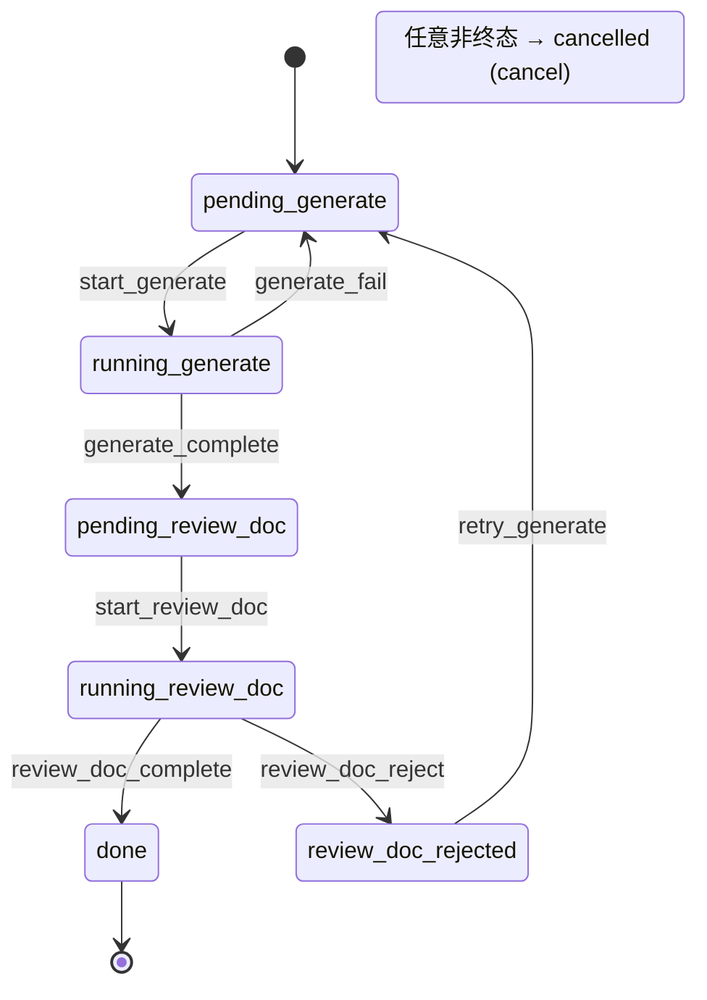

[中文](workflow-development.md) | [English](en/workflow-development.md)

# 工作流开发指南

本文档指导你如何为 autopilot 创建自定义工作流。

## 定义方式

YAML 工作流（目录配对格式），每个工作流一个目录：

```
~/.autopilot/workflows/
├── my_workflow/
│   ├── workflow.yaml    # 工作流定义（结构、阶段、状态）
│   └── workflow.ts      # 阶段函数（TypeScript）
```

`workflow.yaml` 定义结构，`workflow.ts` 只写阶段函数；状态与转换从阶段名自动推导（见下）。简单阶段甚至可只写 yaml 的 `prompt` 字段，省去 `workflow.ts`。

---

## YAML 工作流定义

### 最简写法（状态自动推导）

```yaml
name: doc_gen
description: 自动文档生成与评审

phases:
  - name: generate
    timeout: 600

  - name: review_doc
    timeout: 600
    reject: generate        # 语法糖：自动生成驳回 + 重试逻辑
    max_rejections: 5
```

等价于完整写法：

```yaml
name: doc_gen
description: 自动文档生成与评审
initial_state: pending_generate
terminal_states: [done, cancelled]

phases:
  - name: generate
    label: GENERATE
    pending_state: pending_generate
    running_state: running_generate
    trigger: start_generate
    complete_trigger: generate_complete
    fail_trigger: generate_fail
    timeout: 600
    func: run_generate

  - name: review_doc
    label: REVIEW_DOC
    pending_state: pending_review_doc
    running_state: running_review_doc
    trigger: start_review_doc
    complete_trigger: review_doc_complete
    jump_trigger: review_doc_reject
    jump_target: generate
    max_rejections: 5
    timeout: 600
    func: run_review_doc
```

### 自动推导规则

从 phase `name` 自动生成（以 `design` 为例）：

| 字段 | 推导值 |
|------|--------|
| `pending_state` | `pending_design` |
| `running_state` | `running_design` |
| `trigger` | `start_design` |
| `complete_trigger` | `design_complete` |
| `fail_trigger` | `design_fail` |
| `label` | `DESIGN` |
| `func` | `run_design`（在 workflow.ts 中查找） |

Workflow 级别推导：
- `initial_state`：不写则取第一个 phase 的 `pending_state`
- `terminal_states`：不写则 `[done, cancelled]`

### `reject` 语法糖（只能往回跳）

```yaml
- name: review
  reject: design
  max_rejections: 10
```

自动展开为：
```yaml
- name: review
  jump_trigger: review_reject
  jump_target: design
  max_rejections: 10
```

注意：`reject` 目标必须在当前阶段之前，否则校验报错。

### `jump_trigger` / `jump_target`（任意方向跳转）

直接使用底层字段可以跳转到任意阶段（前/后均可）：

```yaml
- name: step2
  jump_trigger: step2_skip
  jump_target: step4    # 可以向前跳
```

### 兼容旧字段

旧字段 `reject_trigger` / `retry_target` 仍可使用，会自动映射为 `jump_trigger` / `jump_target`。

### 函数绑定

YAML 中 `func` 字段是字符串，对应 `workflow.ts` 导出的函数名：

```yaml
func: my_custom_func    # → workflow.ts 中导出的 my_custom_func()
```

不写 `func` 时，自动使用 `run_{phase_name}` 约定。

支持绑定的函数字段：
- `phases[].func` — 阶段执行函数
- `setup_func` — 任务初始化钩子
- `notify_func` — 通知函数
- `hooks.before_phase` / `hooks.after_phase` / `hooks.on_phase_error`

### `prompt` 字段（零代码工作流）

阶段可直接在 yaml 中写 `prompt`，省去写 ts 函数。当一个阶段：

- 没有对应的 `run_<name>` 函数（`workflow.ts` 缺失或不存在）
- yaml 里有非空 `prompt` 字段

框架会自动绑定内置的 prompt-runner，等价于：

```ts
const agent = agentForPhase(workflowName, phase.name);
const result = await agent.run(resolvedPrompt, {
  cwd: getTaskWorkspace(taskId),
  timeout: (phase.timeout ?? 900) * 1000,
});
// 输出落到 workspace/<NN-phase>/agent_output.md
```

`agentForPhase(workflowName, phaseName)` 解析该 phase 内联的 `agent:` 对象；phase 未写 `agent:` 时回退框架内置 `DEFAULT_AGENT`（anthropic / claude-sonnet-4-6 / max_turns 10 / permission_mode auto），`model` 缺省时回退 `providers.<provider>.default_model`。

**变量占位符**（prompt 字符串内可用）：

| 写法 | 含义 |
|------|------|
| `${TASK_ID}` | 任务 id |
| `${TASK_TITLE}` | 任务标题 |
| `${REQUIREMENT}` | task.requirement（用户需求详情） |
| `${PHASE}` | 当前 phase name |
| `${WORKSPACE}` | 任务 workspace 绝对路径 |
| `${TASK.field}` | 取 `setup_func` 留下的任意字段（如 `${TASK.repo_path}`） |
| `$VAR` | 简写形式（不支持点号） |

未识别的变量原样保留，避免静默失败。

**优先级**：

| ts run_xxx | yaml prompt | 实际执行 |
|---|---|---|
| ✓ | — | 用 ts 函数（向后兼容） |
| ✗ | ✓ | 框架自动 prompt-runner |
| ✓ | ✓ | ts 优先（prompt 字段被忽略） |
| ✗ | ✗ | 抛错 |

**适用场景**：简单的"调一次 agent 跑一段 prompt"任务（写作 / 翻译 / 改写 / 总结 / 单轮分析）。

**不适用**：需要 reject / 解析返回结论 / 多 agent 互动 / git 等 IO 操作的阶段——这些仍需写 ts 函数。

完整示例参考 `examples/workflows/prompt_quick/`（无 `workflow.ts`，仅 yaml）。

### transitions 格式

YAML 中手写 transitions 时使用列表格式：

```yaml
transitions:
  pending_design:
    - [start_design, designing]
    - [cancel, cancelled]
  designing:
    - [design_complete, pending_review]
    - [design_fail, pending_design]
    - [cancel, cancelled]
```

不提供 `transitions` 字段时，从 `phases` 自动生成（推荐）。

---

## 并行阶段（parallel）

### YAML 语法

```yaml
phases:
  - name: design
    timeout: 900

  - parallel:
      name: development              # 并行组名称
      fail_strategy: cancel_all      # cancel_all（默认）| continue
      phases:
        - name: frontend
          timeout: 1800
        - name: backend
          timeout: 1800

  - name: code_review
    timeout: 1200
```

### 执行流程

并行块**不创建独立子任务、不写状态机**（状态机单状态无法同时表达多个 running），而是在父任务进程内并发执行各子阶段函数：

1. 父任务到达并行组时，状态 → `waiting_{group_name}`
2. 在父进程内用 `Promise.allSettled` 并发调用各子阶段的 `phaseFn(taskId)`；进度通过日志与事件流记录（不建子任务行）
3. 全部 settle 后：
   - 全部成功 / `fail_strategy: continue` → `transition({group}_complete)` → 推进下一阶段
   - 有失败 且 `fail_strategy: cancel_all`（默认）→ `transition({group}_fail)` 走失败分支
4. **`cancel_all` 命名有误导**：它**不中途取消/打断仍在跑的兄弟**，`Promise.allSettled` 永远等所有兄弟各自结束，只是决定全部结束后走 fail 还是 complete 分支。真正的「失败即取消兄弟」尚未实现（见状态机文档 CONC-06）。

> 共用沙盒模型下，并行块的各子阶段共用同一个任务 clone、**不隔离子工作树**，因此暂不支持多个子阶段并行写同一份代码（YAGNI）。并行块更适合「各子阶段产出互不冲突的产物」（如前端/后端分别写各自目录）或只读型并发。

---

## workflow.yaml 顶层字段

| 字段 | 必填 | 说明 |
|------|------|------|
| `name` | ✓ | 工作流唯一标识 |
| `phases` | ✓ | 阶段定义列表 |
| `description` | | 描述 |
| `initial_state` | | 默认：第一个阶段的 `pending_state` |
| `terminal_states` | | 默认：`[done, cancelled]` |
| `transitions` | | 不提供则从 `phases` 自动生成 |
| `setup_func` | | 任务初始化钩子（`workflow.ts` 导出的函数名） |
| `notify_func` | | 通知实现（`workflow.ts` 导出的函数名） |
| `hooks` | | `before_phase` / `after_phase` / `on_phase_error`（函数名） |

## 阶段（phase）字段

| 字段 | 说明 |
|------|------|
| `name` | 阶段标识符 |
| `label` | 日志标签（自动推导为 `NAME.upper()`） |
| `timeout` | 超时秒数 |
| `func` | 阶段执行函数名（默认 `run_<name>`，在 `workflow.ts` 中查找） |
| `trigger` / `complete_trigger` / `fail_trigger` | 触发器（自动推导，一般不手写） |
| `jump_trigger` / `jump_target` | 跳转（`reject` 语法糖展开后生成） |
| `max_rejections` | 最大驳回次数（超过则任务失败） |
| `agent` | 该 phase 内联的 agent 配置对象（`provider` / `model` / `system_prompt` / `max_turns` / `permission_mode`）；省略则用 `DEFAULT_AGENT` 兜底 |
| `prompt` | 零代码 prompt（见上「`prompt` 字段」） |
| `gate` / `gate_message` | 人工审批门（见下「Gate」） |

## 转换表：自动生成 vs 手写

### 自动生成（推荐）

不提供 `transitions` 字段时，registry 从 `phases` 自动生成：

- `pending_state` → `(trigger, running_state)`
- `running_state` → `(complete_trigger, next_pending_state)`
- 有 `fail_trigger` 时：`running_state` → `(fail_trigger, pending_state)`
- 有 `jump_trigger` 时：生成驳回和重试转换
- 所有非终态都加入 `(cancel, cancelled)`
- `parallel` 阶段自动生成 fork/join 转换

### 手写

复杂流程需要非线性流转时才需手写：

```yaml
transitions:
  state_a:
    - [trigger1, state_b]
    - [trigger2, state_c]  # 条件分支
```

## 任务数据存储

框架 schema 只保留核心列，工作流自定义字段存入 `extra` JSON：

```typescript
import { createTask, getTask, updateTask } from "src/core/db";

// 创建任务：核心字段显式传入，其余自动存入 extra
createTask({
  task_id: "T001",
  title: "My Task",
  workflow: "dev",
  channel: "telegram",
  notify_target: "chat-id",
  // 以下全部存入 extra JSON
  req_id: "REQ-001",
  project: "my-project",
  repo_path: "/path/to/repo",
  branch: "feat/T001",
  codebase_id: "cb-001",
});

// 读取：extra 字段自动展开，直接访问
const task = getTask("T001");
task.repo_path;  // 直接可用，无需关心存储位置
task.project;    // 同上

// 更新：透明区分列字段 vs extra
updateTask("T001", { pr_url: "https://...", failure_count: 1 });
```

## 阶段函数编写规范

### 编写模式

```typescript
export async function run_my_phase(taskId: string): Promise<void> {
  // 1. 获取任务信息（extra 字段自动展开）
  const task = getTask(taskId);

  // 2. 准备输入
  const plan = readFileSync(join(taskDir, "plan.md"), "utf8");

  // 3. 执行核心逻辑（直接访问 extra 字段）
  const result = await myExecute(prompt, { repoPath: task.repo_path });

  // 4. 保存产出物
  writeFileSync(join(taskDir, "output.md"), result);

  // 5. 状态转换
  transition(taskId, "my_phase_complete");

  // 6. Push 下一阶段
  runInBackground(taskId, "next_phase");
}
```

### 注意事项

- **不要手动管理锁**：`execute_phase()` 自动获取锁
- **不要吞异常**：让异常抛出，Runner 会捕获并记录
- **转换必须在 Push 之前**：先 `transition()` 再 `run_in_background()`
- **字段存储透明**：`getTask()` 自动展开 extra，开发者无需关心字段在列里还是 JSON 里

## 人机交互（Gate 与 ask_user）

工作流默认是全自动的——所有阶段串起来跑完。但有时候需要人工介入。autopilot 提供两种内建机制，**工作流作者基本不用写代码**：

### Gate：阶段产物的人工审批

**适用场景**：阶段干完后人来审一道再放行（例：方案确认 / 高风险 push 前 / 最终验收）。

**用法**：在 `workflow.yaml` 的 phase 上加 `gate: true`：

```yaml
phases:
  - name: design
    agent: architect
    gate: true                              # ← 跑完后挂起等人决断
    gate_message: "请审阅技术方案"          # ← 可选，UI banner 提示文案
  - name: develop
    agent: developer
```

**框架自动行为**：
1. design phase 函数跑完 → status 变 `awaiting_design`
2. UI 出橙色 banner：[通过] / [驳回（必填理由）] / [取消任务]
3. 通过 → 进 develop；驳回 → 回 reject 目标（`reject:` 字段，默认本 phase）；取消 → cancelled

**让 agent 重做时看到驳回理由**——phase 函数读 `task.last_user_decision`：

```ts
const lastDecisionRaw = task["last_user_decision"] as string | undefined;
if (lastDecisionRaw) {
  const d = JSON.parse(lastDecisionRaw) as {
    phase: string;
    decision: "pass" | "reject" | "cancel";
    note: string;
    ts: string;
  };
  if (d.phase === "design" && d.decision === "reject") {
    rejectionHistory += `\n\n## 上次人工驳回意见 (${d.ts})\n${d.note}`;
  }
}
```

**重要**：使用 gate 时，phase 函数末尾**不要**手动 `transition('xxx_complete')` + `runInBackground('next')`。runner 检测到状态仍是 `running_<phase>` + `gate: true` 才会触发 await；阶段函数主动推进会绕过 gate。

### ask_user：agent 中途主动提问

**适用场景**：agent 跑到一半发现方向不确定（例：A/B 实现路径二选一 / 目标范围模糊 / 敏感操作前确认），需要人协助决断。

**用法**：什么都不用配。框架自动给所有 anthropic agent 注入 `mcp__autopilot_workflow__ask_user` 工具。**让 agent 想用它**——在 prompt 里提示一句：

```ts
const prompt =
  `你是一位资深架构师。\n\n` +
  `## 需求\n${requirement}\n\n` +
  `开始之前，如果方向有不确定的关键决策，可以用 ask_user 工具向用户询问后再继续。\n` +
  `不要为了细节频繁问，仅在确实卡住时调。\n\n` +
  `请输出技术方案：...`;
```

Agent 调用形式：

```
ask_user({
  question: "你倾向 A（extra 字段）还是 B（独立 tag 表）？",
  options: ["A: extra 字段", "B: 独立 tag 表"]   // 可选，UI 渲染按钮；不传则文本回答
})
```

**任务表现**：
- status 保持 `running_<phase>`（agent 还在跑，phase 函数 await pending）
- `task.pending_question` 字段写入问题
- UI 弹蓝色 banner：选项按钮 / Textarea
- 用户答 → agent 收到答案继续

### 对比速查

| 维度 | Gate | ask_user |
|---|---|---|
| 谁触发 | runner（阶段完成时自动） | agent（执行中主动调） |
| 配置 | `workflow.yaml` `gate: true` | 无 |
| 阶段函数要写代码 | 否（可选读 `last_user_decision`） | 否（可选在 prompt 里鼓励） |
| status | `awaiting_<phase>` | `running_<phase>` + `pending_question` 非空 |
| 用户输入 | 通过 / 驳回 / 取消 | 文本 / 选项 |
| 时机 | "agent 干完，人审批" | "agent 干一半，人协助" |
| 持久化 | 是（db 字段） | 否（promise 在内存，daemon 重启会丢） |

### 组合用法

两者可叠加。典型开发流：

```yaml
phases:
  - name: design       # agent 写方案，遇到不确定可调 ask_user
    agent: architect
    gate: true         # 写完后人工审方案
  - name: develop      # 通过才开发
    agent: developer
    gate: true         # 开发完审代码
  - name: submit_pr    # 通过才真 push + 提 PR
```

## 完整示例

参见 `examples/workflows/dev/` 和 `examples/workflows/req_review/`：
- `workflow.yaml` — 工作流定义
- `workflow.ts` — 阶段函数实现

## doc_gen 工作流状态机

以最简工作流 `doc_gen`（2 阶段 + 驳回）为例，展示自动推导后的完整状态图：


```mermaid
stateDiagram-v2
    [*] --> pending_generate

    pending_generate --> running_generate : start_generate
    running_generate --> pending_review_doc : generate_complete
    running_generate --> pending_generate : generate_fail

    pending_review_doc --> running_review_doc : start_review_doc
    running_review_doc --> done : review_doc_complete
    running_review_doc --> review_doc_rejected : review_doc_reject
    review_doc_rejected --> pending_generate : retry_generate

    done --> [*]

    state "任意非终态 → cancelled (cancel)" as cancel_note
```

> 更多工作流状态图见 [状态机详解](state-machine.md)

---

## Workspace 配置（workflow.yaml `workspace:` 段）

每个 task 都有独立的 workspace 目录（`AUTOPILOT_HOME/runtime/tasks/<task-id>/workspace/`）。
工作流可声明 workspace 初始化方式：

```yaml
workspace:
  template: workspace_template   # 模式 A：拷贝模板目录（相对 workflow 目录）
  git: true                      # 模式 B：基于 codebase 起一个 git worktree
  branch_prefix: "autopilot/"    # 可选，git=true 用，默认 "autopilot/"
  base: "main"                   # 可选，git=true 用，默认 codebase.default_branch
```

**三种模式**：

| 配置 | 行为 |
|------|------|
| 都不写 | 空目录 |
| `template: xxx` | 从 `<workflow-dir>/xxx/` 递归拷贝到 workspace（防穿越 .. 检查） |
| `git: true` + 提供 codebase | `git worktree add -b <branch_prefix><taskId> <ws> <base>`，task 的 workspace 就是 codebase 上的一个临时分支 |

**git 模式细节**：

- caller（`task-factory` / `tools.start_task`）反查 `task.extra.codebase_id` 拿 codebase 信息传给 `ensureTaskWorkspace`。
- 分支名：`${branch_prefix}${taskId}`，若已存在自动附 `-2 / -3` 后缀。
- 元数据写到 `runtime/tasks/<taskId>/.worktree.json`（`codebase_id` / `branch` / `base` / `created_at`），删除路径无需查 DB。
- **退化**：codebase 缺失 / 非 git 仓库 / `git worktree add` 失败 → warn 退化空目录，**不阻塞任务启动**。
- **template 与 git 互斥**：同时配置时 `git` 优先，`template` 被忽略并 warn。
- **清理**：`deleteTaskWorkspace` / `applyRetentionPolicy` 自动调 `git worktree remove --force` 干掉临时分支再 rmSync 兜底。超过保留期还没提交的就是垃圾，直接 force 干掉。

> 与现有 workspace（非 git 模式）兼容：未在 yaml 写 `git: true` 的工作流走原逻辑，task workspace 仍是普通目录。

---

## Prompt phase handoff 协议（workflow.yaml `phases[].handoff`）

**仅对纯 yaml prompt phase 生效**（ts phase 已有完全控制权，不强加 4 段格式）。详见 spec §3.10。

启用：
```yaml
phases:
  - name: draft
    agent: writer
    handoff: true    # 跑完后解析 agent_output.md 抽出 4 段写 handoff.md
    prompt: |
      ${REQUIREMENT}
  - name: polish
    handoff: true
    prompt: |
      请基于上一阶段决策润色：
      ${HANDOFF}     # 内置占位符：拼接所有前序 phase 的 handoff.md
```

**handoff: true 的运行时行为**：

1. prompt 末尾**自动追加** 4 段输出指令（中文，固定格式），不需要在 yaml 里重复写：
   ```
   ## Handoff（必填，给下一阶段读）

   在 agent_output.md 末尾输出以下 4 段，每段非空（无内容写「无」），用 markdown 二级标题分隔：
   - ## Decided    做了什么决定（关键选择 + 理由）
   - ## Files      关键文件路径（绝对 / 相对皆可）
   - ## Risks      给下一阶段的风险与注意点
   - ## Remaining  本阶段未完成 / 留给后续的事
   ```
2. 阶段函数跑完后，**逐段独立解析** `agent_output.md` 中 4 段（缺一段不影响其他段），写到同目录 `handoff.md`。
3. 缺段时写**占位**「无（agent 未输出）」+ emit `phase:handoff-incomplete` 事件 + 写 task_logs WARN，**继续 transition**（不阻塞）。

**占位符**：
- `${HANDOFF}` — 拼接所有**前序** phase 的 handoff.md（按顺序，每段加 `## <phase label>` 标题）；上游全无时填降级提示。
- `${HANDOFF_<PHASE_NAME>}` — 单独取某个 phase 的 handoff（大写转换：`${HANDOFF_DRAFT}` 取 `draft` phase）。

**为什么 ts phase 不强制 handoff**：ts phase 已有 readFileSync 任意文件的完整控制权（dev workflow 的 plan.md / dev_report.md 是结构化报告，不该被压扁成 4 段）。零代码 yaml prompt phase 才需要协议约束。

---

## Phase 内联 agent（workflow.yaml `phases[].agent`）

每个 phase 在 `workflow.yaml` 里**内联自己的 agent 配置对象**，不再依赖全局 `config.yaml` 的命名 agent。全局 `config.yaml` 只保留 `providers` 等跨工作流基础设施，不含 `agents:` 段。

```yaml
phases:
  - name: design
    timeout: 900
    agent:
      provider: anthropic
      model: claude-sonnet-4-6
      max_turns: 10
      permission_mode: auto
      system_prompt: |
        你是一位资深架构师，负责输出技术方案。

  - name: develop
    timeout: 1800
    # 省略 agent: → 用框架内置 DEFAULT_AGENT 兜底
```

**字段**：

| 字段 | 说明 |
|------|------|
| `provider` | `anthropic` / `openai` / `google` |
| `model` | 省略则回退 `providers.<provider>.default_model` |
| `system_prompt` | 该 phase 的 agent 系统提示词 |
| `max_turns` | 最大对话轮数 |
| `permission_mode` | 权限模式（如 `auto`） |

**两层心智模型**（取代旧的"全局 → 工作流 → 运行时"三层覆盖）：

1. **phase 内联 `agent:` 对象** — 写了就用它；阶段函数里用 `agentForPhase(workflowName, phaseName)` 取。
2. **`DEFAULT_AGENT` 兜底** — phase 省略 `agent:` → 用框架内置默认 agent（anthropic / claude-sonnet-4-6 / max_turns 10 / permission_mode auto）。

外加一条 `model` 回退：phase 写了 `agent:` 但缺 `model` → 回退 `providers.<provider>.default_model`，跟随 provider 默认模型升级。

**已移除的旧抽象**（迁移自旧文档时注意）：

- ❌ 全局 `config.yaml` 的 `agents:` 段（命名可复用 agent）
- ❌ 工作流级 `agents[]` 段 + `extends`
- ❌ `agent_aliases`（agent 别名）
- ❌ `chat_agent` 字段（chat 现在固定用 `DEFAULT_AGENT`）
- ❌ `getAgent(name, workflow)`（改为 `agentForPhase(workflow, phase)`）

---

## 相关文档

| 文档 | 说明 |
|------|------|
| [5 分钟快速入门](quickstart.md) | 从安装到跑通第一个 demo |
| [架构总览](architecture.md) | 整体架构、模块职责、数据流 |
| [状态机详解](state-machine.md) | 状态转换表、驳回机制、完整状态图 |
| [FAQ 与故障排查](faq.md) | 常见问题与解决方案 |
